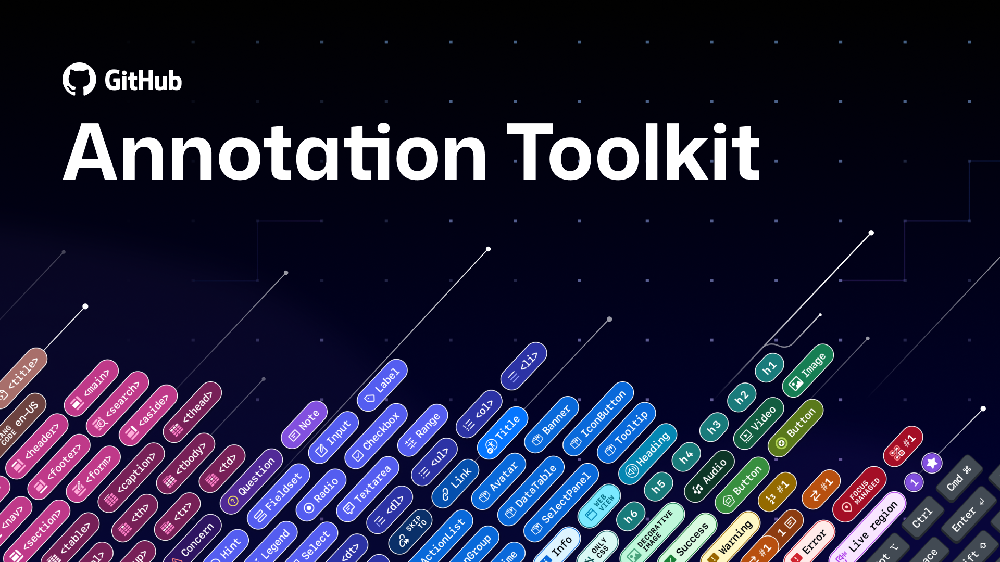
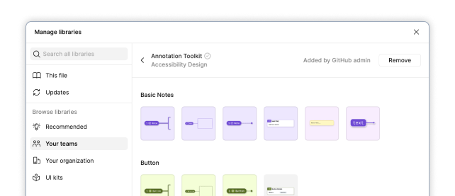
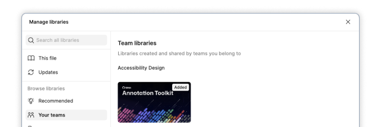

# Welcome to the GitHub Annotation Toolkit

The GitHub Annotation Toolkit is a Figma asset library packed with components to help you organize your design canvas, diagram UI anatomy, and annotate accessibility details. Whether you’re a designer, developer, or product manager, this toolkit meets you where you are—you don’t need to be an accessibility expert. It’s flexible enough to document broad accessibility considerations or dig into the fine details of complex components.

> [!IMPORTANT]
> **Tell us what you think!** We would love your feedback and [contributions](./CONTRIBUTING.md) to help improve the Annotation Toolkit, including any examples of how you’ve used or customized this library. Just open an [issue](https://github.com/github/annotation-toolkit/issues) in this repository. GitHub staff can reach out via Slack.

<!-- add link to the Figma Community file here -->

## Get the Annotation Toolkit
- [Download the library from Figma Community](//#)
- [Release Notes](https://github.com/github/annotation-toolkit/releases)

## What are annotations and why do we use them?

Annotations are notes included in design projects that help make the unseen explicit. They convey design intent that isn't immediately obvious from visual elements alone, improving the usability of digital experiences by providing developers with a holistic picture of how an experience should function. Think of annotations as a visual aid for basic code semantics—they help show how designs should function under the hood. 

When annotations are part of our design process, our teams work better together. They're a collaboration tool that can help:

- Close communication gaps
- Prevent quality issues
- Avoid accessibility audit issues
- Eliminate expensive re-work

They can also be used in early design explorations or wireframes to validate functionality. If you find it difficult to annotate a wireframe, that's often a sign that deeper thinking is needed about how the UI should work.

## Requirements

A paid Figma plan is recommended in order to use the components as an asset library. 

The components in this library support web as well as mobile (iOS and Android) platforms.

### How to use the Annotation Toolkit library in your design files
If not already available in your list of libraries, Publish and enable from the Assets tab. 

Find the "Annotation Toolkit" library in the Figma Asset panel. This is enabled by default for all internal GitHub design files. For older files, you enable the library by following [these instructions](https://accessibility-playbook.github.com/enabling-a11y-design-toolkit-library-in-figma).

|  |
|--------|
| Publish to your Figma instance and add to your file. |

|  | 
|--------|
| The Annotation Toolkit is now available to use in your work! |

## Tutorials, training, and documentation

### Toolkit basics
- [Features](basics/features.md) - What's in the Toolkit?
- [Getting Started](basics/getting-started.md) - How to use the Annotation Toolkit components

### Deep dives and training
- [Annotation Theory](deep-dives/annotation-theory.md) - What annotations are and how they can transform our work
- [Best Practices for annotating in Figma](deep-dives/best-practices-for-annotating.md) - Keep the canvas legible regardless of complexity
- [Best Practices for avoiding hand-off friction](deep-dives/best-practices-for-hand-off.md) - Planning and collaboration tips to help prevent issues and rework

### In-depth tutorials for each type of annotation
- [How to: Basic Notes](tutorials/basic-notes.md)
- [How to: Button](tutorials/button.md)
- [How to: Flow Lines](tutorials/flow-lines.md)
- [How to: Form element](tutorials/form-element.md) - Input, textarea, checkbox, etc
- [How to: Heading](tutorials/heading.md)
- [How to: Landmark](tutorials/landmark.md)
- [How to: Link](tutorials/link.md)
- [How to: List](tutorials/list.md)
- [How to: Mobile Annotations](tutorials/mobile-annotations.md) - For any platform, including iOS and Android
- [How to: Media](tutorials/media.md) - Image, Video, and Audio
- [How to: Metadata](tutorials/metadata.md) - Page Title and Language
- [How to: Ordering](tutorials/ordering.md) - Focus order, Arrow stops, and Reading order
- [How-to: Primer components](tutorials/primer-presets.md) - How to use Primer A11y Presets
- [How to: System Feedback](tutorials/system-feedback.md) - States and Live regions
- [How to: Table](tutorials/table.md)
- [How to: User Interactions](tutorials/user-interactions.md) - Keyboard shortcuts, touch gestures, mouse actions, device settings, platform functions

### Checklists and references
- [The Tiered Model](deep-dives/tiered-model.md) - Prioritizing around time constraints or knowledge gaps
- [Accessibility Checklist for Designers](checklists/designer-checklist.md)
- [Accessibility Checklist for Engineers](checklists/engineering-checklist.md)

## Resources
### Design system annotations (GitHub Blog series)
- [Part 1: How accessibility gets left out of components](https://github.blog/engineering/user-experience/design-system-annotations-part-1-how-accessibility-gets-left-out-of-components/) by [@janmaarten-a11y](https://github.com/janmaarten-a11y)
- [Part 2: Advanced methods of annotating components](https://github.blog/engineering/user-experience/design-system-annotations-part-1-how-accessibility-gets-left-out-of-components/) by [@janmaarten-a11y](https://github.com/janmaarten-a11y)

### Further reading
- [Accessibility annotation kits only annotate](https://ericwbailey.website/published/accessibility-annotation-kits-only-annotate/) by [@ericwbailey](https://github.com/ericwbailey)
- [How we’re building more inclusive and accessible components at GitHub](https://github.blog/engineering/user-experience/design-system-annotations-part-1-how-accessibility-gets-left-out-of-components/) by [@ericwbailey](https://github.com/ericwbailey)
- [Auditing Design Systems for Accessibility](https://www.deque.com/blog/auditing-design-systems-for-accessibility/) by Anna E. Cook
- [The value of accessibility annotations in inclusive design](https://tangible.is/en/thinking/2024/10/the-value-of-accessibility-annotations-in-inclusive-design) by Antonio Matera
- [A Designer’s Guide to Documenting Accessibility & User Interactions](https://stephaniewalter.design/blog/a-designers-guide-to-documenting-accessibility-user-interactions/) by Stéphanie Walter

## Support 

This project uses GitHub issues to track bugs and feature requests. Please search the existing issues before filing new issues to avoid duplicates. To get help, submit bugs, ask questions, or make feature requests, create an [Issue](https://github.com/github/annotation-toolkit/issues) in this repository. The Annotation Toolkit is under active development and maintained by GitHub staff. We will do our best to respond to support, feature requests, and community questions in a timely manner.

### Internal Support options for GitHub employees
The Accessibility Design team is here to help! GitHub colleagues have multiple ways to reach out to us:

- React to any Slack message with the emoji: `:a11y-design-i-would-like-help-with-this:`
- Message us in the **#accessibility-design** or **#annotation-toolkit** Slack channels
- Schedule a [pairing session](https://gh.io/a11y-design-pairing) for a quick check-in, collaboration on a complex problem, or 1:1 coaching
- Submit an [A11y Design Office Hours request](https://gh.io/a11y-oh-issue) for design reviews and guidance every Tuesday and Thursday
- Catch up on our [A11y Design Checklist video series](https://gh.io/a11y-design-checkpoints)
- Visit the [Accessibility Design](https://gh.io/accessibility-design) repository

## Maintainers
- [@janmaarten-a11y](https://github.com/janmaarten-a11y), Senior Accessibility Designer & Project Lead
- [@alexislucio](https://github.com/alexislucio), Senior Accessibility Designer & Project Manager
- [@ericwbailey](https://github.com/ericwbailey), Senior Accessibility Designer
- [@mattobee](https://github.com/mattobee), Staff Accessibility Designer

## Contributors
Special thanks to the following legends for their early feedback and help improving this library.
- [Chelsea Adelman](https://www.linkedin.com/in/chelsea-adelman/)
- [Joe Lamyman](https://www.linkedin.com/in/joelamyman/)
- [Demelza Feltham](https://www.linkedin.com/in/demelza-feltham-76bb9594/)
- [Julian Kittelson-Aldred](https://www.linkedin.com/in/julianmka/)
- [Devin Owsley](https://www.linkedin.com/in/devin-owsleyaquilia/)
- [David Cox](https://www.linkedin.com/in/dav-idcox/)
- [Jasmine Friedrich](https://www.linkedin.com/in/jasmine-friedrich/)
- [Daniel Henderson-Ede](https://www.linkedin.com/in/danhendersonede/)
- [Kevin Oliveira](https://www.linkedin.com/in/kevin-s-oliveira/)

## Acknowledgement
The GitHub Annotation Toolkit is a fork of the CVS Health Inclusive Design team’s [Web Accessibility Annotation Kit](https://www.figma.com/community/file/1311421011482282592) (CC-BY 4.0). User interaction annotations were created using modified open source icons by [Jordan Stephensen](https://www.figma.com/@jws) and [Yogi Aprellianto](https://thenounproject.com/icon/puzzle-7950022/) (CC-BY 4.0).

## License 
This project is licensed under the terms of the CC-BY 4.0 license. Please refer to the [LICENSE](./LICENSE.md) file for the full terms.
When using the GitHub logos, be sure to follow the [GitHub logo guidelines](https://github.com/logos).
