# Features
: What’s in the Annotation Toolkit

While this toolkit can greatly help developers during a hand-off, it also helps designers validate that their designs are accessible to everyone! Included in this kit are annotations and tools to help with the following:

## Tools to help design effectively
These components help make designs and annotations easier to understand by helping organize a design canvas, label flows, clarify design statues, and guide developer handoff.

### [Flow lines](../tutorials/flow-lines.md)
Organize your frames and flows with labels to convey intent for transitions, interactions, validation states, and focus management. 

### [A11y Checkpoints](../checklists/)
Enable designers and engineers to check that a design’s color, hierarchy, content, images, interactivity, forms, layout, and keyboard operability are accessible for all users.

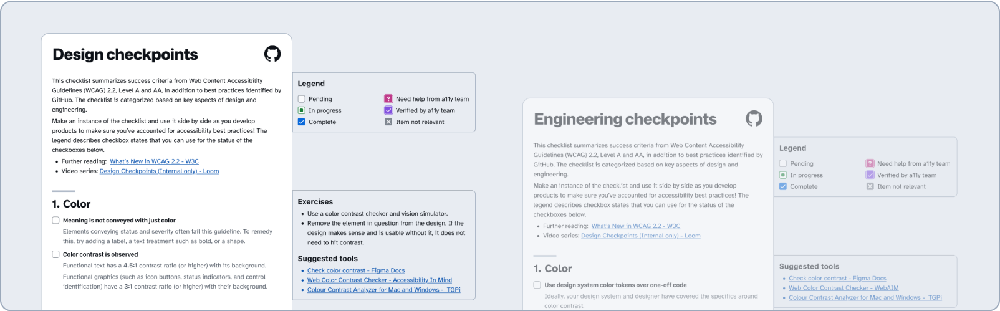

### Toolkit Legend
Helps engineers understand how to read annotations by defining the basic elements used to create them.

### Title cards, labels, flows, and more
Organize and label design canvas while providing info about project status and other metadata. Mark areas as “out of scope” or ambiguous due to being driven by third party data, user-generated content, and so on...

### [Notes](../tutorials/basic-notes.md)
Add notes or post-its for freeform details that don’t fit into any other annotation category. Add a Question to the Figma canvas or document a Concern on any part of a design.

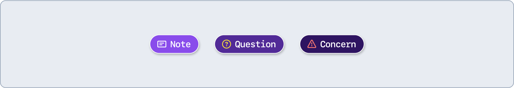

## Document semantic structure
Break down content on a website to make it approachable and easier to find. This can make your experiences easier to digest, especially for complex content and high volumes of data.

### [Metadata](../tutorials/metadata.md)
Define the document `<title>` shown in a browser's title bar and search engine results. Declare the language of the page or parts of the page.

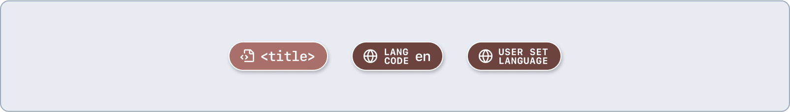

### [Page structure and headings](../tutorials/heading.md)
Create a content outline sorted by heading hierarchy. Make semantic heading levels clear, regardless of visual design, to help screen reader users navigate a page.

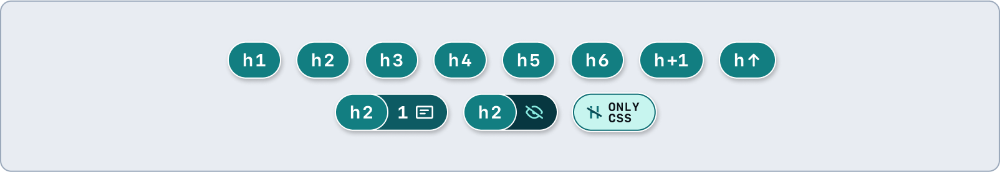

### [Landmarks](../tutorials/landmark.md)
Mark and name important sections of a page so all users understand their specific purpose in navigating a webpage. 

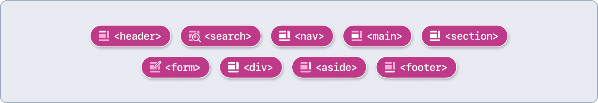

### [Lists](../tutorials/list.md)
Group a set of related items together so users can understand their context and association. 

### [Tables](../tutorials/table.md)
Present information in a grid with columns and rows to give quick access to tabular data and help people more easily understand complicated information relationships.

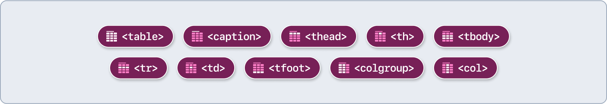

## Make visuals and interactions accessible
Clearly define how you want each interaction to function so that they can be perceived and operated by everyone, regardless of their ability or assistive technology stack.

### [Media](../tutorials/media.md)
Describe informative images or mark images as decorative that don’t convey any added meaning or context. Embed video and audio with alternative media. 

### [Buttons](../tutorials/button.md) and [Links](../tutorials/link.md)
Clearly label controls that perform actions on a page and those that navigate elsewhere.

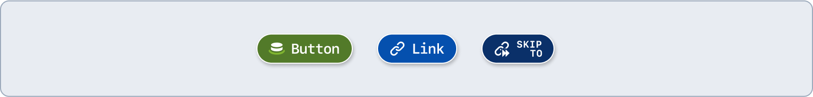

### [Form elements](../tutorials/form-element.md)
Identify the hidden semantics of all form fields and controls that accept data input from users.

### [Keyboard shortcuts](../tutorials/user-interactions.md)
Note any specific keyboard shortcuts that a page, component, or control may provide to help users operate them or advance further.

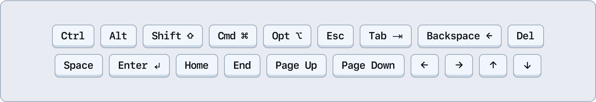

### [User interactions](../tutorials/user-interactions.md)
Communicate various basic, specialized, and advanced touch gestures, mouse actions, device settings, and platform functions.

## Document complex components
Fill in the gaps that aren’t obvious from visuals and properties alone.

### [Primer A11y Presets](../tutorials/primer-presets.md)
Bespoke annotations for our design system components. Learn more about how to use them. 

### [Interface guidelines](../tutorials/basic-notes.md#interface-guidelines)
Basic labels and redlines can be used to document component anatomy and create Interface Guideline diagrams. 

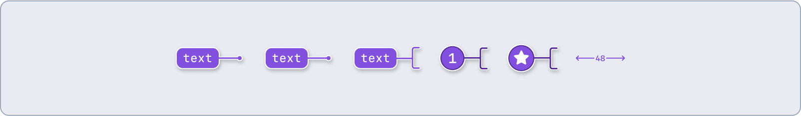

### [System feedback](../tutorials/system-feedback.md)
Highlight important information, potential issues, errors, and successful actions. Includes live region announcements.

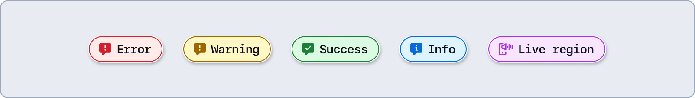

### [Ordering](../tutorials/ordering.md)
Outline the sequential order of focusable components to support keyboard navigation (using tab or arrow keys) while preserving meaning and operability. Preserve the logical reading order of content that screen readers perceive when it differs from what is shown visually.

## Annotate native app designs for iOS and Android
Support accessible UI design by providing clear, structured notes for native [mobile elements](../tutorials/mobile-annotations.md). 

### Screen reader grouping
Highlight multiple objects to be announced together. This may be related information, a group of actions with a common purpose, images and accompanying text, etc.

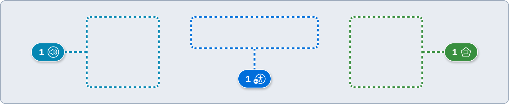

### Mobile structure and buttons
Mark controls that initiate actions; Headings that help users understand the purpose of, and navigate to, a section; and Titles that help users orient to new views.

### View context
Outline areas that may have different accessibility considerations than native UI elements, such as web views, user generated content, long blocks of text content that lacks headings, and non-native content.

