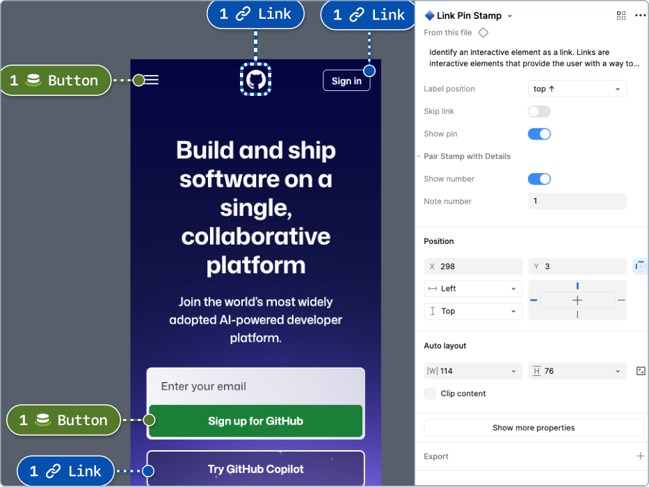

# Getting started:
 How to use the Annotation Toolkit

The Annotation Toolkit allows you to apply annotation labels (“Stamps”) over design elements. Stamps may also be set to correspond to detailed notes (“Details”) about the content the stamp points out. Details are often placed in the margins, so as to not obscure the design they document.

> [!NOTE]  
> Since the word “annotations” can refer to the individual components in this toolkit as well as the documentation as a whole (a finished, annotated design), we use the word “Stamp” to avoid confusion.

## Step 1: Label design elements with Stamps

Add a Pin, Bracket, or Lasso Stamp over the design from the Figma asset panel. In this example, we want to add **Link** and **Button** annotations to this page.

Use the **Label position** component property to change the orientation of the label. Try to align the Stamp label on the edge of, or outside the frame to keep the underlying design more legible. 

| Step 1 | Step 2 |
| :--- | :--- |
|  |  |
| Find the Annotation Toolkit components in the Figma asset panel. | Add Stamps to the canvas, setting their size and Label position. |

> [!TIP]  
> When positioning Stamps on top of a design frame, it can be helpful to **Lock** (<kbd>⇧</kbd>+<kbd>⌘</kbd>+<kbd>L</kbd>) the frame or hold down the <kbd>Space</kbd> key while dragging a component. This helps prevent Stamps being inserted into the design itself which can make them difficult to edit and disrupt the layout of any frames that use auto-layout.

## Step 2: Pair Stamps with Details components in the margins

Pair Stamps with **Details** components in the margins

You’ll notice that all of the Stamps have the same number. Make sure to update each Stamp instance using the **Note number** component property. This will help associate each Details annotation with its corresponding Stamp.

It helps to add these in a linear order so that engineers can read your annotations without getting lost or searching for two matching numbers, especially if many annotations are present.

In this example, some Stamps don’t need a matching Details annotation. Because of this, we can skip numbering these Stamps.

| Step 1 | Step 2 |
| :--- | :--- |
|  |  |
| Add Details components in the margins around the design frame. | Use the Note number property to pair Stamps and Details together. |

> [!NOTE]  
> In most cases, the sequence of the **Note number** property should apply to all different types of annotations on a given frame. It’s rarely necessary to have a separate numbering sequence for Buttons, and another for Links, and so forth.

## Step 3: Fill out the Details component properties

The content of these stamps can include interface behavior, code semantics, ARIA attributes, and more. 

Every type of Details annotation is different. Some, like the Note Detail, are open-ended. Others provide specific semantic properties that can help improve an experience for all users. 

Make sure to investigate the component properties of each annotation type you use to understand all the options it contains.

| Step 1 | Step 2 |
| :--- | :--- |
|  |  |
| Add design intent to the Details via the properties panel. | All buttons and links on this frame have been annotated! 🎉 |

## How the annotation components work

Each annotation type has its own color, icon, text label, outline, and shadow. These signifiers all help to identify and differentiate annotation types from one another, as well as the designs they are placed over.

### Stamp formats

#### Pin stamps

Pin Stamps highlight one specific element in a design. 

The pin can be toggled off with the “**Show pin**” property, leaving just the label.

#### Bracket stamps

Bracket Stamps are useful for highlighting sections of a page and elements without clear boundaries. 

#### Lasso stamps

Lasso Stamps are useful for highlighting groups of elements, sections of a page, or elements without clear boundaries. 

There are more “**Label position**” options for Lasso Stamps compared to Pin and Bracket stamps. This is to help reduce overlap.

### Note numbers may not appear by default

Stamps for `Focus order`, `Arrow stops`, or `Reading order` have an **Order #** property to communicate a linear progression in the stamp label. `Heading` stamps have a **Heading Level** in their stamp label by default. 

These annotations typically do not need additional info. However, you can pair a Details component with these annotations if you need to. This is done by toggling the **Has note** property to reveal the **Note number** field.

### Many Stamps may have label variants

Annotations such as Note, Heading, Landmark, List, Form Element, Table, Media and Primer A11y Preset stamps all have labels that can be changed through the properties panel.

| Add Stamp | Edit properties |
| :--- | :--- |
|  |  |

### Details annotations can be extensively customized

Details are notes in the margins around a design frame. They are meant to be paired with Stamp components via matching **Note number** values.

The content of these Details annotations can include interface behavior, code semantics, ARIA, and much more. You will be prompted to fill out different kinds of content depending on the type of annotation used. 

Some properties can be hidden, while others cannot. Those that can’t are considered required. This is because there may be risk of accessibility issues or diminished UX quality if they aren’t filled out accurately.

Enabling the **Add more info...** property on any Details annotation will reveal more settings for:

- Additional details
- Code snippets
- Links to documentation (up to 5)

Some Details annotations also support indicating what keyboard shortcuts should be honored.

