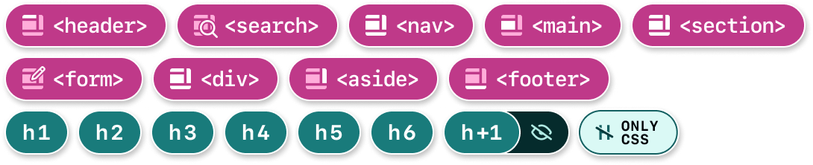
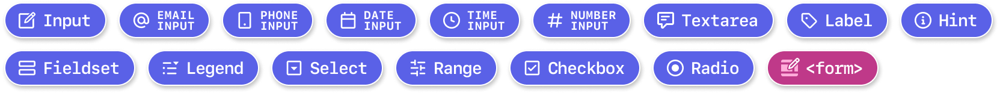
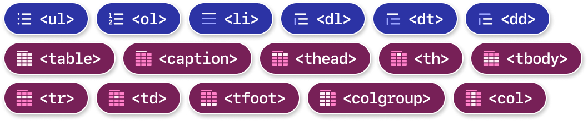
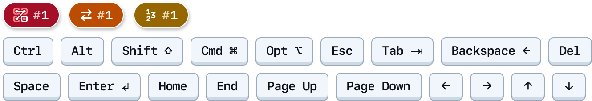

# Designer Checklist

This checklist summarizes success criteria from Web Content Accessibility Guidelines (WCAG) 2.2 (Level A and AA, in addition to best practices identified by GitHub), and categorizes it based on key aspects of design. Where applicable, each section also contains suggested exercises, suggested annotations for use, and tools.

Use it side by side as you develop products to make sure you’ve accounted for accessibility best practices! The legend describes checkbox states that you can use for the status of the checkboxes below. 

**Further reading:**  
- [What’s New in WCAG 2.2 - W3C](https://www.w3.org/WAI/standards-guidelines/wcag/new-in-22/)
- [Video series: Design Checkpoints (Internal only) - Loom](https://gh.io/a11y-design-checkpoints)

---

## 1. Color

- [ ] **Meaning is not conveyed with just color**
	- Elements conveying status and severity often fail this guideline. To remedy this, try adding a label, a text treatment such as bold, or a shape.
- [ ] **Color contrast is observed**
	- Functional text has a **4.5:1** contrast ratio (or higher) with its background.  
	- Functional graphics (such as icon buttons, status indicators, and control identification) have a **3:1** contrast ratio (or higher) with their background.

### Exercises

- Use a color contrast checker and vision simulator to check your work.  
- Remove the element in question from the design. If the design makes sense and is usable without it, it does not need to hit contrast.

### Suggested Tools

- [Check color contrast - Figma Docs](https://help.figma.com/hc/en-us/articles/360041003774-Apply-paints-with-the-color-picker#h_01JQF1T71AC72G6VDXN27B77V0)
- [Web Color Contrast Checker - WebAIM](http://webaim.org/resources/contrastchecker/) 
- [Colour Contrast Analyzer for Mac and Windows -  TGPi](https://www.tpgi.com/color-contrast-checker/)

---

## 2. Hierarchy

- [ ] **Each page has one H1**
- [ ] **Headings are annotated and used in a consecutive order.**
	- Heading levels should be sequential. Don’t skip levels (i.e. `<h2>` to `<h4>`)
	- Nested headings are encouraged and natural as content goes from more general to specific.
	- In certain cases, headings may be visually hidden. Levels and visual styling may deviate from one another (i.e. giving an `<h2>` the same visual treatment as an `<h3>`). Please consult the a11y design team in this case.
- [ ] **Landmarks are identified and annotated** 
	- Page has only one main section and one footer section.  
	- Leave out landmark identifiers when giving a unique name. e.g., use "Repository" instead of "Repository navigation". This prevents redundancy in screen readers that already read out the navigation landmark.

### Exercises

- Write out your heading structure without content, as shown in [Priority Guides - A List Apart](https://alistapart.com/article/priority-guides-a-content-first-alternative-to-wireframes/).

### Annotations that can help
- [Landmark](https://gh.io/annotation-tutorial-landmark)
- [Heading](https://gh.io/annotation-tutorial-heading)
  - Semantic heading
  - Visually hidden heading
  - CSS only styling

### Suggested Tools

- [Page Region tutorial - W3C WAI](https://www.w3.org/WAI/tutorials/page-structure/regions/)
- [HeadingsMap browser extension](https://www.accessibility-developer-guide.com/setup/helper-tools/browser-extensions/headingsmap/) to check the hierarchy of an existing site.

---

## 3. Content

- [ ] **Break your content into small sections**
	- Avoid long passages or lines of text, and strive for one overall point per paragraph. Recommended 60-70 characters, but up to 80 is allowed.
- [ ] **Directionality is not used in content** 
	- Avoid content like “see below” or “to the left/right” and instead rely on 
“first/last” and “previous/next”.
- [ ] **Content is clear to read and accessible to an 8th grade education level.** 
	- Make sure to explains abbreviations the first time you use them. Avoid overly complex language like complex metaphors, regional phrases, and slang.
- [ ] **Truncation only used when unavoidable** 
	- This is generally an anti-pattern for accessibility.
- [ ] **Metadata like page titles and applicable language codes are annotated** 
	- Define the document's title that is shown in a browser's title bar or tab. If supporting localization, declare the language of the page (or parts of it).

### Exercises

- Read the copy out loud yourself, or by utilizing Immersive Reader or Text to Speech (see the following links).

### Annotations that can help

- [Page Title (Metadata)](https://gh.io/annotation-tutorial-metadata#page-title)
- [Language (Metadata)](https://gh.io/annotation-tutorial-metadata#language)

### Suggested Tools

- [Hemingway Editor](https://hemingwayapp.com/) or [Readability Analyzer](https://datayze.com/readability-analyzer.php)
- [Microsoft Edge’s Immersive Reader - Microsoft](https://support.microsoft.com/en-us/topic/use-immersive-reader-in-microsoft-edge-78a7a17d-52e1-47ee-b0ac-eff8539015e1)
- [MacOS’s Text to Speech - University of Calgary](https://www.ucalgary.ca/student-services/access/current-students/resources-and-supports/assistive-software-how-videos/mac-text-speech). Includes other speech to text resources as well!

---
 
## 4. Images, graphics, and other media

- [ ] **Alt-text for functional images and icon buttons without labels are annotated:** 
	- Be descriptive in your alt-text; communicate the meaning for the image being on the page.  
- [ ] **Important text is not located inside an image**
	-  Instead, it should live outside the image so a greater audience can access it and key functionality like copying text is possible.
- [ ] **Alternative media is included where applicable** 
	- Potential content includes captions, audio descriptions, transcripts, etc.
- [ ] **Automatically moving or scrolling content can be paused, stopped, and played**
	- Allowing users to control moving content prevents disorientation and motion sickness, which helps those with cognitive, reading, or vestibular disorders.

### Annotations that can help
- [Image (Media)](https://gh.io/annotation-tutorial-media#image)
- [Video (Media)](https://gh.io/annotation-tutorial-media#video)
- [Audio (Media)](https://gh.io/annotation-tutorial-media#audio)

### Exercises

- Figure out if an image needs a description using [W3C’s alt-text decision tree](https://www.w3.org/WAI/tutorials/images/decision-tree/).
- Annotate any images that are purely decorative.

### Resources

- [Alt Text Guide - GitHub Workplace Accessibility](https://github.com/github/workplace-accessibility/blob/main/resources/content-accessibility/alt-text-guide.md)
- [Your Image Is Probably Not Decorative - Smashing Magazine](https://www.smashingmagazine.com/2021/06/img-alt-attribute-alternate-description-decorative/)
- [Images Tutorial - Web Accessibility Initiative (W3C)](https://www.w3.org/WAI/tutorials/images/)
- [Functional Images - Web Accessibility Initiative (W3C)](https://www.w3.org/WAI/tutorials/images/functional/)
- [Dungeons & Dragons taught me how to write alt text - Eric Bailey](https://ericwbailey.website/published/dungeons-and-dragons-taught-me-how-to-write-alt-text/)

---

## 5. Interactivity

- [ ] **Disabled buttons are not used in your designs**
	- Disabled buttons may prevent users from completing tasks or understanding form feedback. An inactive button is a better alternative.
- [ ] **Links and buttons are appropriately used** 
	- Remember that links change navigation, and buttons initiate actions.
- [ ] **Buttons and links have unique name** 
	- Multiple “Read More” and “Click Here” links are not helpful to screen reader users. Use unique descriptive names. Only if essential, annotate a longer accessible name for assistive technology.
- [ ] **Ensure all hit areas are at least 24x24 CSS pixels** 
	- This benefits mobile users using touch gestures and motor-impaired mouse users. _There are a few exceptions to this rule under [SC 2.5.8](https://www.w3.org/WAI/WCAG22/Understanding/target-size-minimum.html)._

### Annotations that can help

- [Button](https://gh.io/annotation-tutorial-button)
- [Link](https://gh.io/annotation-tutorial-link)
  

### Resources

- ​[​Links and Buttons - Primer design guidance](https://primer.style/accessibility/design-guidance/links-and-buttons/)
- [Links and Buttons Overview - University of Washington](https://www.washington.edu/accesstech/checklist/links-buttons/)

---

## 6. Forms

- [ ] **Inputs have clear labels and instructions**
	- Visible labels allow users to identify what is required inside of a form field, and allows voice recognition users to activate the control.
- [ ] **Avoid input placeholders** 
	- Users should be able to understand what to do with an input with no placeholder text present.
- [ ] **Input-based and form-based error states included in design** 
	- Errors for inputs should be next to the field with the error, while form-based errors should surface at the top or bottom of a form, ideally with line items describing each error and a link directly to the field. 
- [ ] **The same info is not asked for multiple times in the same session**
	- Auto-populate information or use a checkbox (i.e. “Same as shipping address”) so users don’t have to keep typing the same information.

### Annotations that can help

- Label, Input, etc. ([Form Element](https://gh.io/annotation-tutorial-form-element))
- `<form>` [Landmark](https://gh.io/annotation-tutorial-landmark#form)

### Resources

- [Form Pattern Documentation - Primer](https://primer.style/design/ui-patterns/forms/)

---

## 7. Layout

- [ ] **Workflow can be completed regardless of screen size or orientation** 
	- Does your design work as intended for small screens as well as large? Can it change from landscape to portrait orientation without losing key details? 
- [ ] **Resize and reflow considered** 
	- If a user zooms in or out (50-400%) is the intention still the same? Is any content overlapped or obscured?
- [ ] **Scrolling in two directions is not required to read content** 
	- Multiple scrolling directions makes it difficult for some users to traverse a page and has the potential for users to miss content. There are some exceptions to the rule; please consult the a11y design team if needed.
- [ ] **Help options are available in the same location on all web pages** 
	- Note that help options are not required, but keep them in the same place across pages for consistency if you do.

### Annotations that can help

- [Table](https://gh.io/annotation-tutorial-table)
- [List](https://gh.io/annotation-tutorial-list)

---

## 8. Keyboard

- [ ] **Every interaction with a mouse can be also accessed with a keyboard**  
	- This includes content on hover. Do not place interactive elements or important information in hover content.
- [ ] **A focus border is visible on every interactive element**
- [ ] **Focus order is annotated and matches the intention of the design**  
	- Avoid focus that jumps back and forth across the page to reach items visually out of order.

### Annotations that can help

- Focus Order ([Ordering](https://gh.io/annotation-tutorial-ordering))
- Arrow Stop ([Ordering](https://gh.io/annotation-tutorial-ordering))
- Keyboard Shortcut ([User Interactions](https://gh.io/annotation-tutorial-user-interactions))

---

## Additional Resources
Here are some additional checklists that can be tailored to specific functions and job roles (other than just design and engineering):
- [Vox Media Accessibility Checklist](https://accessibility.voxmedia.com/): Splits checklist by function--design, engineering, project management, QA, and editorial/content.  
- [Intopia’s Not-Checklist:](https://not-checklist.intopia.digital/) We appreciated the job role filtering (visual, content, UX design, and video production).
