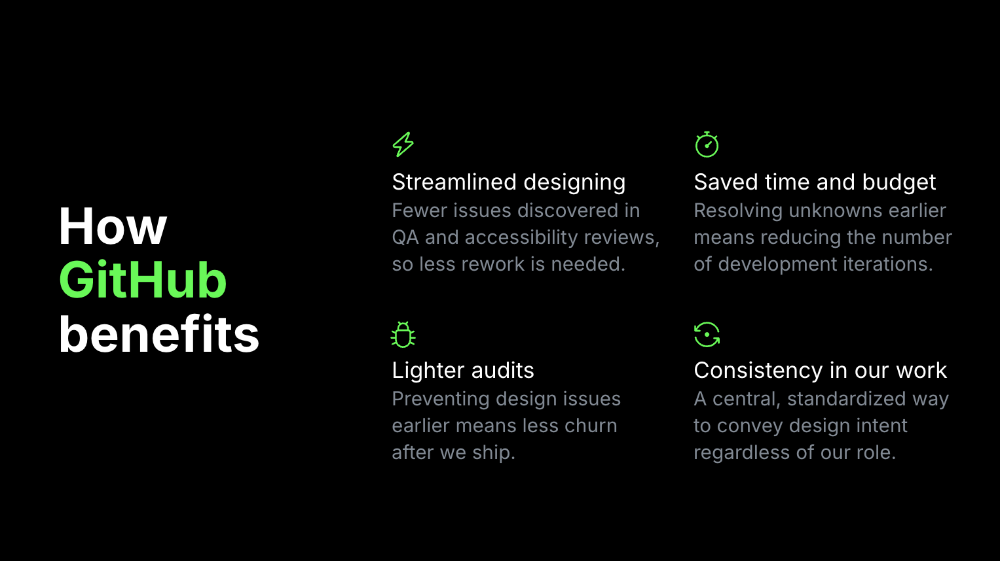

# Annotation Theory

Our annotated designs are only as **effective** as they are **understood**. Using this Annotation Toolkit isn't only about [how an interface gets annotated](../basics/getting-started.md) and [where you put those components on the canvas](best-practices-for-annotating.md).

The Annotation Toolkit can only transform our work for the better if we understand what annotations **are** and what they **aren't**, as well as **why** we use it and how the practice impacts (and may be impacted by) [our planning efforts, team culture, and rituals](best-practices-for-hand-off.md).

---

## Why do we annotate our designs?
When our team did an analysis of GitHub's issues in May 2024, we found that **48% of all of audit issues** can be prevented in design. Based on those specific types of issues, **40% of all audit issues can be prevented through design annotations**. Meaning, when we eliminate ambiguity and get designers and engineers collaborating earlier, there are a ton of benefits. Two that we that we often call attention to are:
1. **They lead to a higher standard.** When our designs are more accessible, the experience is better for everyone using them.
2. **They help our teams work better together.** Sharing design intent through annotations can bridge communication gaps between design and engineering, even remotely across time zones.

Both of these things are great and true, but they also gloss over a lot of nuance, so let's zoom out and look at benefits from a higher level.

### How GitHub benefits
The organization as a whole sees a number of benefits when we use the annotation toolkit as a tool for closer collaboration. 

- **Streamlined designing** - Our streamlined design process means fewer issues come up in reviews and QA, and we have less remediation to do.
- **Saved time and budget** - When we resolve unknowns earlier, we reduce the time it takes to develop our designs, saving time and budget.
- **Lighter audits** - Preventing design issues earlier means our audits come back with fewer issues, and we can keep focusing on shipping the next thing.
- **Consistency in our work** - The more we do this consistently, the more predictable our work can become - so it is also easier to do even better planning from the start.

---

### How our Users benefit
We’re making things for people to use both inside of GitHub and outside.

- **Expanded access** - The more we remove barriers, the more people can use GitHub. And the more we open up GitHub, the more we are able to remove additional barriers. 
- **Expectations upheld** - We have a huge global audience with great diversity in terms of the devices, software, languages, and preferences they use. Annotations can help us build with platform and web standards in mind so that we meet everyone's expectations.
- **Improved experiences** - Meeting those standards and expectations makes for improved experiences for folks using assistive technology, whether screen readers, zoom or text size preferences, keyboard navigation, voice navigation, etc.
- **Higher standards for all** - As we continue to set a high bar, we become an example for other companies to follow, which will help improve user's access and experiences **outside** of GitHub.

---

### How our Designers benefit
There are personal benefits for us as designers as well. 

- **We get to go deeper** - When we resolve unknowns earlier, we gain the time and space to do some deeper design thinking and create better solutions.
- **Career potential** - Better solutions can bring in better results, which can open doors for our career growth.
- **Knowledge sharing** - Speaking a similar language and sharing knowledge with engineers improves our understanding of technical standards and the platforms we build for, and it can bring us closer to that ideal of "designers who code"
- **More fulfilling work** - Closer interdisciplinary relationships and knowing (from real outcomes) that you're making a bigger difference with your design work.

---

## What even are annotations?
> Annotations help capture design intent that cannot be conveyed through visuals or component properties alone.

**Design annotations are a tool to facilitate communication.** They're a visual aid for semantics that can help folks understand the ways their designs will function under the hood—a shared language to help people reach a common understanding, regardless of their role, so that we can build a thing right the first time.

At first glance, annotations look like **design documentation** because they're a valuable resource for engineers to know how to build a feature (at least the first time). On their own, they may lack information about why certain choices were made, or who is affected. 

They also aren't a **source of truth**, because they're often just a moment in time. It may not even be clear which moment, especially when looking back at annotations after a feature is shipped. A design might be annotated in the wireframing stage but not later when handed off. It might be annotated for hand-off, only to be changed as it's developed. A lot of things can happen before a feature is finished and released, and because things can so often change, an annotated design stops being "current" very quickly.

---

## Do we really need to annotate our designs?
There are some common misconceptions to adopting annotations as a practice, but they're not the barriers they appear to be.

### Myth #1: Adding annotations makes design take longer
This is easy to believe because all new tools and processes have learning curves. Because we're learning, annotating our designs may take some more in the short term, and there might not be an ideal time for that impact. But the more we use the new tool, the faster we get and the more efficient it makes us from one end of our work to the other. Additionally, reducing the cost of rework and remediation in the long term is a significant benefit, and it frees us up to do new work with fewer delays.

### Myth #2: Using Primer means our designs are accessible 
It's easy to think that we can use accessible design system components in lieu of annotations, and that any issues can just be caught by engineers or by audits. This sentiment isn't true or false, but a spectrum. Some Primer components are more accessible than others, and there is a lot of ongoing work to resolve this. 

Regardless, even components that are as accessible as possible can be put together in ways that create new access barriers. So even if this _could_ be true, an accessible design system still isn't a substitute for being clear with our intent and how we communicate it to engineers.
