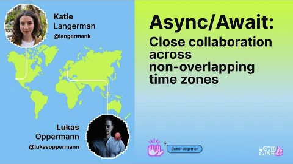

# Best practices for avoiding hand-off friction

Design annotations can transform our work for the better, but they don't do this on their own. They aren't a replacement for good planning or collaboration, and they don't fix fundamentally inaccessible designs—they're [a tool to help communicate more clearly](annotation-theory.md) with one another so that we only have to do it once.

---

## Four key ways to prevent friction

1. **Include others early** - Invite engineers to meetings. Early pairing & collaboration makes all the difference. Including cross-functional roles early and often means  discovering an issue then is far less challenging and expensive than having it pointed out after a feature has already been designed.
2. **Annotate strategically** - You don't need to annotate absolutely everything. Plan ahead for the time it will take you. If you can, start early and update the annotations as you go. If time is short, use the [Tiered approach](tiered-model.md).
3. **Plan a hand-off meeting** - Go through annotated designs with your product and engineering partners _before_ development starts. If you're team has that traditional hand-off, **this** is the moment you want everyone on the team to have a shared understanding of how your design should be realized in order to avoid a lot of rework (and potentially cut your audit issues in half). If we hand designs off from one silo to another, it's likely going to haunt us later. _If you only do one of these four things, do this one!_
4. **Follow through and QA the designs you hand off** - Plan ahead to take the time to check PRs, review the work and make sure everything is up to spec and the annotations were followed.

This list may seem idealistic, but we have teams here who already operate like well oiled machines. The Brand team, for instance, deals with a lot of outside pressure and adopted these practices out of necessity. The results, however, speak for themselves.

---

## How our work can break down (and how to address it)
There are lots of ways that our plans, processes, and the quality of our work can break down when there isn't a shared understanding between different product, design, and engineering roles. These situations can lead to friction long before and long after our designs are handed off. The more of them that we encounter on a project, the greater the potential issues and aftereffects.

**The majority of these can be addressed with good planning, consistent use of annotations, and the best practices listed above.**
 
 

### 🔵 Planning and cross-functional collaboration

<strong>Hand-off expectations and process aren’t clear</strong>

 
> Whether you create your own process or use the practices outlined in this document, it's important that the whole team and all stakeholders have a shared understanding of what's meant to happen and when. This applies equally to designers, engineers, and product folks. 
>   
> Setting clear expectations for how work should be handed off—and consistent in our follow-through makes it easier for new team members to onboard, makes for a smoother hand-off, and reduces the rework required to ship a feature. 
>   
> Document your team or product's basic hand-off process somewhere prominent and easily accessible. Include references to important steps, meetings, and ceremonies in issues that are widely seen (i.e. make it hard to miss these key details).
> 

<strong>Planning and design phase meetings didn’t include Engineers</strong>

> When our work is silo'd in conventional ways, this happens easily. **Invite them anyway.** Even if they choose not to attend because the work won't be ready for them for a while, to include them  early is to take the opportunity to solve potential issues earlier. They may be complex, underlying, architectural issues that would take much longer to resolve after the hand-off.
> 
> In @ashtom's own words, “We need to burn down organizational silos.”

<strong>Time zone differences made it difficult to collaborate effectively</strong>

  
> This may be the biggest barrier to a synchronouse hand-off meeting, but some advanced planning and team commitments to follow-up can mitigate it. Plan to take some extra time when you're ready to hand off a design to film a walkthrough of your file and the annotations, and set up agreements with the team to get any feedback and work through questions promptly. This async focus time can be reserved on their calendars in advance.
> 
> Katie and Lukas from Design Infrastructure also have [some great lessons from LGTM 2024](https://www.youtube.com/watch?v=LN6dGGBfDYs) about how to collaborate when your workdays don't overlap at all.
> 
> 

<strong>There's not enough enough time to annotate designs before they need to be delivered</strong>

  
> Planning for time to annotate when a feature is kicked off is the best mitigation. When constraints don't allow for this, we can tactically prioritize what to annotate using [the Tiered Model](tiered-model.md) in order to get the most value for less effort.
>
> While it's valuable to have high fidelity designs annotated, you don't need to wait until then. We have teams who use design annotations while wireframing as a way to explore ideas and help clarify basic functionality. This can be especially helpful if there's close, early collaboration with engineers. Shifting left in this way may mean that the high fidelity annotations aren't even necessary.

<strong>Designer is moved off the team before the work is finished</strong>

  
> Ensuring hand-off expectations are clear and well documented (as outlined in the first list item above) will help any new team member get onboarded quickly. Set up introductory 1:1s with their engineering partners and make a point to have consistent hand-off meetings.

 

### 🟢 Designing and annotating

<strong>Annotations weren’t included in the design hand-off </strong>

  
> If there are accessibility knowledge gaps and silos between members of the team, this can have costly and time-consuming effects. If there's close collaboration and strong accessibility knowledge, this might be an ideal state where annotations can be minimal or even unnecessary. If that doesn't describe you or your team, the [Best Practices listed above](best-practices-for-hand-off.md#four-key-ways-to-prevent-friction) can greatly help.

<strong>Primer components aren’t clearly marked in the Figma file (oops, we detached some component)</strong>

  
> Sometimes design system components get detached because they're configured in Figma in such a way that doesn't allow them to be used as needed, even within the scope of the component's usage guidance. When that happens, it may not be clear to engineers what component should be used. Without making this clear, there's a risk they'll try to reinvent the wheel instead.
> 
> Primer A11y Preset annotations can prevent this from causing issues for engineers. In lieu of annotations, a hand-off meeting that goes through the design can help make clear which components should be used.

<strong>Designer tagged in a PR and has to drop everything to review it immediately</strong>

  
> It can prevent a lot of churn and potential delays to block off some time and capacity for designers to QA their work after the hand-off. With a little advanced planning, you may not need to borrow time from subsequent deadlines, and can also prevent design/a11y issues which would otherwise show up in an audit—at which point time/capacity has to be found in order to fix those anyway.

<strong>Design team assumed that engineers would catch and fix a11y issues</strong>

  
> This is very likely to result in more accessibility issues unless there's very close collaboration, shared understanding of design intent, and a wealth of accessibility knowledge. Engineers can fix many things in production, but not if there are fundamentally inaccessible design specs. And without that close collaboration, this assumption is likely to result in quite a lot of back and forth questions, clarifications, and debate about how to proceed. 
> 
> 

<strong>Key details were missed in the annotations</strong>

> When this happens, we might not know it and an audit may come back with unexpected surprises (which then limit our capacity with future work).  Even accessibility specialists miss things. Good annotations also prioritize what's most important because if we were to annotate everything possible, it would take too long and potentially overwhelm engineers, so there are a number of reasons things can get missed. A hand-off meeting where designers, engineers, and product folks go over a design and its annotations will often reveal these missed details just in time for development.

 

### 🟡 Hand-off

<strong>Designs are delivered in Figma, but the Engineer isn’t familiar with the tool</strong>

> This may be an opportunity for training, as well as pairing and synchronous hand-off meetings where you explore the Figma canvas together. There's also a new feature in Figma called [Code Connect](https://github.com/figma/code-connect) that we have directly integrated with Primer, which can make it very easy for engineers to get the exact code they need.

<strong>Figma canvas is laid out in a way that’s difficult to  navigate and understand</strong>

> There's no one way to lay out a Figma canvas or to annotate a design. Following our [Best Practices for annotating](best-practices-for-annotating.md) can help make your design frames more legible and easy to follow. There are also a growing number of utilities and 'canvas helpers' in the Toolkit which can be leveraged for this, such as the new "Area out of scope" component.

<strong>Documentation (issues, API docs, Loom videos, etc) don’t get reviewed before development starts</strong>

> Sometimes we're in a rush and skip it and sometimes we don't see it or follow it for whatever reason. It's a good idea for designers and engineers to get to know one another and understand what their preferred communication and learning styles are. Do you prefer Slack chats or video calls? Do you prefer to follow long API docs or video walkthroughs? Not only is there no one right answer, this is also a great reason to have a hand-off meeting to go through everything before development starts.

<strong>Annotated designs are handed off without a meeting or review</strong>

> This could be a point of friction and lead to some churn and rework, but it's good that the designs did include annotations. If a hand-off meeting isn't possible, a video walkthrough might be helpful. If a design just needs to be handed from one silo to another, our [Best Practices for annotating](best-practices-for-annotating.md) can help make sure the canvas is legible and easy to follow. If this is how your project goes, make an effort to follow up and QA the design before it's shipped.

 

### 🟠 Development

<strong>The “source of truth” for the work isn’t clear (is it an Issue? Figma file? Loom video?)</strong>

  
> See the first list item under Planning.
>
> Closer relationships between designers and engineers may help, at least to understand what specific communication/learning preferences different team members have (whether written docs or video walkthroughs).

<strong>Engineers just ‘guestimates’ props & styles instead of using DevMode or examining layers</strong>

> This may be a training opportunity for engineers, but using our new Annotation Toolkit will expose design intent, semantics, and component information in detail, reducing the risks that come with ignoring precise layer details or DevMode. With a hand-off meeting and a regular, planned QA practice, this becomes a much smaller problem.

<strong>Engineers copy/paste existing code instead of following Primer guidance</strong>

> This may be a training opportunity for engineers. It also helps to be clear with our intent in our annotations as well as in a hand-off meeting. There's also a new feature in Figma called [Code Connect](https://github.com/figma/code-connect) that we have directly integrated with Primer, which can make it very easy for engineers to get the exact code they need.

<strong>Designs and/or annotations weren’t followed to spec</strong>

 
> This most often happens when team members aren't on the same page and it can be mitigated with a **hand-off meeting**. Get together with engineers and product partners and go through the design frames and annotations to ensure everyone has the same understanding of how the feature is meant to be built.
 

<strong>Annotations not included until after Eng work had already started</strong>

> Sometimes design processes do this intentionally, as parts of a design can be finished before others. Letting engineers get a head start on the work isn't too risky if the process involves consistent and close collaboration (again, invite engineers to your design meetings!). If work is being started before it's ready, there's a risk that it's made poorly, doesn't align with what Product and Design intended, and/or needs to be reworked. It may be worth the effort to add some more standardization to hand-off processes and set clearer expectations for the team as a whole.

<strong>Designer wasn’t tagged in the engineer’s PR</strong>

 
> Standardized processes and workflow automations can make this much less of an issue. 
> - Using an issue tag for PRs that are hooked up to a project board. 
> - Recurring meetings or scheduled focus time to review PRs.
> - A Slackbot that posts about pending reviews when tagged by devs.
> - Reminders for design folks to follow-up on work after it’s been handed off, ensure issues are tagged, etc.
> The root issue might also be that the engineer might not know exactly who to tag, in which case see the first list item under Planning about setting expectations and clear processes for the team.

<strong>PR is merged before Design has a chance to review it</strong>

> This can cause design and accessibility issues to be missed, the latter of which may get picked up in an audit, but both will require rework. Standard processes and checkpoints planned ahead of time can prevent this. Repo automation can help as well (provided they're set up carefully), such as:
> - Require PRs to be reviewed by the designers before merge is allowed
> - Automatically tag designers so that QA opportunities aren't missed

 

### 🔴 Shipping

<strong>Current work is delayed to fix papercuts on work designers have already handed off</strong>

> This may have happened because annotations weren't included, specs weren't followed, or because something else came up in the course of development. Including annotations and attending a hand-off meeting can reduce the impact of this, but it's also wise to plan ahead for some time to QA our designs.
 

<strong>Designers don’t attend bug bash to fix QA issues</strong>

> This kind of cross-functional collaboration not only takes care of immediate issues, it helps designers and engineers be able to speak the same language and understand one another better. If we can't follow up on our work after the hand-off, we're leaving a lot to chance. The final product may not match your design intent, and any unresolved issues become debt you'll have to pay back later with your time and capacity. 
 

<strong>Design QA issues aren’t caught before being shipped</strong>

> This may be an opportunity to make the QA phase a more formal and scheduled part of your team's process. Some of our teams will swarm on new work just to make sure to get as many eyes on it as possible, as quickly as possible.
 

<strong>Issues aren’t noticed, let alone resolved, for months</strong>

> This happens a lot with silo'd teams and broken feedback loops. If a team relies on being manually tagged for issues, it also relies on someone proactively finding the issue and tagging folks. If this is everyone's job, then it's no one's job. Healthy workflow automations, reminders, and standardized processes can help make sure nothing falls by the wayside.
 

<strong>Audits come back with a lot of unexpected surprises</strong>

> This is always frustrating and it's a possibility even when we follow best practices and shift left as much as possible. Sometimes problems are missed, and sometimes they're only apparent once they're shipped. It's also good that issues like this are caught in an audit, because it's possible for us to miss an issue repeatedly, AND for third party vendors to miss it as well—which means our users will discover it.
>
> Accessibility is never "done" (just like security), and the nature of our work sometimes means that we prioritize high severity issues and leave the lower hanging fruit for later. The more practiced we are with our tools, at avoiding silos, and being consistent in our processes, the less likely we are to get these sorts of surprises. And if we end up needing to leave some issues to be dealt with later on, we can (and should) plan for that time/capacity as soon as we see it coming.

