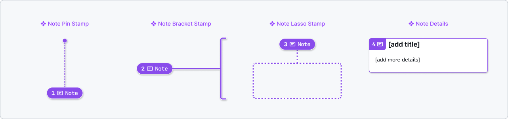
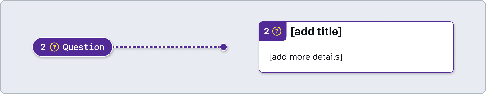
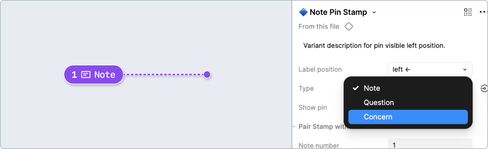
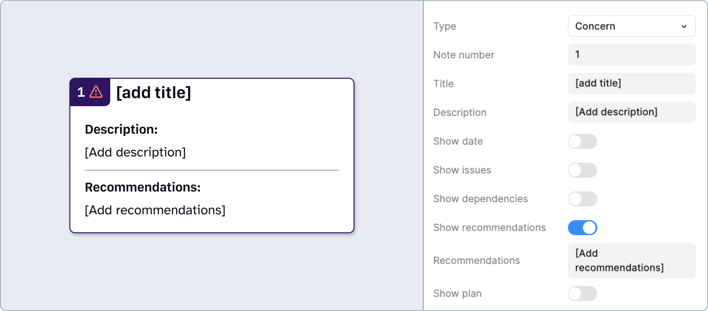
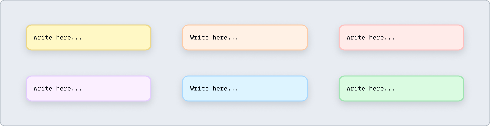
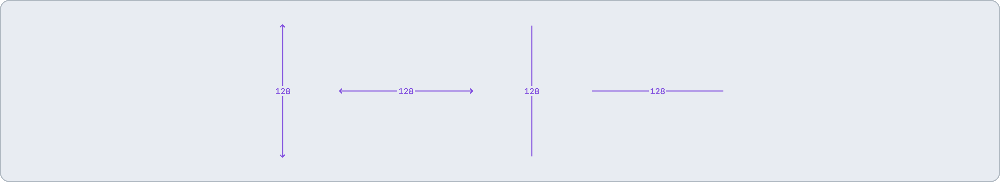
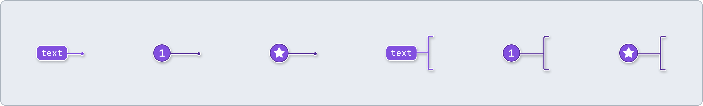
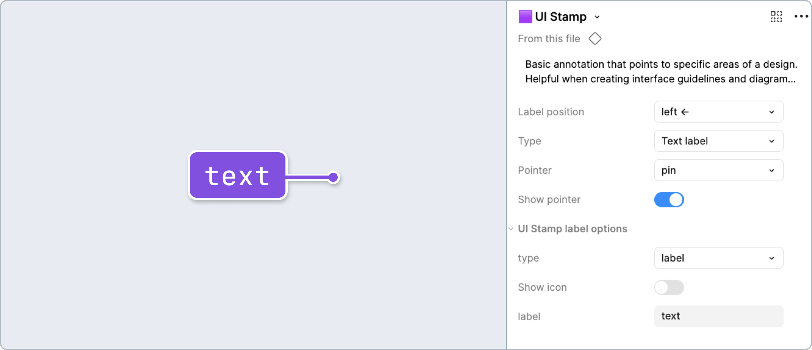

# How to: Basic Notes

Create interface guidelines and diagrams. Add details that don’t fit within any other type of annotation.

## Note Stamps and Details
If an element needs more info that doesn't fit within other annotation types, use a Note. Each Note stamp will need to have a Note Details component associated with it (paired via a matching **Note number** property).

### [Annotation Tiers](https://github.com/github/annotation-toolkit/blob/main/deep-dives/tiered-model.md)
- Difficulty Tier 1: **Easy**
- Priority Tier: N/A

### Variants

#### Question

Keep an always visible (and less ephemeral than Figma comments) question on the Figma canvas.
This can help when presenting design issues to stakeholders, attending an office hours session, etc. 

#### Concern

Flag concerns with any part of a design for stakeholders, including:
- **Title**: Give this concern a name.
- **Date**: Optional. Add the date the concern was first written down. This may be helpful later on.
- **Description**: Required. Make the content of your concern clear. 
- **Possible issues**: Optional. Who is materially affected by this? How might they be impacted? How could those impacts *harm* users or the business?
- **Dependencies**: Optional. Include relevant constraints (technical or otherwise) that may impact those affected or prevent the concern from being resolved. 
- **Recommendations**: Optional. How should this concern be mitigated in order to reduce the impacts?
- **Path forward**: Optional. Add tangible next steps for how to resolve the concern.

### How to use these annotations
1. ​Add a **❖ Note Stamp** component from the asset panel. Place the stamp over the design frame and resize to extend pin, bracket, or lasso. Configure the component properties as needed:
   - **Label position**: Set based on Stamp’s placement relative to the element being annotated.
   - **Type**: Set to `Question` or `Concern` as needed.
   - **Note number**: Set this number in relative sequence with the other numbered Stamps placed over the same design.

2. ​Place a **❖ Note Details** component in the margins next to the design and configure the component properties as needed:
   - **Type**: Set to `Question` or `Concern` as needed.
   - **Note number**: Set this to match the corresponding **❖ Note Stamp**. This number should be unique and in relative sequence with other Details annotations on the same design.
   - **Title**: Add a descriptive name for the Details annotation. Make it clear what the paired Stamp is referring to.
   - If **Type** is set to `Concern`, enter as much info as needed through the optional properties for date, dependencies, issues, recommendations, and plans for moving forward.

---

### Interface Guidelines
#### Post-it
Freeform note component for short descriptions of interactions, frames, and user flow info.

#### UI Redlines
Redlines are annotations that point to specific areas of a design. Helpful when creating interface guidelines and diagram images. Resize to extend line.

#### UI Stamp
Basic annotation that points to specific areas of a design. Helpful when creating interface guidelines and diagram images.

### How to use these annotations

1. ​Place on the canvas and resize to extend the pointer as needed.
2. Select whether the **pointer** ends as a pin, an arrow, or a bracket. If a pointer is not needed at all, deactivate the **Show pointer** property.
3. Set **label position** based on Stamp’s placement relative to the element being annotated.
4. Set the **type** property:
   - `text` - Add a custom text label. Use short strings only.
   - `number` - to show a number. This can be helpful when creating an interface reference diagram, but is not intended to reference a corresponding Details component, nor convey things like focus order.
   - `icon` - functions similar to circle with an icon instead of a number. Helpful when needing to associate specific areas of a design with an icon legend. Icon instance can be swapped for others in GitHub's Octicon library.
5. Update the label with a short string of text, a number, or icon.

