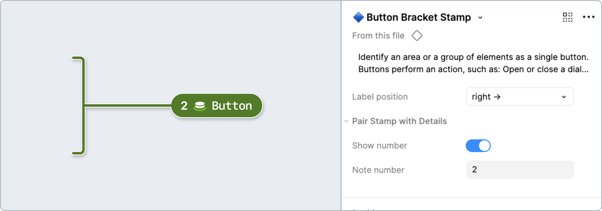
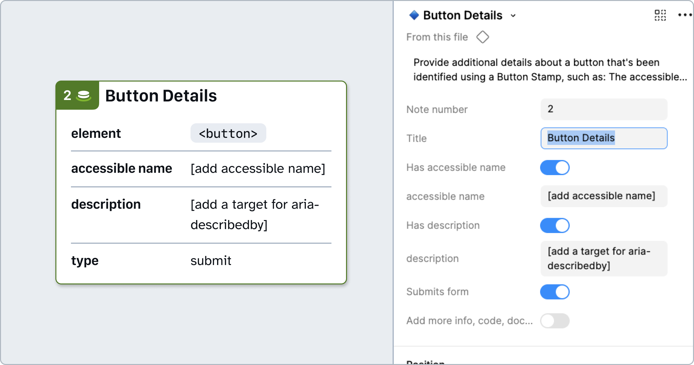

# How to: **Button**
Interactive elements that perform an action such as: open or close a dialog, submitting a form, progressing through a work flow, and toggling the expanded or collapsed state of a component.

## Why?
Buttons help make all of our designs function, but if they’re created without care, they can prevent people from doing what they need to do. They’re not interchangeable with Links, which primarily function as navigation rather than to activate an action.

There’s a great deal of functionality that comes with a native `<button>` element which is difficult to recreate manually. A custom button control must behave in the same expected ways, including:

* Activated with the Space and Enter keys.
* Show the default arrow cursor on hover.
* Appear in a screen reader’s list of all buttons on a page.
* Do not allow the user to conduct the action in a new tab.
* Do not allow the user to track their history of actions.
* Do not work with the browser’s back and forward buttons.

Screen readers show a menu of all buttons on a page to help users understand what functions can be performed. This is one of the reasons unique button labels are important.

## Button Stamps and Details

### [Annotation Tiers](https://github.com/github/annotation-toolkit/blob/main/deep-dives/tiered-model.md)
- Difficulty Tier 1: **Easy**
- Priority Tier 1: **Mandatory**

### How to use these annotations

1. ​Add a **Button Stamp** component from the asset panel. Place the stamp over the design frame and resize to extend pin, bracket, or lasso. Configure the component properties as needed:
- **Label position:** Set based on Stamp’s placement relative to the element being annotated.
- **Show number:** Toggle off if there’s no need for a matching Details annotation (in which case, skip step 2).
- **Note number:** Set this number in relative sequence with the other numbered Stamps placed over the same design.

2. ​Place a **Button Details** component in the margins next to the design and configure the component properties as needed:
- **Note number:** Set this to match the corresponding **Button Stamp**. This number should be unique and in relative sequence with other Details annotations on the same design.
- **Accessible Name:** Programmatic label for the button when the visible text is insufficient. This can be implemented as an `aria-label`, `aria-labelledby`, or through `visually-hidden` (or `“sr-only”`) styling.
- **Description:** Specify a target for `aria-describedby` if needed. For instance, when a notification button label shows that there are new notifications, and a tooltip reveals details about quantity or content.
- **Submits form:** Adds a semantic attribute to the element when data should be submitted to the server.

> [!Note]
> There is also a Primer A11y Preset annotation for buttons which may offer additional helpful options when using Primer Web components.

---

## Design considerations

- What interface elements are buttons?
- If a button includes visuals, do they need to be described?
- Is your button performing an action? Or is it taking the user somewhere? If it is the latter, consider whether it should be a link.
- Are there multiple buttons with the same visible label?  
- Does it submit a form?  
- Does the button convey the state of the action or feedback such as success or failure?

## Resources

- ​[​Links and Buttons - Primer design guidance](https://primer.style/accessibility/design-guidance/links-and-buttons/)
- [Links and Buttons Overview - University of Washington](https://www.washington.edu/accesstech/checklist/links-buttons/)
- [Getting To The Bottom Of Minimum WCAG-Conformant Interactive Element Size - Smashing Magazine](https://www.smashingmagazine.com/2024/07/getting-bottom-minimum-wcag-conformant-interactive-element-size/)
