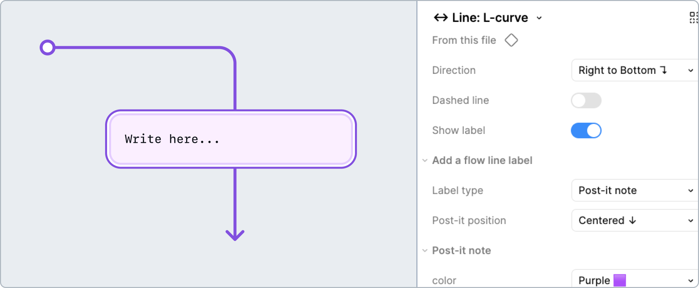

# How to: **Flow lines**

Flow lines can help organize design canvases. These components have robust labels for various scenarios to help designers clearly communicate the full range of platform functionality, validation states, and user interactions.

## Why?

Annotating design interactions and gestures with flow lines can help:
- Keep Figma canvases organized
- Label various types of interactions, such as:
    - Touch gestures
    - Mouse actions
    - Platform functions
    - Device settings
- Highlight accessibility features in design, allowing more people to interact with the feature
- Give clear guidance to developers on how users will interact with designs

## Flow lines: Straight, L-curve, S-curve and U-curve

### Label types

#### Post-it note (default)

Post-it notes are best for short, quick annotations. The color of the post-it can be customized as well as the content.

#### Manage focus

Indicates that focus is deliberately managed through code to support accessible navigation and user experience.

#### Error state

Error states refer to a documented visual and behavioral representation for when something goes wrong. The error can be due to an invalid input, system failure, failed user action, and more.

#### Warning state

Informs about a potential issue or consequence as the result of an action.

#### Success state

The visual and behavioral feedback shown when a user’s action is completed successfully.

#### Info state

Highlights important information that has an influence on the current view or offers an action.

#### Live region announcement

Live regions are parts of a webpage that are monitored for dynamic content updates. They “listen” for these updates and announce the changes to assistive technologies like screen readers, allowing everyone to stay informed in real time.

#### Keyboard shortcut

Clearly labels a pre-set or custom combination that a user presses on a keyboard to initiate an action, such as selecting a menu item, copy/paste text, and refreshing the page.

#### Touch gesture

Touch gestures identify what user action is required especially for touch screens.

#### Mouse action

The mouse action label highlights an action performed with a mouse, such as clicking, double-clicking, right-clicking, or scrolling. 

#### Device setting

Device settings refer to preferences or configurations that a user sets at the system or device level to customize how content is displayed or how interactions behave. 

#### Platform function

A built-in capability of an operating system or application that supports an interaction or accessibility features. 

### How to use these annotations

1. Place a **❖ Flow line Stamp** component over the design (Straight, L-curve, S-curve, or U-curve). Resize and position it on the canvas as needed.
- **Direction:** Specify both the origin direction and the direction that the arrow points. For example, left to right, right to bottom, etc.
- **Dashed line:** Toggle the stroke style of the line.
- **Show label:** Enable if a label is needed to convey more context from one frame to another.

2. If you need to convey more specific context than a general note (state, announcement, interaction, or managed focus), select it from the **Label type** options.
- **Show Post-it:** If the label type is not a post it, toggling "Show post it" on will attach a post-it note below the label in order to help add some more context.
    - **Post-it position:** If Show Post-it is enabled, this allows the note to be shifted from a Centered position to the Left or Right. Helpful in the event that labels overlap key visuals.

3. Configure additional label properties as needed. Keyboard shortcuts, touch gestures, mouse actions, device settings, platform functions all have complex configurations.

