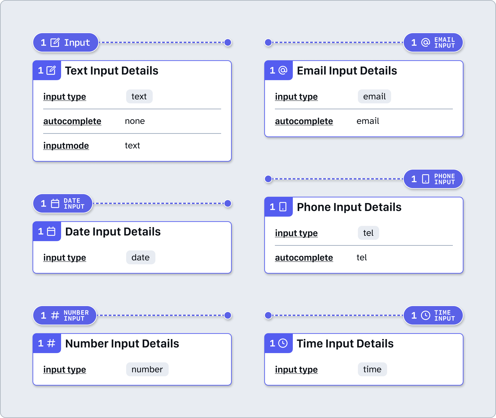
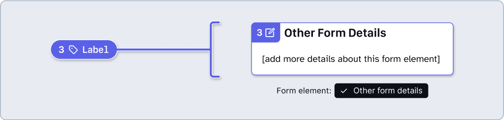

# How to: Form elements

Form elements allow us to capture information from people. HTML includes a flexible set of fields that we can use for different scenarios.

## Why?

When we need people to provide information, we can use form elements to capture this information. Visually, text elements should be designed with affordances that people are familiar with, and are consistent with their expectations. Form elements must have a role that matches their purpose and design, so that people using screen readers are able to understand the purpose of the element.

HTML provides a series of different form elements by default, all of which have different accessibility considerations baked in to them. If we were to create custom form elements, they must convey similar semantic information and be usable with assistive technologies, these considerations include:
- Form elements must have a visible label, to describe the required information.
- Form elements must have an accessible name that includes the visible label.
- The elements must have an appropriate role that matches their purpose and intended use.
- Where appropriate, elements that can visually convey different states, must programmatically convey this information too (this is typically done using ARIA attributes).
- Form elements must receive focus and be usable with only a keyboard.

## Form element Stamps and Details

### [Annotation Tiers](https://github.com/github/annotation-toolkit/blob/main/deep-dives/tiered-model.md)
- Difficulty Tier 2: **Moderate**
- Priority Tier 1: **Mandatory**

### Common properties

Form element annotations have many variants. Many of them have the same set of properties shared between them. 

- **autocomplete**: Inputs that collect personal information about a user must use the relevant autocomplete attribute, so that people can easily determine the requested information.
- **inputmode**: The inputmode can be changed to display different virtual keyboards which might be more relevant to the requested information (for example, using `inputmode="numeric"` would display a keyboard with only number keys, which might be useful for entering number values).
- **required**: Active by default. This specifies that an element is mandatory and must be provided with a value before the form can be successfully submitted.
- **Has error validation?**: Since required is active by default, this is as well. This reveals an **error message** property for cases where the element’s validation has not been met. 

### Advanced mode

Form element annotations are flexible and complex, allowing you to add constraints that help make sure you are capturing valid information. For less common use cases, the Advanced Mode toggle can be activated to reveal additional attributes and properties.

#### Properties
Many of these are shared between different types of form elements, while certain form elements have unique properties, listed in their own subsequent element description.
- **​size**: Visually changes the width and height of the input to match the specified number of characters
- **step**: Specifies the configuration for values that can be selected between the minimum and maximum.
- **pattern**: Accepts a regular expression which can be used to check that user entered content is valid.
- **description**: Specify a text element which should be announced by screen readers when announcing the input, to help provide additional information.
- **disabled**: Enable to specify that the element should not be interactive. *Caution: this may cause issues with assistive technologies. It may be better to use the **aria-disabled** attribute instead to ensure that the element is still discoverable by assistive technology.*

### Form elements
When creating an interactive form using these elements, make sure your annotations also include a **❖ Landmark Stamp** for the `<form>` element.

#### Text Input

Text inputs allow the user to enter any text or number. Depending on the purpose of the input field, you may want to select one of the specific **❖ Form Element Details** variants:
- `​Email Input`
- `​Number Input`
- `​Telephone Input`
- `​Date Input`
- `​Time Input`

These details variants will automatically specify the correct `input type`, and where relevant, the expected `autocomplete` attribute.

**Advanced Mode** can be toggled on to reveal additional rarely-used properties, some of which are unique to text input: 
- **​size**
- **maxlength**: The maximum number of characters that can be entered in to the field. Most browsers prevent entry after the maximum has been reached.
- **minlength**: The minimum number of characters that should be entered in to the field. *Note: the browser does not enforce this pattern like it does with maxlength.*
- **pattern**
- **disabled**

#### Textarea

Textarea elements share similarities with text inputs, but can span multiple lines, allowing for longer content. 
Textarea Details has a number of specific properties:
​- **autocomplete**
- **inputmode**

**Advanced Mode** can be toggled on to reveal additional advanced input options:
- **cols**: Sets the visible width of the textarea element using the average character width.
- **rows**: Sets the number of visible text lines.
- **description**
- **disabled**

#### Label
All form fields must have a label, so that people can determine the information that is required. The label text should be clear, to the point, and easy to understand.
The label is always visible so that everyone can see it, positioned appropriately in relation to the input field.
If additional information needs to be added, use the `Other form details` variant of **❖ Form Element Details**.

#### Fieldset

Fieldsets are used to group multiple controls. This means that they're commonly used for grouping checkboxes or radio buttons under a single question.

Fieldsets need to have an accessible name, and the easiest way to do this is to include the question text as a legend element. When marked up correctly, the group will use the legend's content as the accessible name for the group. This information will be announced by screen readers.

The Fieldset has a number of specific properties:
- **​Has `<legend>`**: Enable this to add a **legend**. Most fieldsets should use a legend as they provide answer groups with an accessible name, in a way that is easily available to everyone.
- **Radiogroup?**: The implicit role of a fieldset element is group. However, if you're creating a custom fieldset-like grouping, you can specify `radiogroup` to convey that only a single option from the group should be selected.

 and Radiogroup? properties have both been toggled on." width="557">

#### Legend

Legend elements are mostly used as a way of captioning fieldset groups. The legend's content should be the question that the controls in the fieldset are used to answer.
When navigating to the fieldset's controls with a screen reader, if marked up correctly, the legend's content will be announced to provide sufficient context.
If additional information needs to be added, use the `Other form details` variant of **❖ Form Element Details**.

#### Checkbox

In general, checkboxes are used when there are multiple answers that can be provided for the same question. Alternatively, they might be used when people are required to explicitly opt-in to, agree or confirm something.

The Checkbox Details has the following specific property:

- **​checked**: Enable to specify that the checkbox should be checked by default

#### Radio

Radio inputs are intended for use when there are multiple answers that could be provided, but only one should be selected.

Radio buttons which are part of the same set of answers, should be wrapped in a group, ideally a fieldset, with the question provided using a legend.
The Radio Button Details has the following specific property:

- **​checked**: Enable to specify that the radio button should be checked by default

#### Select

Select elements are used to provide a number of options that someone can select from.

In general, radio buttons are a better choice when displaying a small number of options, as they will all remain visible. However, select elements are better for larger number of options, such as a list of countries.

The Select Input Details has a number of specific properties:
- **​autocomplete** 
- **description**

), required set to true, autocomplete set to country-name, and description references an element’s id attribute." width="557">

#### Range

Range inputs are used to specify a number value on a scale. Typically, range inputs are rendered as a slider, with the user using the thumb element to select a value. Range has a number of specific properties:
- **value**: Sets the currently selected numeric value on the range input.
- **min**: Specifies the minimum possible numeric value.
- **max**: Specifies the maximum possible numeric value.

**Advanced Mode** can be toggled on to reveal additional rarely-used properties, some of which are unique to range input: 
- **​step**: Specifies the configuration for values that can be selected between the minimum and maximum.
- **Vertical?**: When enabled, this shows the `writing-mode` attribute which specifies that the range input should be rendered vertically, as opposed to horizontally (which is the default).
- **description**
- **Tick marks**: Set the `datalist` values and labels that should appear alongside the range input, as tick marks.

#### Hint

Inputs that require complex information, or a specific format, may benefit from providing a hint. This is separate from the label or input, and can be programmatically related to the input. When it receives focus, the hint information is announced by screen readers. 

If additional information needs to be added, use the `Other form details` variant of **❖ Form Element Details**.

#### Other form details

If additional information needs to be added to a Label, Hint, Legend, or any other part of a form, use this variant.

## How to use these annotations

1. ​Add a **❖ Form Element Stamp** component from the asset panel. Place the stamp over the design frame and resize to extend pin, bracket, or lasso. Configure the component properties as needed:
- **Label position**: Set based on Stamp’s placement relative to the element being annotated.
- **Form element**: Set based on the form element that’s been used in the design. 
- **Show number**: Toggle off if there’s no need for a matching Details annotation (in which case, skip step 2).
- **Note number**: Set this number in relative sequence with the other numbered Stamps placed over the same design.

2. ​Place a **❖ Form Element Details** component in the margins next to the design and configure the component properties as needed:
​- **Note number**: Set this to match the corresponding **❖ Form Element Stamp**. This number should be unique and in relative sequence with other Details annotations on the same design.
- Set any relevant common form element properties, advanced mode properties, or unique element properties listed in the previous section.

## Design considerations 

- Is the input optional?  
- Is there a specific virtual keyboard (`inputmode`) that is needed?  
- What data should the browser `autocomplete`?  
- Is it important that the input only use a certain number of alphanumeric characters? What is the `maxlength` or `size` of the input?  
- Does information need to follow a specific format, and if so, is there a pattern that could be used?
- Which sets of radio buttons and checkboxes should be grouped in a fieldset?
- Does every input field have a visible label?
- Are all labels clear and easy to understand?
- Do error messages provide enough information for people to be able to understand that there’s an error present?
- Do error messages provide enough information for people to resolve the issue themselves, if possible?

## Resources

- [​Form pattern documentation - Primer](https://primer.style/product/ui-patterns/forms/)
- [Forms Tutorial - W3C Web Accessibility Initiative](https://www.w3.org/WAI/tutorials/forms/)
- [Create accessible forms - A11y Project](https://www.a11yproject.com/posts/how-to-write-accessible-forms/)
- [Structuring Accessible Forms - Rachel DiTullio](https://racheleditullio.com/blog/2021/09/structuring-accessible-forms/)
- [Creating Accessible Forms - WebAIM](https://webaim.org/techniques/forms/controls)
- [Don’t use the placeholder attribute - Smashing Magazine](https://www.smashingmagazine.com/2018/06/placeholder-attribute/)
- [Provide helpful error messages - Harvard University](https://accessibility.huit.harvard.edu/provide-helpful-error-messages)
- [Foundations: fieldset and legend - TetraLogical](https://tetralogical.com/blog/2025/01/31/foundations-fieldset-and-legend/)
- [Foundations: form validation and error messages - TetraLogical](https://tetralogical.com/blog/2024/10/21/foundations-form-validation-and-error-messages/)
