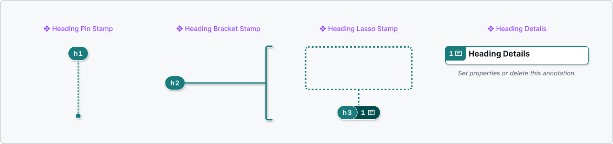
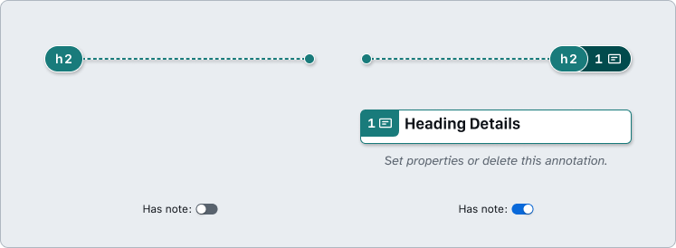
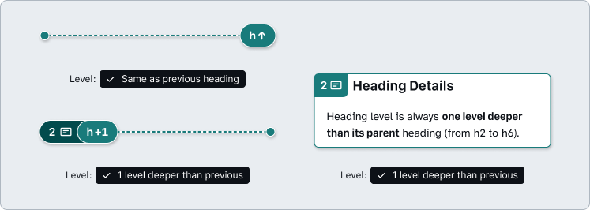
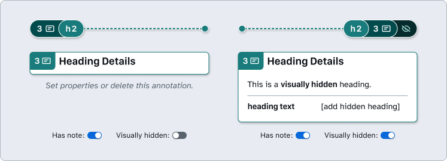
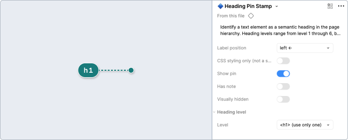
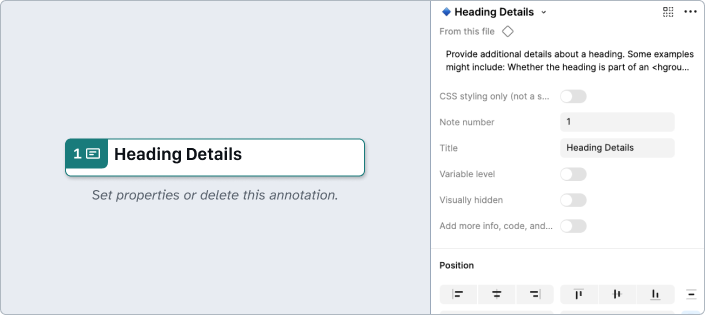
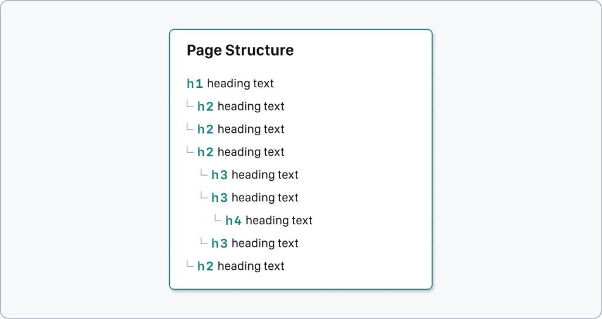

# How to: **Heading**

Headings allow us to create structure within a page’s content by establishing hierarchy through HTML semantics, or in rare cases, through custom code.

## Why?

Headings provide a way for people to scan content and determine what information might be present. When marked up correctly, headings can be used by everyone to better understand the information on a page and its structure.

HTML heading elements (`<h1>` through to `<h6>`) provide semantic information by default. Any custom headings must communicate the same information, including:

- Communicate that the content has a `role` of `heading`
- Communicate an appropriate level, using `aria-level`

## Heading Stamps and Details

### [Annotation Tiers](https://github.com/github/annotation-toolkit/blob/main/deep-dives/tiered-model.md)
- Difficulty Tier 1: **Easy**
- Priority Tier 1: **Mandatory**

### Properties

#### Heading level

**Required**. The rank or importance of a heading within a document’s structure. Conveys hierarchy and content grouping. 

- `​​<h1>` to `<h6>` helps map text to appropriate heading levels. 
- All pages **require** an `<h1>`, and should have only one. Ideally, it corresponds to the page `<title>` as well.
- Since the Stamp label has a number that corresponds to the heading level, you can activate the **Has note** property to reveal a **Note number** when additional details are needed.

### Additional heading level options

Useful options when there is a lack of control over structure, such as when annotating a new design system component or working with content that’s user-generated or data-driven:

- **​1 level deeper than previous** (or **h+1**) conveys that the heading level will always be one deeper than the previous heading. 
- **Same as previous heading** (or **h↑**) means that the heading level should match the previously used heading level.

### Visually hidden

Enable when a heading should be used to provide necessary context for people using screen readers, but not for sighted users.

Always pair with **❖ Heading Details** (with **Visually hidden** activated as well) to annotate what the **heading text** would be.

### CSS styling only (not a semantic heading)

For instances where the heading is not intended to be part of the page's hierarchy and should only appear visually as a heading.

**Use these rarely** as they can cause confusion for users.

The Details variant may not be required if there’s no additional context to add and the Stamp’s meaning is well understood.

 element. " src="Images/css-styling-only-heading-properties.png" width="679">

### How to use these annotations

**1.** ​Add a **❖ Heading Stamp** component from the asset panel. Place the stamp over the design frame and resize to extend pin, bracket, or lasso. Configure the component properties as needed.

- **Label position**: Set based on Stamp’s placement relative to the element being annotated.
- **CSS styling only**: Use this rarely. Enable if the heading is not part of the page's hierarchy, and should only appear visually as a heading
- **Has note**: Toggle on if there’s a need to include additional context through a Heading Details annotation. Otherwise, you can skip to Step 2.
    - **Note number**: Set this number in relative sequence with the other numbered Stamps placed over the same design.
- **Visually hidden**: Enable when a heading should be used to provide necessary context for people using screen readers, but not for sighted users.
- **Level**: Changes the heading element used. Make sure that no levels have been skipped.

**2.** ​If the **❖ Heading Stamp** is using the **Has note** property, place a **❖ Heading Details** component in the margins next to the design and configure the component properties as needed.

- **CSS styling only**: Use this rarely. Enable if the related heading is not part of the page's hierarchy and should only appear visually as a heading
- **Variable level**: Enable if the heading is likely to change depending on the surrounding context in order to better maintain the content's hierarchy. (Note: the Heading Stamp level property should be set to “1 level deeper than previous”) 
- **Visually hidden**: Enable for instances where a heading should be used to provide additional context to people using screen readers (but is otherwise visually hidden).
- **Note number**: Set this to match the corresponding ❖ Heading Stamp. This number should be unique and in relative sequence with other Details annotations on the same design.

## Page structure

The hierarchy of the page's content can be inferred by use of heading levels. For example, if a `<h1>` is followed by a `<h2>`, the `<h2>` content will be related to the `<h1>` content. If we had content that was specifically related to the `<h2>`, we could then use a `<h3>` to create a hierarchy and make it clear as to how the content is structured.

For this reason, it's important that a clear hierarchy is maintained throughout content. Heading elements shouldn't be used for styling purposes alone. Instead, use CSS to change the appearance of the correct heading element. Similarly, it's also why heading levels should not be skipped as this might confuse people.

### [Annotation Tiers](https://github.com/github/annotation-toolkit/blob/main/deep-dives/tiered-model.md)
- Difficulty Tier 1: **Easy**
- Priority Tier 1: **Mandatory**

### How to use these annotations

Place a **❖ Page Structure** component in the margins next to the design and configure the component properties as needed:
 
1. ​Toggle the **Show guidance** property if the additional high level guidance and resources aren’t needed.
2. Optionally update the **Title** field. 
3. Optionally use the **Show description** property to add a description for the page structure itself.
4. Configure the page structure to include all headings (whether visible or hidden). Remember not to skip levels.
    1. Select the appropriate **level** for the content and place within the page hierarchy. 
    2. Provide **text** for what each heading is.
    3. Toggle whether or not a heading is **visually hidden**.

> [!NOTE]
> **You can safely detach this component!** If you need more rows than are included by default in order to show the page structure, you can add more by detaching the component (<kbd>**⌥⌘B**</kbd>). Then you can duplicate the **Page structure item** rows.

---

## Design considerations

- Do the headings in the page maintain a clear hierarchy?
- Have any heading levels been skipped?
- Is heading content clear and easy to understand?
- Are there any sections of the page that would benefit from an additional heading?
- Are there any sections that would benefit from a visually hidden heading to make navigation easier for people using a screen reader?

## Resources

- [​How to: Accessible heading structure - A11y Project](https://www.a11yproject.com/posts/how-to-accessible-heading-structure/)
- [Foundations: headings - TetraLogical](https://tetralogical.com/blog/2022/02/28/headings/)
- [Priority Guides - A List Apart](https://alistapart.com/article/priority-guides-a-content-first-alternative-to-wireframes/)
- [Page Region tutorial - Web Accessibility Initiative (W3C)](https://www.w3.org/WAI/tutorials/page-structure/regions/)
- [HeadingsMap browser extension](https://www.accessibility-developer-guide.com/setup/helper-tools/browser-extensions/headingsmap/)
