# How to: Landmark
Mark important sections of a page and name them to so users can understand their specific purpose in navigating a page. 

## Why?
In every day life, we give context via landmarks. “Do you know where the hospital is on ______ street?” Web pages work the same way. Landmarks help screen reader users quickly scan and move to various sections of a webpage. For example, a `<footer>` landmark makes it easier to find the navigation links at the bottom of a page without moving through the whole website to search for it.

> [!TIP]
> If you are designing a new experience within GitHub.com, you may not need to annotate landmarks for areas of a design that aren’t changing (such as the banner area, header, and main navigation).

> [!CAUTION]
> Avoid overuse of landmarks to prevent clutter. Hearing 10 or more landmarks announced on a screen reader can be overwhelming and make it hard for a user to map a mental model. 

## Landmark Stamps and Details

### [Annotation Tiers](https://github.com/github/annotation-toolkit/blob/main/deep-dives/tiered-model.md)
- Difficulty Tier 2: **Moderate**
- Priority Tier 2: **Ideal**

### Elements

The labels and properties of Landmark annotations prioritize semantic HTML elements over implementations that use aria `role`. If you need the latter, you can toggle the **Show role** property.

#### \<header>

Identifies introductory content or site-wide information, such as branding or logos. It is usually positioned at the top of the page.
- **accessible name** is optional.
- **role** is set to `banner`.

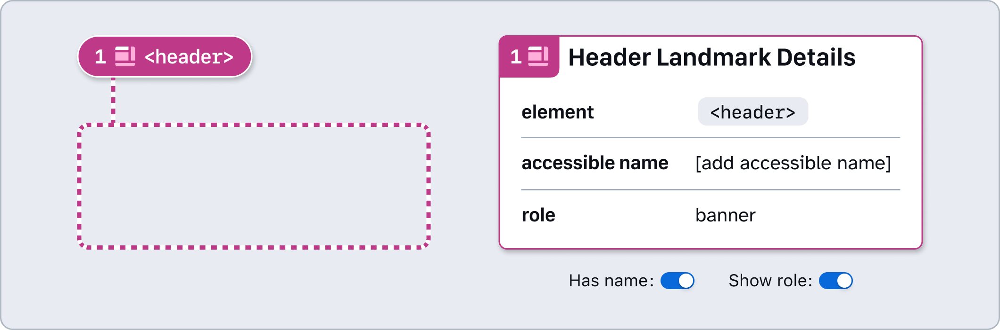

#### \<nav>

Identifies a section of the page containing links to other parts of the site or page, helping users quickly access key areas for browsing.
- **accessible name** is **required** and must be unique. Avoid including the word “navigation” or “nav”, as this will be announced based on the element/role. 
- **role** is set to `navigation`.

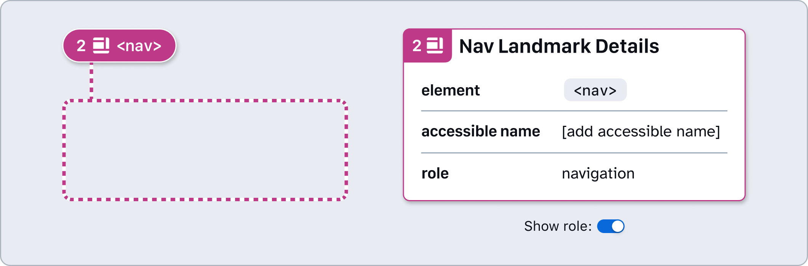

#### \<search>

Identifies the site’s search functionality. This allows all users to quickly locate and operate site-wide or page-specific search tools.
- **accessible name** is **required** and must be unique. 
- **role** is set to `search`.

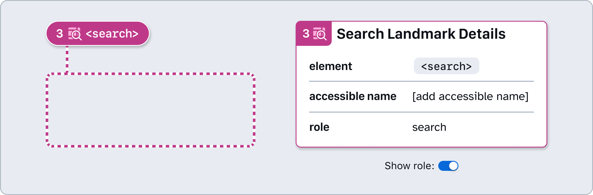

#### \<main>

Contains the central content unique to the page between its header and footer. It allows assistive technologies to quickly identify and navigate to the primary content area. 
- There should only be one `<main>` landmark per page. It should not be contained within another landmark. 
- An accessible name is not needed.
- Skip links, which are used to bypass repetitive content, are often anchored to the `<main>` element. 
- **role** is set to `main`.

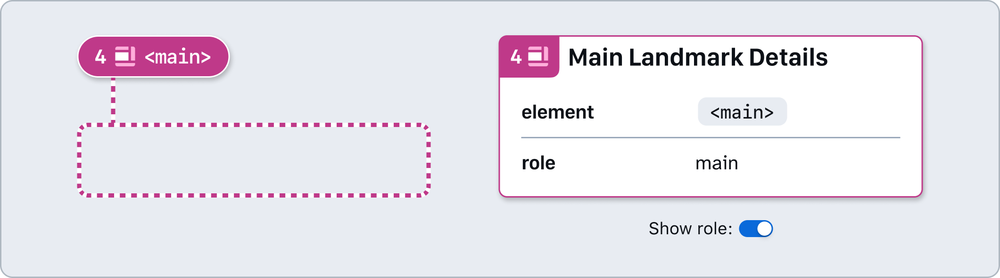

#### \<section>

Defines a stand-alone group of elements and content. It is typically introduced by a **heading** to help organize a page into meaningful, logical parts. 
- **accessible name** is **required** and must be unique. Consider referring to the `section`’s heading as the accessible name.
- **role** is set to `region`. 

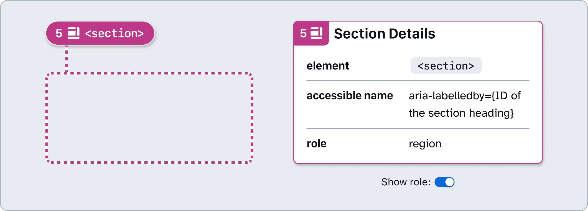

#### \<form>

Region that contains a collection of items and objects that, as a whole, combine to create a form when no other landmark is appropriate.
- **accessible name** is encouraged to help users understand the  form’s purpose, but required if multiple forms are on a page.
- **role** is set to `form`. 

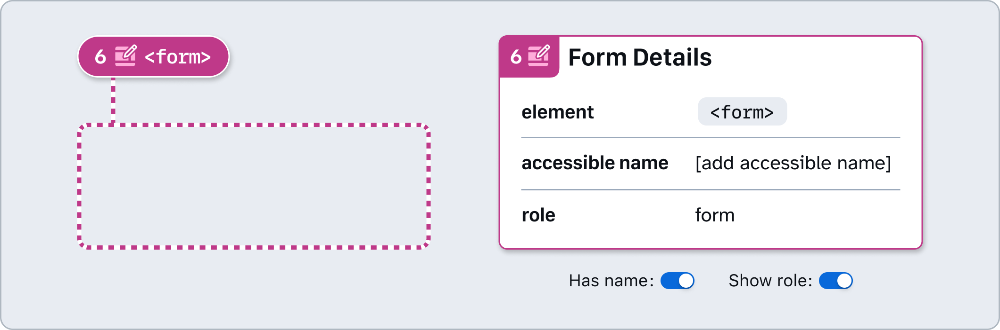

#### \<aside>

Supporting section for main content, yet remains meaningful on its own. Often used for sidebars and content callouts. 
- **accessible name** is encouraged for all asides, and is **required** when multiple aside landmarks appear on a page. 
- **role** is set to `complementary`.

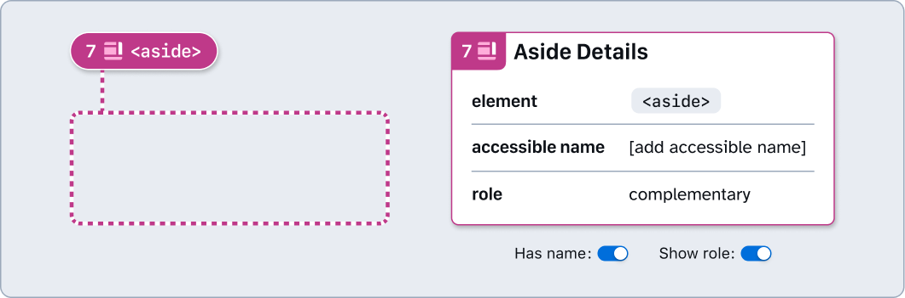

#### \<footer>

Identifying common information at the bottom of each page, typically the “footer” of the page.  
- **accessible name** is optional.
- **role** is set to `contentinfo`.

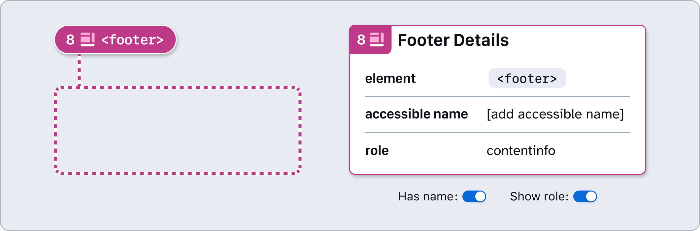

#### Custom landmark

A generic landmark container for content that is important enough that users should be able to navigate easily to this area. Can be helpful when a `
` element is needed rather than another semantic element that already has a **role** (proceed with caution).
- **element** is **required** and should match the stamp label.
- **accessible name** is **required** and must be unique.
- **role** is **required**.

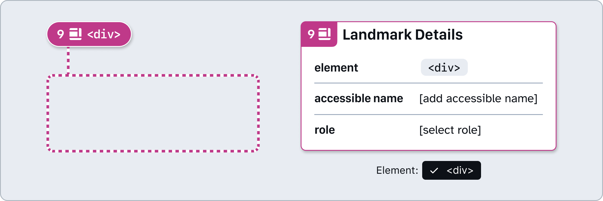

### How to use these annotations
1. ​Add a **❖ Landmark Stamp** component from the asset panel. Place the stamp over the design frame and resize to extend pin, bracket, or lasso. Configure the component properties as needed:
- **Label position**: Set based on Stamp’s placement relative to the element being annotated.
- **Show number**: Toggle off if there’s no need for a matching Details annotation (in which case, skip step 2).
- **Note number**: Set this number in relative sequence with the other numbered Stamps placed over the same design.
- **Element**: Select the landmark element to ensure the Stamp is paired and labelled correctly.

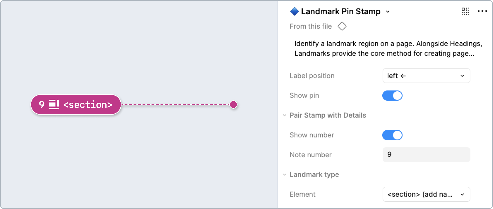

2. ​Place a **❖ Landmark Details** component in the margins next to the design and configure the component properties as needed:
- **Element**: Select the applicable landmark element. 
- **Has name**: Accessible name is shown by default for many landmarks, and only needs to be enabled for `<header>` or `<footer>` in rare circumstances.
    - **Accessible Name**: Programmatic label for the landmark to help users quickly navigate to it. Unique names help differentiate landmarks of the same type from one another.
- **Show role**: Only needs to be enabled for other landmarks when not using the recommended semantic HTML element.
    - **Role**: Select the appropriate [landmark role](https://developer.mozilla.org/en-US/docs/Web/Accessibility/ARIA/Reference/Roles/landmark_role). This is set for many landmarks using the semantic element, but vital if using a custom landmark (especially when set to use the `
` element).
- **Note number:** Set this to match the corresponding **❖ Landmark Stamp**. This number should be unique and in relative sequence with other Details annotations on the same design.

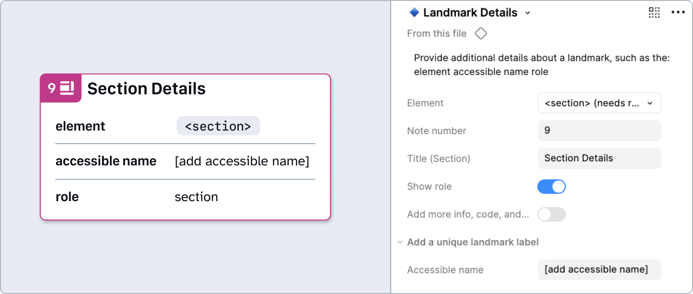

## Design considerations
- Have all regions of the page been identified? 
- Does each landmark have a clear and unique purpose defined by the role and accessible name?
- Are there any redundant landmarks that are cluttering the page layout?
- In the case of multiple landmarks, do they each have unique and accessible names? For example, main navigation and secondary navigation.

## Resources

- [​Landmark roles - MDN](https://developer.mozilla.org/en-US/docs/Web/Accessibility/ARIA/Roles/landmark_role)
- [Foundations: Landmarks - TetraLogical](https://tetralogical.com/blog/2022/03/18/landmarks/)
- [Semantic Structure: Regions, Headings, and Lists - WebAIM](https://webaim.org/techniques/semanticstructure/)
- [WAI-ARIA landmarks - W3C](https://www.w3.org/WAI/ARIA/apg/)
