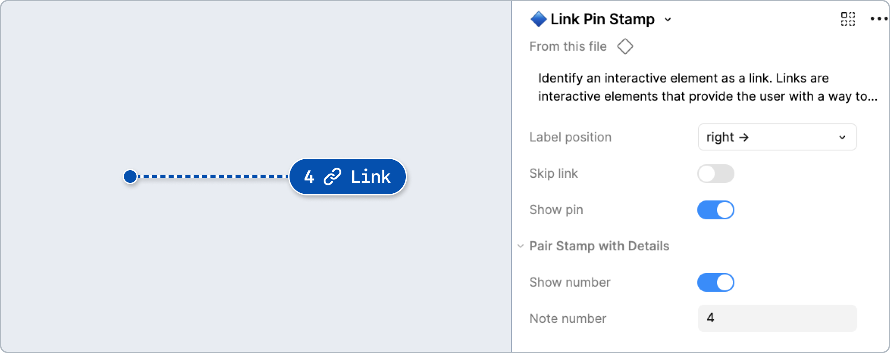
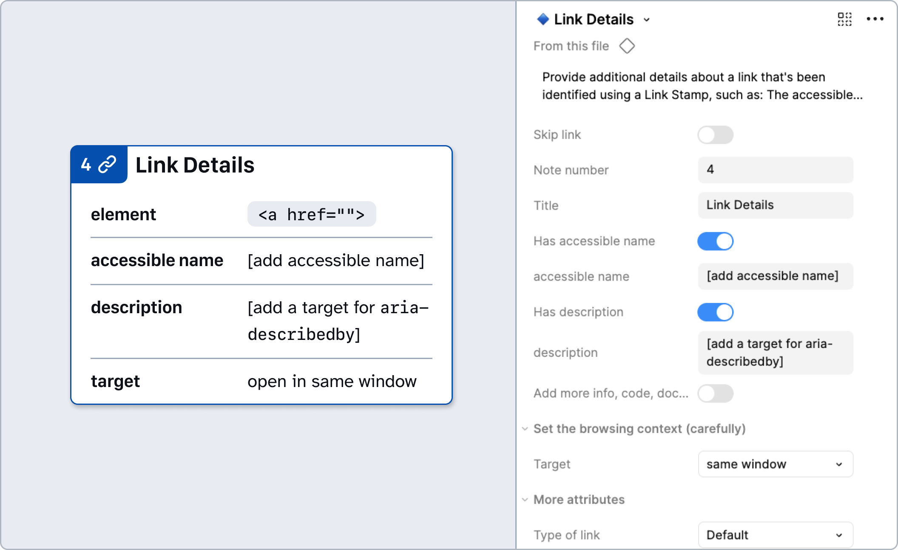

# How to: **Link**

Links are interactive elements that provide the user with a way to navigate: a section of the same page, a different page within the same website or to a new website, a different to a resource such as a PDF or image, a user's phone app to quick dial a number, or a user's application to start a new message.

## Why?

Links are the backbone of the web. They’re not interchangeable with Buttons, which primarily control actions rather than navigation.

The semantic `<a>` element provides a lot of functionality and information for users. Any custom link controls must behave in the same expected ways, including: 

- Navigate to the destination.
- Update the browser's address field, page title, and focus.
- Open the destination in a new window/tab whether hard coded or the native browser option is used.
- Able to be activated with the Enter key, but not the Space key. The Space key should scroll the page.
- Allow the destination/URI to be copied and bookmarked in the browser.
- Appear in a screen reader’s list of all links on a page.
- Automatically add where the user has been in their browser’s history.
- The browser’s back and forwards buttons function as expected.
- Communicate a visited state when users have already been to the destination.

## Link Stamps and Details

### [Annotation Tiers](https://github.com/github/annotation-toolkit/blob/main/deep-dives/tiered-model.md)
- Difficulty Tier 1: **Easy**
- Priority Tier 1: **Mandatory**

### Variants

#### Skip link

Allow users to bypass repetitive content and jump directly to specific sections of a page. 

Skip links help keyboard (and screen reader) users bypass blocks of content that are repeated across pages. 

Make sure skip links have a clear destination, such as the main landmark region.

### How to use these annotations

**1.** ​Add a **❖ Link Stamp** component from the asset panel. Place the stamp over the design frame and resize to extend pin, bracket, or lasso. Configure the component properties as needed:
  - **Label position:** Set based on Stamp’s placement relative to the element being annotated.
  - **Skip Link:** Toggle if this link is only visible on focus and helps keyboard users bypass repetitive content.
  - **Show Number:** Toggle off if there’s no need for a matching Details annotation (in which case, skip step 2).
  - **Note number:** Set this number in relative sequence with the other numbered Stamps placed over the same design.

**2.** ​Place a **❖ Link Details** component in the margins next to the design and configure the component properties as needed:
  - **Note number:** Set this to match the corresponding **❖ Link Stamp**. This number should be unique and in relative sequence with other Details annotations on the same design.
  - **Accessible Name:** Programmatic label for the link when the visible text is insufficient. This can be implemented as an `aria-label`, `aria-labelledby`, or through `visually-hidden` (or `“sr-only”`) styling.
  - **Description:** Specify a target for `aria-describedby` if needed.
  - **Target:** Defaults to same window. Can be changed to new window for use cases when it’s essential, such as when avoiding form data loss. This option should be used rarely.
  - **Type of Link:** Use the `Telephone number`, `Email address`, or `Downloadable` options to add semantics that ensure these types of links operate properly.
  - **Destination (skip link only):** Enter the element ID or name of section the skip link should point to.

---

## Design considerations

- What design element is a link?  
- Does it have a visual or icon that conveys meaning?  
- Does it open in the same or new tab?
- Does it download a file or open an app?
- Is it a linked image? What alt text would describe the destination?
- Are there multiple links with the same visible label? How can they be differentiated?

## Resources

- [Links and Buttons - Primer design guidance](https://primer.style/accessibility/design-guidance/links-and-buttons/)
- [Links and Buttons Overview - University of Washington](https://www.washington.edu/accesstech/checklist/links-buttons/)
- [Understanding SC 2.4.4 Link Purpose (In Context) - WCAG](https://www.w3.org/WAI/WCAG22/Understanding/link-purpose-in-context)
- [Link Pattern - ARIA Authoring Practices Guide (APG)](https://www.w3.org/WAI/ARIA/apg/patterns/link/)
- [Providing Accessible Names and Descriptions - ARIA Authoring Practices Guide (APG)](https://www.w3.org/WAI/ARIA/apg/practices/names-and-descriptions)
- [Avoid generic link text - erblint-github (Internal only)](https://github.com/github/erblint-github/blob/main/docs/rules/accessibility/avoid-generic-link-text.md)
- [A Few Things About the Anchor Element’s href You Might Not Have Known - Jim Neilson](https://blog.jim-nielsen.com/2025/href-value-possibilities/)
- [Functional Images - W3C WAI Tutorials](https://www.w3.org/WAI/tutorials/images/functional/)
- [Getting To The Bottom Of Minimum WCAG-Conformant Interactive Element Size - Smashing Magazine](https://www.smashingmagazine.com/2024/07/getting-bottom-minimum-wcag-conformant-interactive-element-size/)
- [Basic keyboard shortcut support for focused links - Eric Bailey](https://ericwbailey.website/published/basic-keyboard-shortcut-support-for-focused-links/)
