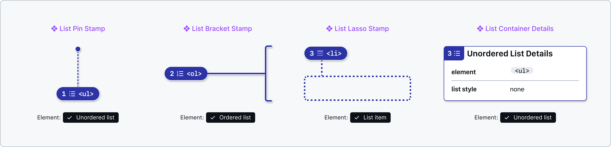
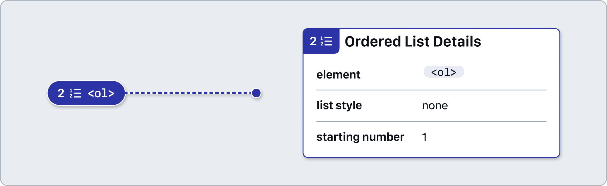
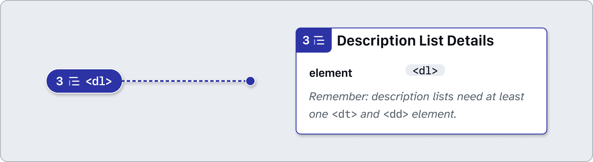
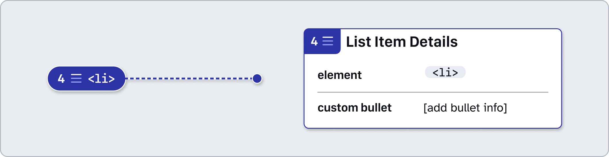
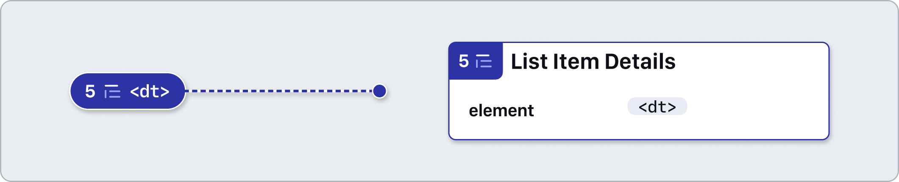
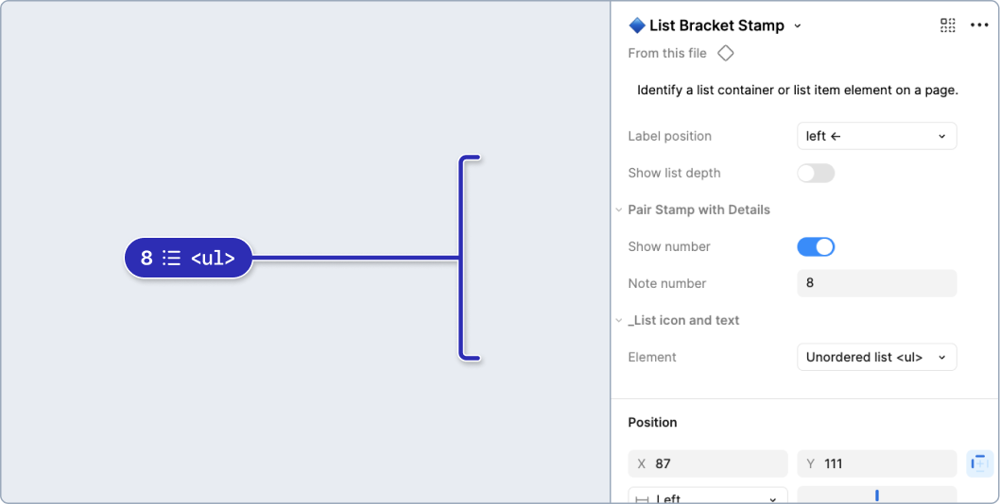
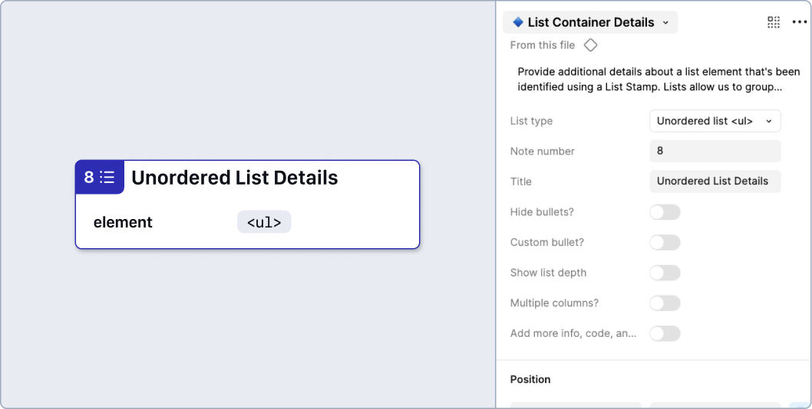
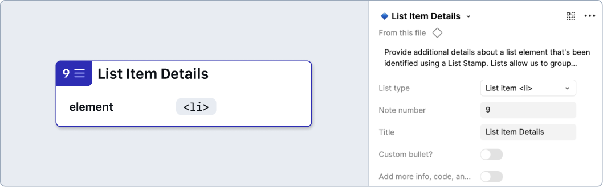
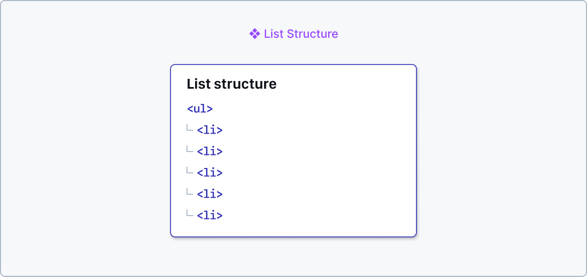

# How to: Lists
Lists allow us to group collections of related items. There are different varieties of lists that we can use depending on the type of relationship between list items. 

## List Stamps and Details

### [Annotation Tiers](https://github.com/github/annotation-toolkit/blob/main/deep-dives/tiered-model.md)
- Difficulty Tier 2: **Moderate**
- Priority Tier 2: **Ideal**

### Why?

Lists can communicate a group of related items. Visually, it can make the content easier to scan and understand, and when marked up correctly, they can inform people of the relationship between items in the list.

There are a few different types of lists that are provided in HTML, which communicate semantic information by default. If we were to create custom lists, they must convey similar semantic information, including:
- Communicate a list's parent, which will wrap individual list items, with a `role` of `list`
- Communicate individual list items with a `role` of `listitem`

 (using an unordered list element) and a note number set to 1. The second is a blue bracket stamp with a label of <ol> (using an ordered list element) and a note number set to 2. The third is a blue lasso stamp which has a white and blue dashed outline attached to it, a label of <li> (using a list item element), and a note number set to 3. The last is annotation is an Unordered List Details component (using an unordered list element) with a note number set to 4. It is a white rectangular panel with blue accents and information about the accessible name and HTML element." width="1012">

### List container types
#### Unordered list
The unordered list is used to display a list of items where the order does not have importance.
- **Hide bullets** - Enable if the default list’s bullets will be hidden.

 and the list style set to none. " width="557">

#### Ordered list
The ordered list is used to display a list of items where the order does matter, and items should be read in a linear order.
- **Hide numbering** - Enable if the default ordered list numbering should be hidden.
- **Starting number** - Used to specify an alternative starting number for the numbered list items.

, the list style set to none, and the starting number preset to 1." width="557">

#### Description list
Description lists are for groups of paired terms and accompanying descriptions.
- **Show Hint** - Enable to display a reminder that description lists need at least one description term and description details pair.

, and a reminder that description lists need at least one <dt> and <dd> element." width="557">

### List item types
#### List item
Anything in an unordered or ordered list must be marked up as a list item.
- **Custom bullet?** - Enable to specify information about **custom bullet** marks to be used for each list item.

 and a preset for displaying a custom bullet." width="557">

#### Description term
A term in a description list, which will be followed by a description.

" width="557">

#### Description details
The detailed information for a term in a description list.

" width="557">

### Nesting and sublists
#### Show list depth in Stamps

When using a list that is nested inside another list, you can activate the **Show list depth** property on the **❖ List Stamp** component as well as **❖ List Container Details**. 
Then, enter the **Nesting level** (starting from 1). List depth numbers must be sequential and follow the previous depth number, without skipping a level.

List depth can also be demonstrated using the **❖ List structure** component.

### How to use these annotations
#### List containers
1. ​Add a **❖ List Stamp** component from the asset panel. Place the stamp over the design frame and resize to extend pin, bracket, or lasso. Configure the component properties as needed:
- **Label position**: Set based on Stamp’s placement relative to the element being annotated.
- **Show Number**: Toggle off if there’s no need for a matching Details annotation (in which case, skip step 2).
- **Note number**: Set this number in relative sequence with the other numbered Stamps placed over the same design.
- **Show list depth**: Enable to specify the **Nesting level** of the related list.
- Identify a list *container* by selecting `Unordered List`, `Ordered List`, or `Description List` as the **Element**.
- Identify the list *items* by selecting `List item`, `Description term`, or `Description details` as the **Element**.

2. ​Place a **❖ List Container Details** component in the margins next to the design and configure the component properties as needed:
- **Note number**: Set this to match the corresponding **❖ List Stamp**. This number should be unique and in relative sequence with other Details annotations on the same design.
- **Custom bullet?** - Enable to specify information about custom bullet marks to be  used for each list item.
- **Show list depth** - Enable to specify the **Nesting level** of the related list.
- **Multiple columns?** - When a list is visually organized into columns, this boolean property will show an additional option:
    - **Reading flow** - Set the desired reading direction for list columns, either “Left to right first” or “Top to bottom first”

3. ​Place a **❖ List Item Details** component in the margins next to the design and configure the component properties as needed:
- **Note number**: Set this to match the corresponding **❖ List Stamp**. This number should be unique and in relative sequence with other Details annotations on the same design.
- **Custom bullet?** (`<li>` only) - Enable to specify information about custom bullet marks to be  used for each list item.

---

## List structure
The hierarchy of list content is based on how the lists are structured. Therefore it's important that the lists are structured correctly, so that people can clearly understand the grouping. For example, we can nest a list inside a list, as long as the nested list relates to one of the parent list's items. If we want to do this, we need to make sure that we start and end the nested list properly, so that the structure can be understood.

### [Annotation Tiers](https://github.com/github/annotation-toolkit/blob/main/deep-dives/tiered-model.md)
- Difficulty Tier 2: **Moderate**
- Priority Tier 3: **Nice to have**

## How to use these annotations

Place a **❖ List Structure** component in the margins next to the design and configure the component properties as needed: 
1. ​Toggle the **Show guidance** property if the additional high level guidance and resources aren’t needed.
2. Optionally update the **Title** field. This can help differentiate annotations when multiple lists are used in a single design. 
3. Optionally use the **Show description** property to add a **description** for the list itself.
4. Configure the list structure to include all levels.
    1. Select the appropriate **Element** for each list container and list item within the list hierarchy.
    2. The `Other element...` option can be selected to add other HTML elements as needed, as the contents within list containers and list items might include non-list elements.
    3. Select the appropriate **Nesting level**. Each list structure item must be appropriately nested.
    4. Provide a **description** for each item if more context is needed.

> [!NOTE]
> **You can safely detach this component!** If you need more rows than are included by default in order to show the list structure, you can add more by detaching the component (<kbd>**⌥⌘B**</kbd>). Then you can duplicate the **List structure item** rows.

## Design considerations

- Is it important which order the list items are read in?
- Are there components/widgets which would benefit from being a list, so that the number of items can be communicated to people using a screen reader?
- Does the grouping and structure of nested lists make sense?

## Resources
- [Content Structure - W3C Web Accessibility Initiative (WAI)](https://www.w3.org/WAI/tutorials/page-structure/content/#lists)
- [Lists - Home Office User-Centred Design Manual](https://design.homeoffice.gov.uk/accessibility/page-structure/lists)
