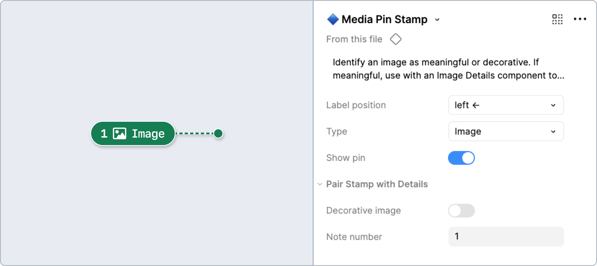
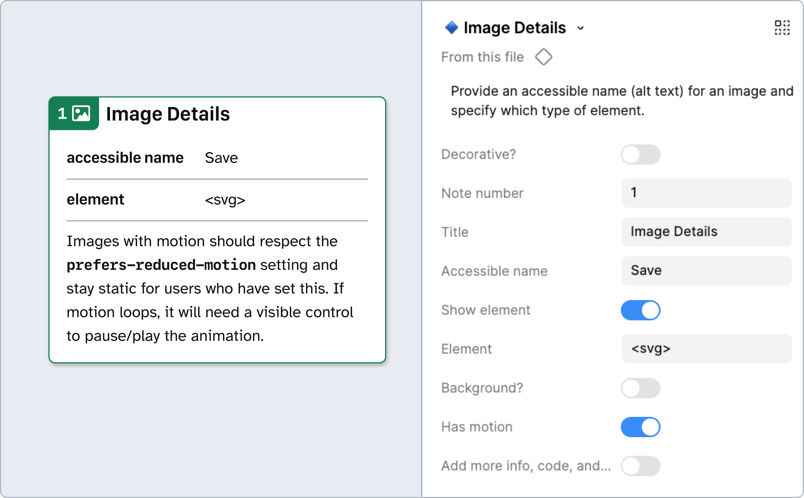
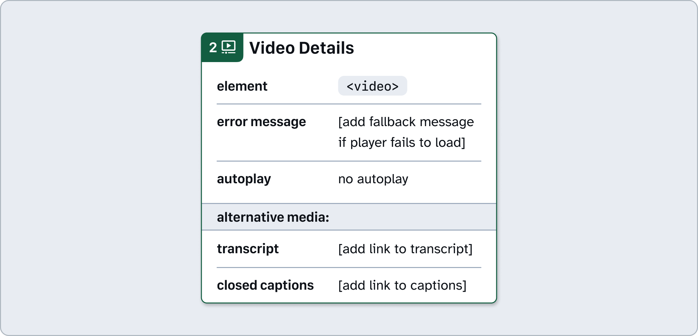
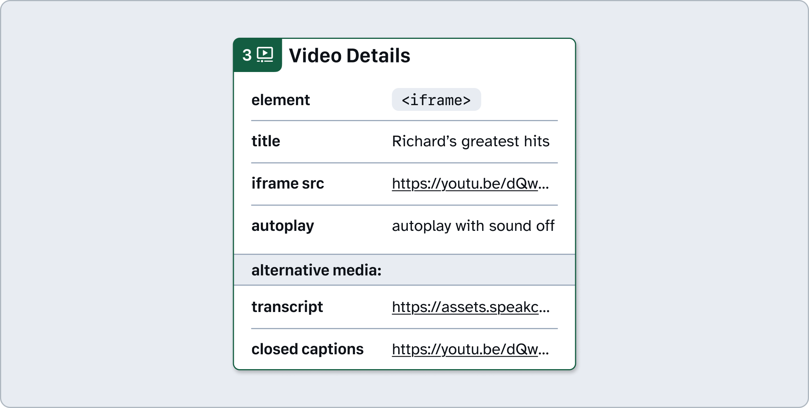
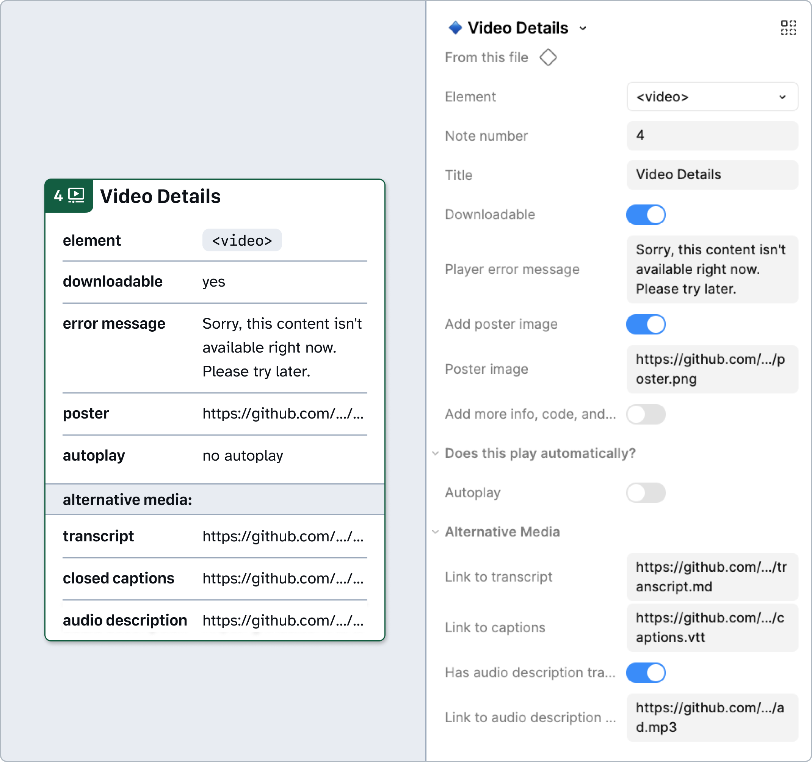
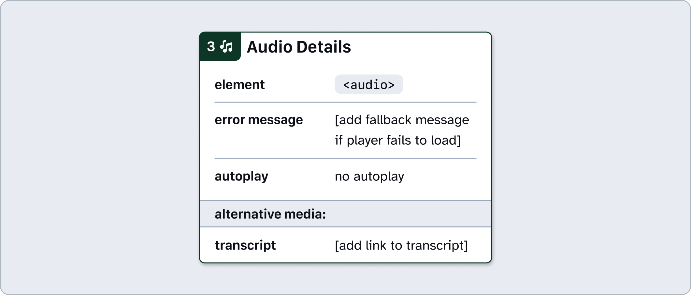
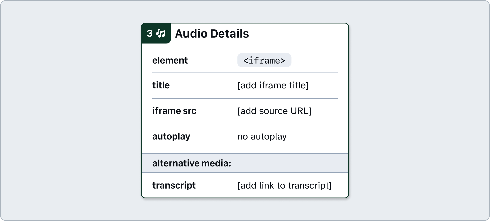
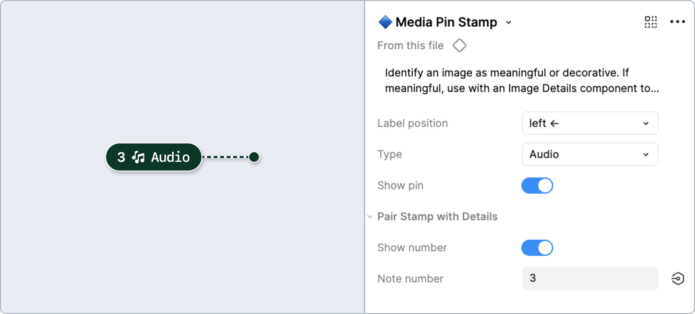
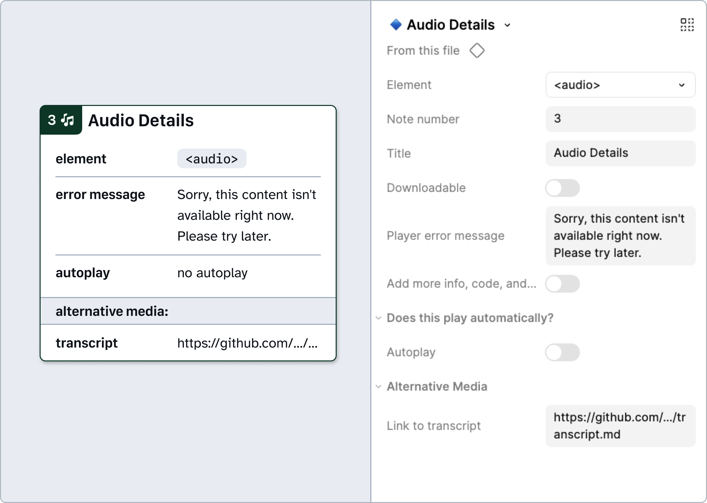

# How to: **Media**

Media is made up of images, video, and audio embeds. These elements provide visual or auditory information (and sometimes both). They often support storytelling, communication, and enhance user engagement across websites and apps.
 
**Types of media**
- [Image](#image)
- [Video](#video)
- [Audio](#audio)

 
## Image

Images are static visual representations of something, be it concrete or abstract. Images include photographs, screenshots, illustrations, infographics or charts, images of text, and so on.

### [Annotation Tiers](https://github.com/github/annotation-toolkit/blob/main/deep-dives/tiered-model.md)
- Difficulty Tier 1: **Easy**
- Priority Tier 1: **Mandatory**

### Why?

With the rise of social media and better graphic processing, images have become a key part of the internet. It’s crucial that when building digital products, we ensure that everyone can access the same information.

Most images exist on the internet through the HTML semantic `` or `<svg>`. Regardless of what path you choose, deciding whether or not an image needs **alternative text** (alt-text for short) is key to providing accessible content.

Images are classified into two main groups: **functional** or **decorative**.

* **Functional images** contain information that surrounding context does not. Something in the image is required to finish a workload or understand what’s going on. 
* **Decorative images**, on the other hand, are… well, decorative! Or, their description is written in surrounding text, therefore alt-text is redundant.

Writing alt-text is an art in and of itself that even AI can’t do entirely on its own. Check out the resources below, and if you do use an AI generator for alt-text, make sure to double check its work to verify that no important details have been missed.

### Variants

#### Decorative

If an image does not visually communicate information that aids in understanding the purpose of a page, it shouldn’t be announced by a screen reader. 

### How to use these annotations

1. Add a **❖ Media Stamp** component from the asset panel. Place the stamp over the design frame and resize to extend pin, bracket, or lasso. Configure component properties as needed:
    - **Label position**: Set based on Stamp’s placement relative to the element being annotated.
    - **Type**: This is already set to `Image` by default.
    - **Decorative**: If the image is decorative and does not convey any information, or is already described in the surrounding text, enable the Decorative image property.
    - **Note number**: Set this number in relative sequence with the other numbered Stamps placed over the same design.

2. Place a **❖ Image Details** component in the margins next to the design and configure the component properties as needed:
    - **Note number**: Set this to match the corresponding **❖ Media Stamp**. This number should be unique and in relative sequence with other Details annotations on the same design.
    * **Decorative** - If the image is decorative and does not convey any information, or is already described in the surrounding text, enable the Decorative image property.
    * **Accessible name** - Provide the text description of the image, focusing on the purpose of the image and the information that it conveys.
    * **Show element** - Toggle this property and the related **Element** field to specify whether the image will be using an `` or `<svg>` element
    * **Background image** - A helpful shortcut that conveys that the image may end up being *built* as a background image, but it’s still informative and requires a visual description through some hidden text.
    * **Has motion** - A helpful shortcut for any images that contain animation or some form of motion. This will add a reminder to respect reduced motion settings so that users can avoid encountering motion. 

### Design considerations

- Does my image have important text in it?
    - If yes, can I change the design to use semantic text instead of the image?
- Is the image decorative or functional?
    - If it is functional:
        - Is the alt-text supported by surrounding text, making alt-text redundant?  
            - If no, what is the accessible name?
    - If it is decorative:
        - Have I noted this in design?

### Resources

- [An alt decision tree - Web Accessibility Initiative (W3C)](https://www.w3.org/WAI/tutorials/images/decision-tree/)
- [Your Image Is Probably Not Decorative - Smashing Magazine](https://www.smashingmagazine.com/2021/06/img-alt-attribute-alternate-description-decorative/)
- [Images Tutorial - Web Accessibility Initiative (W3C)](https://www.w3.org/WAI/tutorials/images/)
- [Functional Images - Web Accessibility Initiative (W3C) ](https://www.w3.org/WAI/tutorials/images/functional/)
- [Dungeons & Dragons taught me how to write alt text - Eric Bailey](https://ericwbailey.website/published/dungeons-and-dragons-taught-me-how-to-write-alt-text/)
- [Alt Text Guide - GitHub Workplace Accessibility (Internal Only)](https://github.com/github/workplace-accessibility/blob/main/resources/content-accessibility/alt-text-guide.md)

---

## Video

Videos are a timed set of moving images. Videos may have audio (and in that case, may need captions, subtitles, and audio descriptions) and may loop again and again.

### [Annotation Tiers](https://github.com/github/annotation-toolkit/blob/main/deep-dives/tiered-model.md)
- Difficulty Tier 1: **Easy**
- Priority Tier 2: **Ideal**

### Why?

Similar to images, we need to ensure that everyone can gather the same information and detail from a video. This depends on how a video is implemented and the capabilities of the hosting platform (i.e. self-managed versus Youtube).

Videos exist on the web in two main formats: the `<video>` element in HTML, and `<iframe>`. It’s important to be intentional with your choice, as browsers don't all support the same video formats or attributes.

More than code, often times making a video accessible relies on what alternative formats you include to ensure users of all abilities can access the information they need. 

### Elements

#### `<video>`

When adding a video directly to your website (particularly if it isn’t already hosted elsewhere), it’s most likely that you’ll use the `video` element directly.

Make sure that you provide a transcript and closed captions for this content. 
When visual information is included that isn’t described in the audio track, you’ll need to add audio description.

#### `<iframe>`

When adding a video that’s hosted elsewhere (such as YouTube or Vimeo), you may need to embed the video using an `iframe` element.

The title property for the `iframe` should describe the video content. Check if auto-generated captions are provided, and if they are, that they are correct and match the spoken content. 

You will also need to provide a transcript and add an audio description if there’s visual information that isn’t included in the audio track.

### How to use these annotations

1. Add a **❖ Media Stamp** component from the asset panel. Place the stamp over the design frame and resize to extend pin, bracket, or lasso. Configure component properties as needed:
    - **Label position**: Set based on Stamp’s placement relative to the element being annotated.
    - **Type**: Set the corresponding element to `Video`.
    - **Show number**: Toggle off if there’s no need for a matching Details annotation (in which case, skip step 2).
    - **Note number**: Set this number in relative sequence with the other numbered Stamps placed over the same design.

2. Place a **❖ Video Details** component in the margins next to the design and configure the component properties as needed:
    - **Note number**: Set this to match the corresponding **❖ Media Stamp**. This number should be unique and in relative sequence with other Details annotations on the same design.
    - **Downloadable** - Enable if it is possible for people to download the video.
    - **Player error message** - Specify a message that will be displayed if the video cannot be loaded.
    - **Add poster image** - For instances where a poster image will be displayed before the video is played, use the related Poster image field to specify the src for the image.
    - **Autoplay** - Enable this if the video will autoplay. Note this will set the video to autoplay with the sound off, as to comply with the Web Content Accessibility Guidelines (WCAG) success criterion [1.4.2 Audio Control (A)](https://www.w3.org/WAI/WCAG22/Understanding/audio-control.html).
    - **Link to transcript** - Specify where the content for the transcript can be found.
    - **Link to captions** - Specify where the captions file can be found. If your video does not have any sound, offer a caption that says “This video has no sound.”
    - **Has audio description** - For instances where audio description is required (such as when visual information is not included in the audio track), specify where the audio description file can be found.
    - **title** (`iframe` only) - Specify a name for the `iframe`, which will be announced by screen readers. Ideally, this should describe the video content.
    - **iframe src** (`iframe` only) - Specify the `src` value for the `iframe`.

### Design considerations

- Is there an appropriate use case for autoplay?
- Do I have the appropriate alternative formats for this video?
    - If spoken dialogue is part of video, do you have captions (shows word-for-word of video audio), subtitles (translation of what’s being spoken), and a transcript?
    - Is there an audio description provided?
- What is the error/fallback message if the audio doesn’t work?
- Does the video content contain less than 3 flashes per second to avoid causing seizures?
- For video that does not include any sound, do the captions and transcript reflect this (i.e. “This video does not have any sound”?)

### Resources

- [Accessible Multimedia - MDN](https://developer.mozilla.org/en-US/docs/Learn_web_development/Core/Accessibility/Multimedia)
- [`<video>`: The Embed Video Element - MDN](https://developer.mozilla.org/en-US/docs/Web/HTML/Reference/Elements/video)
- [Captions, Transcripts, and Audio Descriptions - WebAIM](https://webaim.org/techniques/captions/)
- [How to Create Free Audio Description VTT Files for Videos](https://meryl.net/audio-description-vtt-files/)
- [Web Video Text Tracks API - MDN](https://developer.mozilla.org/en-US/docs/Web/API/WebVTT_API)

---

## Audio

Audio, in the context of the web, is a sound segment, either live or recorded and uploaded, to share information and perhaps use for production of other media.

### [Annotation Tiers](https://github.com/github/annotation-toolkit/blob/main/deep-dives/tiered-model.md)
- Difficulty Tier 1: **Easy**
- Priority Tier 2: **Ideal**

### Why?

While not as common as Video and Images thanks to a graphic-heavy world, sound files are still crucial pieces of the web.

The HTML element `<audio>` is a great start in accessible products. You’ll want to consider other elements for an accessible audio component as well, including:

- Transcripts for deaf users
- Impact of playing on a loop versus having a user opt-in to play again

### Elements

#### `<audio>`

When adding audio directly to your website (particularly if it isn’t already hosted elsewhere), it’s most likely that you’ll use the audio element directly.

Make sure that you provide a transcript for this content.

#### `<iframe>`

When adding audio that’s hosted elsewhere (such as SoundCloud or Spotify), you may need to embed the audio using an `iframe` element.

The title property for the `iframe` should describe the audio content. You will need to provide a transcript that includes the audio content as text.

### How to use these annotations

1. Add a **❖ Media Stamp** component from the asset panel. Place the stamp over the design frame and resize to extend pin, bracket, or lasso. Configure component properties as needed:
    - **Label position**: Set based on Stamp’s placement relative to the element being annotated.
    - **Type**: Set the corresponding element to `Audio`.
    - **Show number**: Toggle off if there’s no need for a matching Details annotation (in which case, skip step 2).
    - **Note number**: Set this number in relative sequence with the other numbered Stamps placed over the same design.

2. Place a **❖ Audio Details** component in the margins next to the design and configure the component properties as needed:
    - **Note number**: Set this to match the corresponding **❖ Media Stamp**. This number should be unique and in relative sequence with other Details annotations on the same design.
    - **Downloadable** - Enable if it is possible for people to download the audio.
    - **Player error message** - Specify a message that will be displayed if the audio cannot be loaded.
    - **Autoplay** - Enable this if the audio will autoplay. Note this will set the audio to autoplay with the sound off, as to comply with the Web Content Accessibility Guidelines (WCAG) success criterion [1.4.2 Audio Control (A)](https://www.w3.org/WAI/WCAG22/Understanding/audio-control.html).
    - **Link to transcript** - Required. Specify where the content for the transcript can be found.
    - **title** (`iframe` only) - Required. Specify a name for the `iframe`, which will be announced by screen readers. Ideally, this should describe the audio content.
    - **iframe src** (`iframe` only) - Specify the src value for the `iframe`.

---

## Design considerations

- Is there an appropriate use case for autoplay?
- Do I have a transcript of this audio?
- If additional design is attached to the component (i.e. CSS styling), is that accessible in terms of color contrast?
- What is the error/fallback message if the audio doesn’t work?

## Resources

- [Accessible Multimedia - MDN](https://developer.mozilla.org/en-US/docs/Learn_web_development/Core/Accessibility/Multimedia)
- [Making Audio and Video Media Accessible - W3C Web Accessibility Initiative](https://www.w3.org/WAI/media/av/)
- [Understanding Guideline 1.2: Time-based Media - WCAG](https://www.w3.org/WAI/WCAG22/Understanding/time-based-media.html)
- [`<audio>` The Embed Audio Component - MDN](https://developer.mozilla.org/en-US/docs/Web/HTML/Reference/Elements/audio)