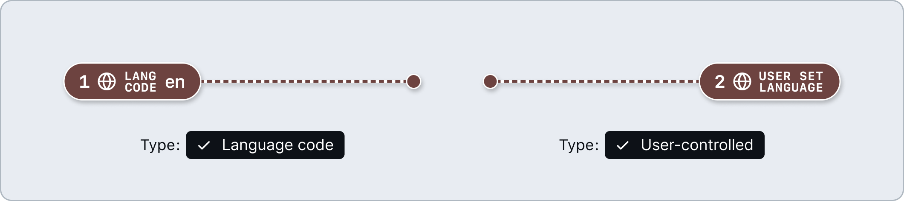
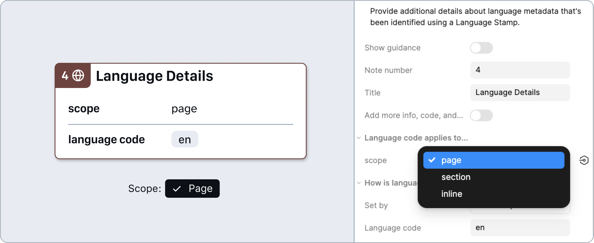
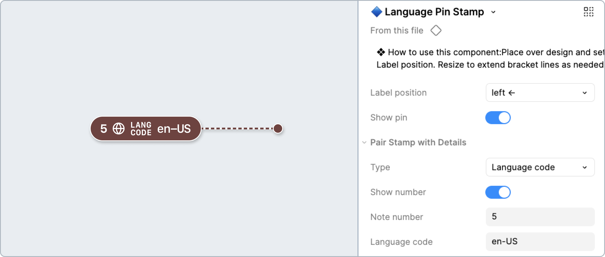
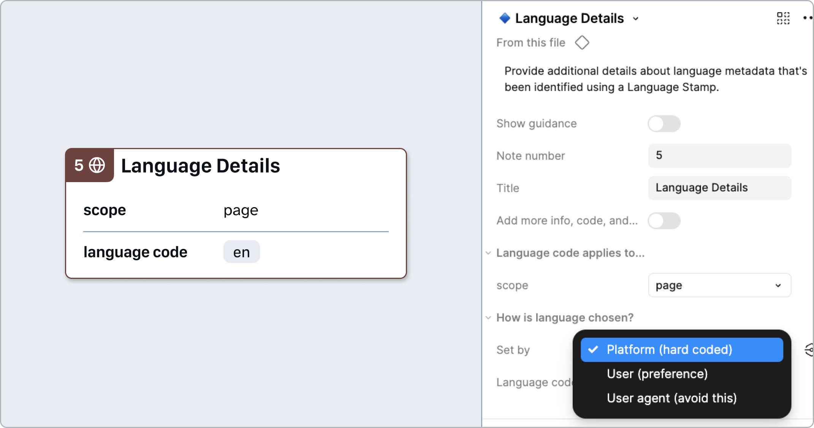
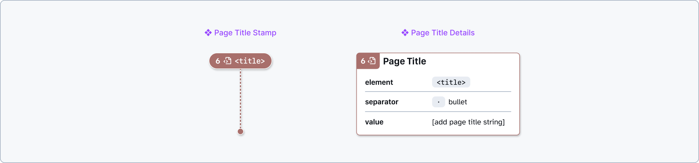
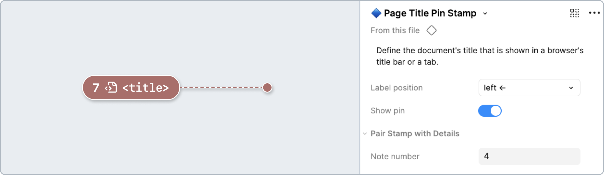
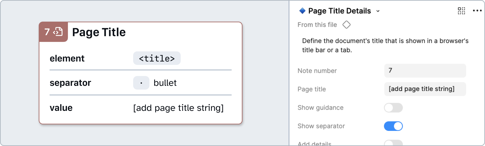

# How to: Metadata

Metadata refers to information about a web document that describes its content and structure, rather than being visible on the page itself. This can include, but is not limited to, the page title, language, character encoding, and instructions for how browsers should display or handle the content.

**Types of metadata:**
- [Language](#language)
- [Page Title](#page-title)

## Language

Declare the language of the page, or parts of the page.

### [Annotation Tiers](https://github.com/github/annotation-toolkit/blob/main/deep-dives/tiered-model.md)
- Difficulty Tier 2: **Moderate**
- Priority Tier 2: **Ideal**

### Why?

A primary language must be set in the pages metadata. Screen readers rely on the documents language setting to correctly interpret and pronounce text. Without this information, assistive technologies may default to the wrong language, leading to poor accessibility.

Additionally, any text written in a different language from the main page should be properly marked up in the HTML. This allows screen readers to accurately interpret and pronounce the content using the correct language settings.

The language code is a two letter ISO code such as `en` for English, or an extended code such as `en-US` for US English or `en-GB` for British English. Only use the extended code when it creates a meaningful difference, such as with varied Chinese dialects, Spanish, French (`fr`) vs French Canadian (`fr-CA`), etc. 

**Remember:**

- Languages don’t have visual parity or equal length. If you have an interface designed in English and a user selects a Spanish or German, for example, the length of text strings may increase by 30% or more.
- If right-to-left (RTL) languages are supported and have associated visuals with a corresponding direction, you can set this with Reading Order annotations. 
- If content is generated or controlled by external data, language may not be able to be annotated. Use a Flexible Content Area utility to mark these areas.

### Key properties

#### **Type** (Stamp)

Determine how the language is chosen:
​- **Language code** - Default. The platform decides what language is displayed, using a two or four-letter ISO code added into the Language code property. 
- **`User-controlled`** - Language set by the user from a pre-defined list of localization options. Useful for annotating content localized through a language-picker.

#### **Set by** (Details)

Determine how the language is chosen:
​- **`Platform`** (hard coded) - Default. The platform decides what language is displayed, using a two or four-letter ISO code added into the  **Language code** property. 
- **`User`** (preference) - Language set by the user from a pre-defined list of localization options. Useful for annotating content localized through a language-picker.
- **`User agent`** (avoid this) - Avoid setting the language based on user agent settings or other forms of automatic detection. This is a choice best left to users—we can’t know whether someone is traveling, what their native tongue may be, or what their preference is based on things like detected location or hardware.
    - Rely instead on the **From setting or stored session** setting to specify that the language can be set based on session cookies or saved local settings.

#### **Scope** (Details)

- **`Page`** - Defines the default language for the entire webpage, typically via `<html lang="en-US">`. This setting is inherited by all content on the page unless overridden. 
- **`Section`** - Applies the language setting to part of a page such as a paragraph, div, or article. For example, using `lang="es"` on a container element will mark the contents as Spanish language.
- **`Inline`** - Applies to a single word or short phrase, typically embedded within a sentence. This is commonly done by wrapping the word in a `` element and adding the appropriate `lang` attribute to indicate its language. 

### How to use these annotations

1. Add a **❖ Language Stamp** component from the asset panel. Place the stamp over the design frame and resize to extend pin, bracket, or lasso. Configure the component properties as needed:
    - **Label position:** Set based on Stamp’s placement relative to the element being annotated.
    - **Type:** Select whether a specific `language code` is being used or if the content’s language is `user-controlled`.
    - **Show number:** Toggle off if there’s no need for a matching Details annotation (in which case, skip step 2).
    - **Note number:** Set this number in relative sequence with the other numbered Stamps placed over the same design.

2. Place a **❖ Language Details** component in the margins next to the design and configure the component properties as needed:
    - **Note number:** Set this to match the corresponding **❖ Language Stamp**. This number should be unique and in relative sequence with other Details annotations on the same design.
    - **Scope:** Set parameters for how much of a page a specific language annotation applies to the page level, a section, or a short string.
    - **Set by:** Determine how the language is chosen, whether hard-coded by the `platform`, based on `user preference`, or based on a `user agent` setting (avoid this). 
    - **Select language code:** The language code is a two letter ISO code such as `en` for English, or an extended code such as `en-US` for US English or `en-GB` for British English.

### Design considerations

- What is the predominant language of the page? 
- Are there any additional languages used for certain sections/words throughout the page?

### Resources
- [GitHub Inclusive Language Docs (Internal only)](https://thehub.github.com/dib/inclusive-language/)
- [Tips for Multilingual Accessibility - Ben Myers](https://benmyers.dev/blog/multilingual-web-accessibility/)
- [On Language Learning for Screen Reader Users - Florian Beijers](https://florianbeijers.xyz/on-language-learning-with-a-screenreader)
- [What they don’t tell you when you translate your app - Eric Bailey](https://ericwbailey.website/published/what-they-dont-tell-you-when-you-translate-your-app/)
- [Language tags in HTML and XML - W3C Internationalization](https://www.w3.org/International/articles/language-tags/)
- [Understanding WCAG 2.2 Success Criteria 3.1.1: Language of Page - WAI](https://www.w3.org/WAI/WCAG22/Understanding/language-of-page.html)
- [Don’t forget to localize your icons - Eric Bailey](https://ericwbailey.website/published/dont-forget-to-localize-your-icons/)

---

## Page Title

Define the document `<title>` shown in a browser's title bar and search engine results.

### [Annotation Tiers](https://github.com/github/annotation-toolkit/blob/main/deep-dives/tiered-model.md)
- Difficulty Tier 1: **Easy**
- Priority Tier 2: **Ideal**

### Why?

If a page title is not descriptive, many people, especially those relying on assistive technologies, may struggle to understand where they are within the site, and additionally, which site they are on. Make sure the page title clearly reflects the main content and purpose of the page. Ideally, it would be:
- Concise and descriptive
- Uses important, distinctive terms first
- Title should correspond to the `<h1>` element

### How to use these annotations

1. Add a **❖ Page Title Stamp** component from the asset panel. Place the stamp over the design frame and resize to extend pin. Configure the component properties as needed:
- **Label position:** Set based on Stamp’s placement relative to the element being annotated.
- **Note number:** Set this number in relative sequence with the other numbered Stamps placed over the same design.

2. ​Place a **❖ Page Title Details** component in the margins next to the design and configure the component properties as needed:
- **Show guidance:** Toggle high-level guidance and resources.
- **Value:** Add the page title to the value input
- **Note number:** Set this to match the corresponding **❖ Page Title Stamp**. This number should be unique and in relative sequence with other Details annotations on the same design.

---

## Design considerations

- Is the title concise?
- Does it adequately provide context for the topic of the page, and more broadly, the site?
- Does it correspond closely to the text of the `<h1>`?

## Resources

- [TetraLogical - Quick accessibility test: Page titles by TetraLogical - YouTube](https://www.youtube.com/watch?v=5DeZzPQgfXo)
- [Success Criterion 2.4.2: Page Titled - W3C](https://www.w3.org/TR/WCAG22/#page-titled)
- [WCAG 2.2 Success Criterion 2.4.2 Page Titled (Level A) - WAI](https://www.w3.org/TR/WCAG22/#page-titled)
