# How to: Mobile annotations

Mobile annotations are designed to support accessible UI design by providing clear, structured notes for interactive elements. Unlike other types of annotation in this library, **these annotations assume foundational knowledge of mobile app accessibility**. They include iOS, Android, and platform-agnostic annotations to guide implementation across different operating systems.

**Types of annotation:**
- [Mobile Stamps and Details](#mobile-stamps-and-details)
- [View context Stamps and Details](#view-context-stamps-and-details) 

## Why?

Native apps require specific accessibility properties that screen readers and assistive technology depend on. Mobile screen readers narrate visual content in a specific format, with a pause in between each part: 

**Label + Value + Role + Hint**
- Accessibility **labels** provide meaningful descriptions of UI elements;
- **Values** and states indicate the current condition of controls like toggles and sliders;
- **Roles** and **traits** communicate how elements behave;
- **Hints** offer additional context without cluttering the interface. 

Though the order of these parts may differ depending on a user’s settings (especially for Android devices), it’s important that each individual part is included properly.

Mobile annotations also pair well with User Interactions to make things like Touch Gestures clear.

---

## Mobile Stamps and Details

Unlike many other components in this Toolkit, these annotations require a fair bit of knowledge about mobile app accessibility.

### [Annotation Tiers](https://github.com/github/annotation-toolkit/blob/main/deep-dives/tiered-model.md)
- Difficulty Tier 3: **Advanced**
- Priority Tier 1: **Mandatory** (for mobile apps)

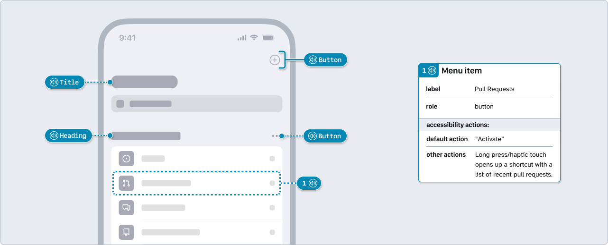

### Platform variants
#### iOS

iOS annotations can be differentiated by their **blue** color as well as the VoiceOver icon for iOS. 
This distinction can be helpful when designing and annotating both mobile platforms on the same canvas.

#### Android

Android annotations can be differentiated by their **green** color as well as the TalkBack icon for Android. 
This distinction can be helpful when designing and annotating both mobile platforms on the same canvas.

#### Any platform

This set of annotations defaults to being **platform-agnostic**. 
This may be useful when building a mobile experience for only one platform and there is no need to differentiate between them.

### Components
#### Mobile Grouping Stamp

The Grouping Stamp is the cornerstone of mobile annotations. It is used to highlight multiple objects to be announced together. Examples include related information, a group of actions with a common purpose, images and accompanying text, paragraphs of text that aren’t divided by headings, and so forth.

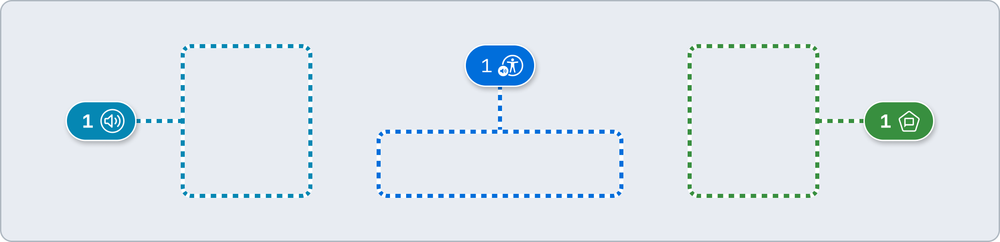

#### Mobile Structure Stamp

Text marked as a **Heading** will help users understand the purpose of a section. Screen readers users can also to navigate quickly between sections of a view based on headings and other elements. 

**Titles** are announced after transitioning to a view and should be placed toward the top. They are similar to `<h1>` headings on web experiences, helping users orient and understand the purpose of the content.

> [!CAUTION]
> Headings and Titles are optional and it’s common for views to not have either one. Only use headings when they truly help illuminate the structure of a screen.

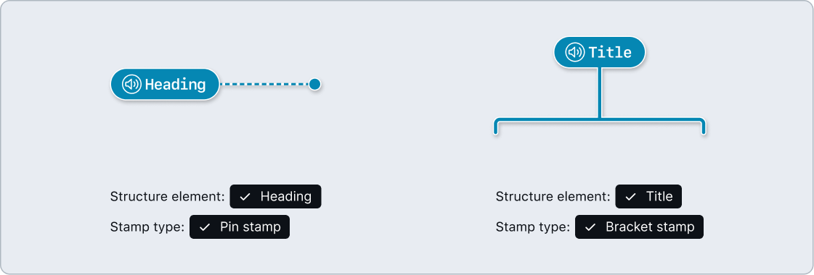

#### Mobile Button Stamp

Mark controls that initiate important actions. Remember, not all tappable controls are buttons, so be strategic about their placement.

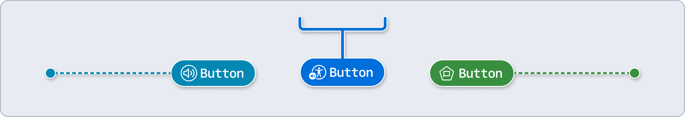

#### Mobile Details

Open-ended and flexible, this annotation requires knowledge of mobile accessibility in order to create accurate accessibility specs. Pair with Mobile Button, Grouping, or Structure stamps. 

- All interactive elements (and some static) must have a **label**.
- **Value** can be used to inform screen readers about a control’s current state, what text has been entered in an input, or other relevant info.
- All interactive elements (and some static) must have a **role** to programmatically inform screen readers about what they do. iOS and Android do this in different ways.
- Most interactive elements come with a default **hint** set by the operating system which cues users about how to interact with them. You may edit hints but don't include critical information here, as many users have their screen readers set to ignore hints.
- If using a stock mobile component, toggle **Follow stock native pattern** and link any relevant specs via the **Link to Docs** list. This can help save a lot of repetitive writing during the annotation process.

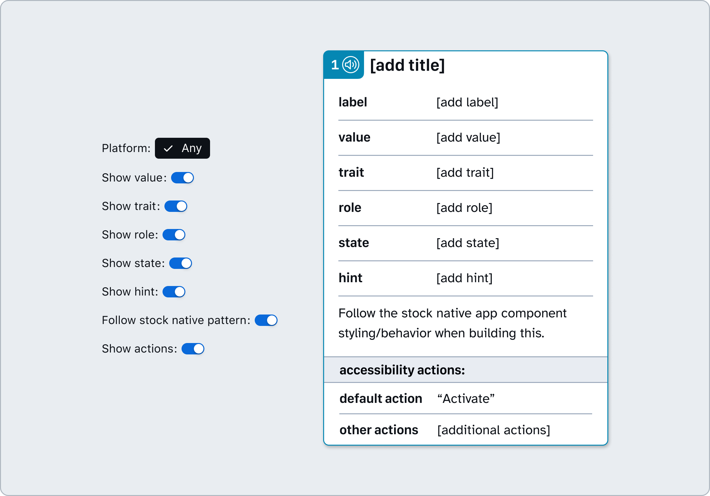

#### Mobile Live Region Announcement

Primarily used when specific states of multiple components require giving an update to users, such as announcing search results.
The `polite` or `assertive` behavior of live region announcements can be simulated on `iOS` and `Android` as long as specific traits and settings are included.
*Note: These components are isolated variants from System Feedback set of* **❖ Live Region** *components*. 

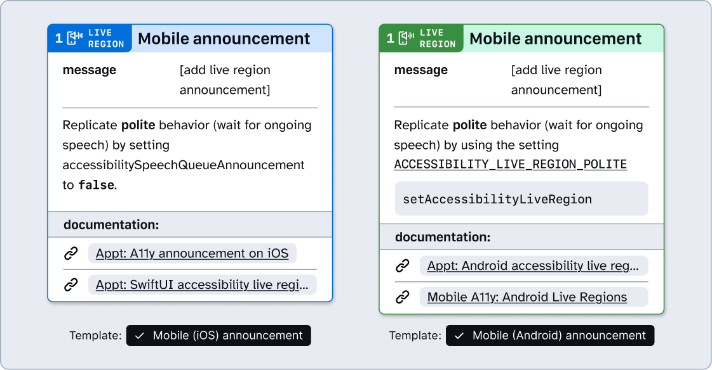

### How to use these annotations

1. ​Add a **❖ Mobile Grouping Stamp** , **❖ Mobile Structure Stamp**, or **❖ Mobile Button Stamp** component from the asset panel. Place the stamp over the design frame and resize to extend pin, bracket, or lasso. Configure the component properties as needed.
   - **Platform**: Optional. Set to `iOS` or `Android` if visual distinction is needed on your design canvas.
   - **Label position**: Set based on Stamp’s placement relative to the element being annotated.
   - **Stamp type**: Switch between Pin and Bracket Stamp formats.
   - **Show number**: Toggle off if there’s no need for a matching Details annotation (in which case, skip to step 2).
   - **Note number**: Set this number in relative sequence with the other numbered Stamps placed over the same design.

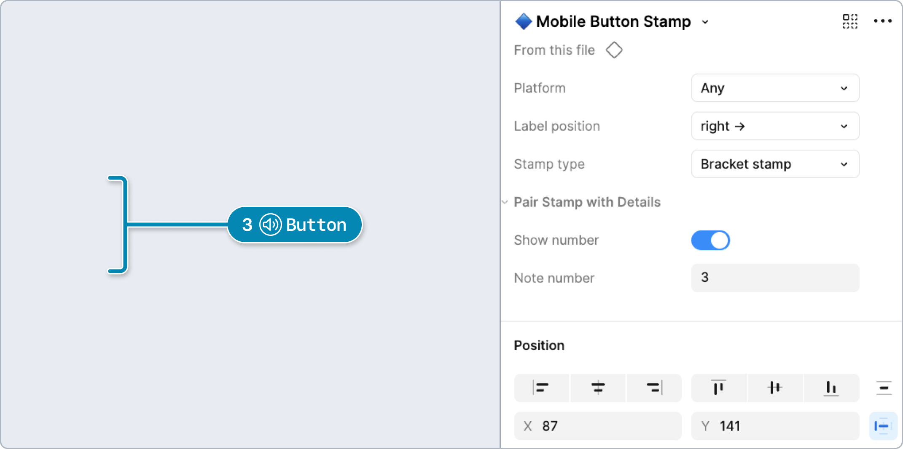

2. ​Place a **❖ Mobile Details** component in the margins next to the design and configure the component properties as needed:
   - **Platform**: Optional. Set to iOS or Android if visual distinction is needed on your design canvas.
   - **Note number**: Set this to match the corresponding **❖ Mobile Stamp**. This number should be unique and in relative sequence with other Details annotations on the same design.
   - **Show guidance**: Toggle high-level guidance and resources. 
   - Toggle and fill out other properties like **label**, **value**, **trait**, **role**, **state**, **hint**, and **actions**. *Remember: Mobile screen readers narrate visual content in a specific format: Label + Value + Role + Hint*

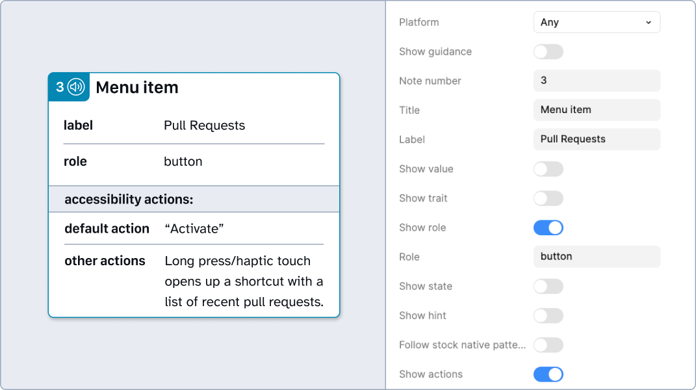

---

## View Context Stamps and Details

Identify areas that may have different accessibility considerations than native UI elements, such as web views, user generated content, long blocks of text content that lacks headings, or other non-native content such as PDF views.

### Why?
This classification helps developers and testers understand what content can be directly annotated versus content that may need special handling during accessibility testing or implementation.

### Variants
#### Web view

Web views show up in many apps, especially in OAuth login flows, in-app documentation, or other embedded content. They create unique accessibility hurdles that are important to keep in mind:
1. The boundary between native elements and web view content can be tricky for screen readers, making it important to implement careful focus management.
2. Not all screen readers interact with them the same way as native content. VoiceOver will behave differently with web content than with native iOS elements, for example.
3. Web content might have different interaction patterns than the surrounding native app, creating inconsistent and confusing user experience. Users might not realize they're in a web view, so maintaining consistency in the experience is key.

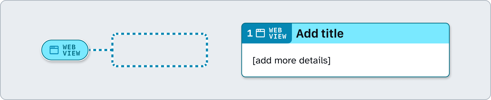

#### User generated

Areas containing content that can’t be directly annotated as they are controlled by users. This might be text such as user profiles, chat messages, or media uploads such as pictures and videos. These areas may have unpredictable content structure, missing alt text, low contrast color choices, or inaccessible embedded media.

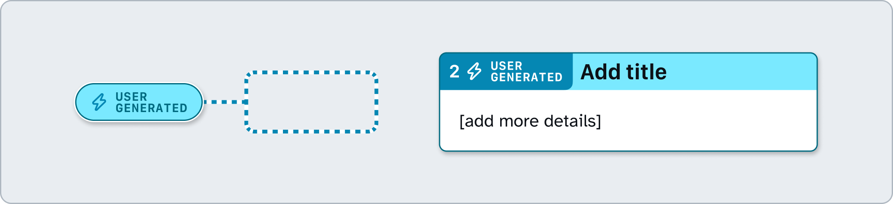

####  Text content

Highlight large blocks of text content that aren’t broken up by interactive controls, headings, or other interactive elements. Sometimes there are legal requirements to include large blocks of text. This stamp can be used suggest ways to improve readability, such as adding lists, tables of contents, or progressive disclosures.

#### Non-native content

Users often come across content that wasn't built with the platform's native UI components. These are things like PDF viewers, document viewers, media players, and interactive maps. These may not fully integrate into a platform or app’s accessibility services.

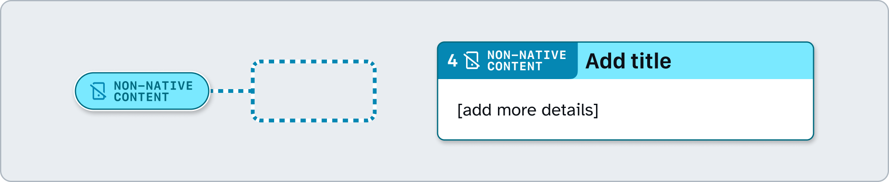

---

## Design considerations

- Which elements on this screen need to be announced together by screen readers?
- Do all UI elements have clear labels in your design? Have you identified which text labels belong with which controls?
- What's the logical reading order for this screen?
- Are there any decorative elements that should be hidden from screen readers?
- Can you mark which content blocks should be treated as a single unit for screen readers?
- How should off-screen or dynamically appearing content be handled?
- Which elements on this screen perform actions when activated?
- Are there any custom controls that could be replaced with standard ones?
- How will the VoiceOver rotor on iOS will navigate this content?
- How will TalkBack swipe gestures navigate through this content on Android?
- Are touch targets sized appropriately for each platform?
- How can users navigate the experience with a keyboard instead of touch? 

## Resources

- [​Accessibility documentation - Appt](https://appt.org/en/docs)
- [Guidance on Applying WCAG 2.2 to Mobile Applications - W3C](https://www.w3.org/TR/wcag2mobile-22/)
- [Mobile-WCAG Mapping - GitHub Accessibility Audit Guide (Internal Only)](https://github.com/github/accessibility-audit-guide/blob/main/mobile/mobile-wcag-map.md)
- [Getting To The Bottom Of Minimum WCAG-Conformant Interactive Element Size - Smashing Magazine](https://www.smashingmagazine.com/2024/07/getting-bottom-minimum-wcag-conformant-interactive-element-size/)
