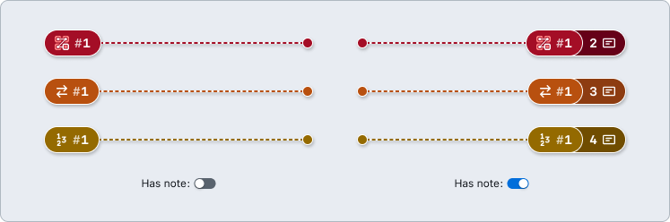
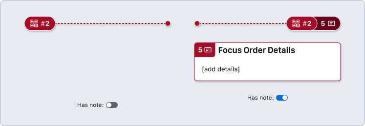
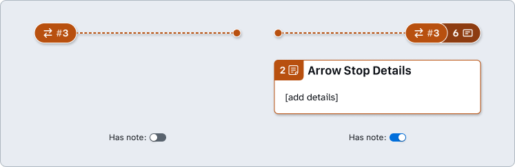
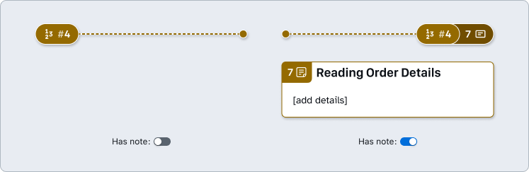
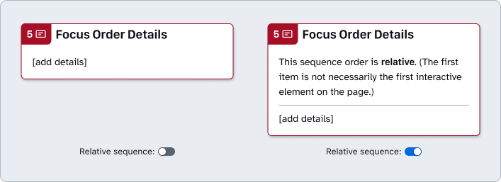
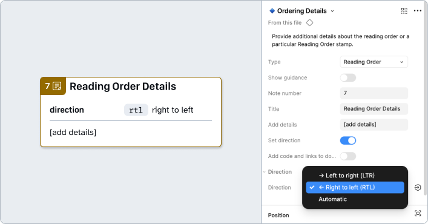
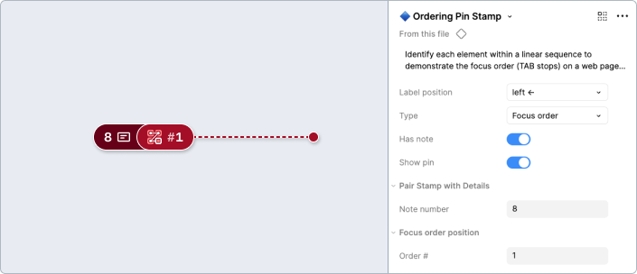
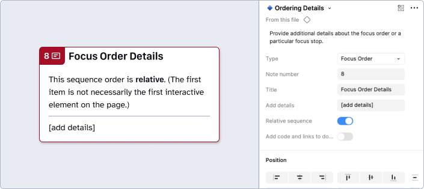
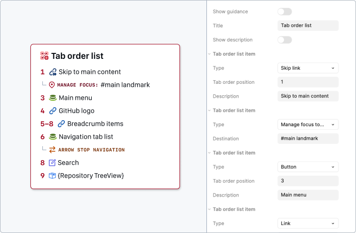

# How to: Ordering

Define the order of elements on a page to help designers visualize intended flows, engineering build said flows, and assistive technology users understand and operate them. 

## Ordering Stamps and Details

### Properties

#### Has note

Since the Ordering Stamp label has a number that corresponds to a relative order of different elements, you can activate the **Has note** property to reveal a **Note number** when additional details are needed. 

This can be used to clarify context about the overall `focus order`, `arrow stops`, or `reading order`, or a specific aspect of them.

### Variants

#### Focus order

[**Annotation Tiers**](https://github.com/github/annotation-toolkit/blob/main/deep-dives/tiered-model.md)
- Difficulty Tier 2: **Moderate**
- Priority Tier 2: **Ideal**

People who cannot use a mouse need to be able to access and activate all interactive elements on a page with a keyboard only. The focus order of interactive elements should be logical and intuitive. When dynamic changes occur, like after selecting a tab or dropdown option, or displaying more results, focus must be appropriately managed to maintain context and ensure a seamless experience for all users.

#### Arrow stops

[**Annotation Tiers**](https://github.com/github/annotation-toolkit/blob/main/deep-dives/tiered-model.md)
- Difficulty Tier 3: **Advanced**
- Priority Tier 3: **Nice to have**

Arrow stops are a compliment to `Focus order` annotations. They can be used on controls first reached through Focus order, which are operated with the arrow keys. People who cannot use a mouse need to be able to access and activate all interactive elements on a page with a keyboard only.

#### Reading order

[**Annotation Tiers**](https://github.com/github/annotation-toolkit/blob/main/deep-dives/tiered-model.md)
- Difficulty Tier 3: **Advanced**
- Priority Tier 3: **Nice to have**

Reading order is the sequential order in which assistive technology will read content. This annotation is useful in rare cases when the sequential order does not follow a traditional left to right, top to bottom flow.
Reading order is determined by the structure of the elements in the page (the DOM), combined with the page’s language. The reading order should match the visual presentation of the page, and must make sense, so that people using screen readers and assistive technologies can understand all of the information. If the reader order differs from the visual layout, the design must be clearly annotated.

### Other properties

#### Relative sequence

A shortcut to convey that the focus order sequence order is relative only to the other `Focus order` stamps on the frame. In other words, the first item is not necessarily the first interactive element on the page, just the first item of what is in scope.

#### Direction

It is possible to determine the direction of the `reading order`. Reading order follows the natural direction of a language’s writing system, so the language of the page will determine the reading order. Correct reading order is crucial for screen readers and other assistive technologies, as misalignment can confuse users and disrupt the intended content flow.
* `​Left-to-right`: Most modern languages use LTR reading direction, including, but not limited to, English, German, French, Spanish, and Chinese (in a horizontal layout).
* `Right-to-left`: RTL is used for languages that have distinct writing systems, such as Arabic, Hebrew, Persian, and Urdu.
* `Automatic`: The browser automatically determines the text direction.

### How to use these annotations

1. ​Add an **❖ Ordering Stamp** component from the asset panel. Place the stamp over the design frame and resize to extend pin, bracket, or lasso. Configure the component properties as needed.
    * **Label position**: Set based on Stamp’s placement relative to the element being annotated.
    * **Type**: Set to `Focus order`, `Arrow stop`, or `Reading order`. 
    * **Order #**: Indicates the sequence position of an element. 
    * **Has note**: Toggle on if there’s a need to include additional context through a Details annotation. Set the Note number in relative sequence with the other numbered Stamps placed over the same design. Otherwise, you can skip to Step 2.

2. ​If the **❖ Ordering Stamp** is using the **Has note** property, place a **❖ Ordering Details** component in the margins next to the design and configure the component properties as needed.
    * **Relative Sequence**: Toggle on if the sequence order is relative to the other Ordering annotations on the frame. In other words, the first item is not necessarily the first interactive element on the page, just the first item of what is in scope.
    * **Note number**: Set this to match the **Note number** of the corresponding **❖ Ordering Stamp** (don’t confuse it with the **Order #** property). This number should be unique and in  sequence with other Details annotations on the same design.

## Tab order list

Every interactive control should be focusable and follow a logical and expected sequence following the visual flow of a page. This annotation can supplement the stamps that show the focus order and arrow stops to make the sequence clear in one concise list.

### [Annotation Tiers](https://github.com/github/annotation-toolkit/blob/main/deep-dives/tiered-model.md):
- Difficulty Tier 2: **Moderate**
- Priority Tier 3: **Nice to have**

### How to use these annotations

Place a **❖ Tab order list** component in the margins next to the design and configure the component properties as needed: 
1. ​Toggle the **Show guidance** property if the additional high level guidance and resources aren’t needed.
2. Optionally update the **Title** field. This can help differentiate annotations when multiple lists are used in a single design.
3. Optionally use the **Show description** property to add a **description** for the list itself.
4. Configure the tab order list to include focusable control **type**s such as `buttons`, `links`, `skip links`, `form elements`, and `Primer components`. 
    1. ​After the first tab in a tablist, menu, carousel or similar groups of items, the *next* item **type** can be `Arrow stops`, which can help show arrow key navigation. Set the **direction** to `horizontal` or `vertical` as needed.
    2. If an item’s use results in focus being sent outside the default tab order, set the *next* item **type** to `Manage focus to …` and describe the **destination**.

> [!NOTE]
> **You can safely detach this component!** If you need more rows than are included by default to show the tab order, you can add more by detaching the component (`⌥⌘B`). Then duplicate the Tab order list item rows.

---

## Design considerations

- Does focus move in a logical order?
- Does focus move in order from top-left to bottom-right?
    - If not, does the intended order still make sense?
- Are there any focus order traps?
- Are elements receiving focus interactive? If not, what is the reasoning for them receiving focus?
- Are there aspects of design that can only be navigated with arrow keys? 
    - Would these aspects of the design be expected by keyboard users? 
- Does the reading order follow a left to right, top to bottom flow?
- Are there snippets of the page that follow a right to left order? 
- Is the reading order logical? If not, what’s causing the issue and could it be improved?

## Resources

- [​Understanding 2.4.3 - Focus Order - WCAG](https://www.w3.org/WAI/WCAG22/Understanding/focus-order.html)
- [Placing the interactive elements in an order that follows sequences and relationships within the content - W3C](https://www.w3.org/WAI/WCAG22/Techniques/general/G59)
- [Learning to focus() by Heydon Pickering - SitePoint](https://www.sitepoint.com/learning-to-focus/)
- [Foundations: Browsing with a keyboard - TetraLogical](https://tetralogical.com/blog/2021/10/26/browsing-with-a-keyboard/)
- [​Understanding WCAG 1.3.2: Meaningful sequence - W3C](https://www.w3.org/WAI/WCAG22/Understanding/meaningful-sequence.html)
- [Failure of Success Criterion 1.3.2 due to using an HTML layout table that does not make sense when linearized - W3C](https://www.w3.org/WAI/WCAG22/Techniques/failures/F49)
- [Source order matter - Adrian Roselli](https://adrianroselli.com/2015/09/source-order-matters.html)
