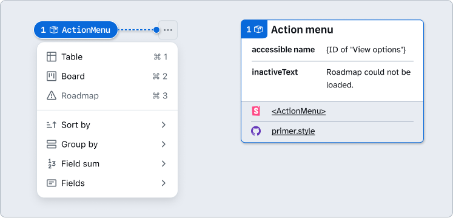
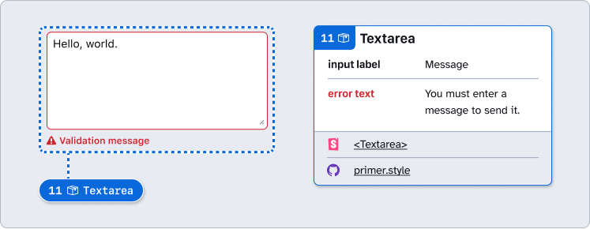

# How to: Primer A11y Presets

Annotation stamp support for every component in Primer Web and Primer Brand, as well as limited Details support for Primer Web. Each annotation component contains custom properties pre-set for you to add vital accessibility information that isn’t found in the Primer Web Figma component or the React instance by default.

## Why?

There are some key UX and accessibility details that can get left out of designs and hand-offs if our teams rely solely on visuals, Figma properties, CodeConnect output, or Storybook.

Arranging a series of accessible components on a page does not automatically create an accurate and informative heading hierarchy. There’s a good chance that without additional documentation, the heading structure won’t make sense visually—nor will it make sense for folks [navigating with assistive technology](https://tetralogical.com/blog/2021/09/29/browsing-with-a-desktop-screen-reader/).

Other annotation-related considerations include: Unexpected focus order behavior, issues with resizing and reflow, meaning conveyed through color, and imagery that may not be clear. Even with a full suite of well-built, accessible design system components, we still need ways to include these sorts of vital details. That’s where preset annotations come in. 

For an example of the purpose of preset annotations: This accordion component has been thoroughly documented the same way the Accessibility Design team helps when Primer builds a new component the first time:

All of these considerations pointed out by the annotations are built into the component. Because of this, you don’t need to annotate these pre-established concerns when adding the accordion to our new designs.

However, there are two important things we need to annotate. This is because these considerations can change from one instance to another, and need to be explicitly pointed out:

1. The optional title at the top.
2. The heading level of each item within the accordion.

We’re leaving it to chance that the page’s heading structure will break, or that the overall experience will be confusing for people to understand and navigate unless we explicitly call attention to these things. The risks may be low for individual components, but they grow with pattern complexity, component nesting, interaction states, duplicated instances, etc.

We can add two quick annotations to prevent leaving these details to chance. One Stamp to point to the component, and one accompanying Details annotation where we fill in some blanks to make the heading levels clear. 

The prompts for specific component details are pre-set in the annotation. This is why they are called Preset annotations or Primer a11y presets.

## Primer A11y Preset Stamps and Details

### [Annotation Tiers](https://github.com/github/annotation-toolkit/blob/main/deep-dives/tiered-model.md)
- Difficulty Tier 2: **Moderate**
- Priority Tier 2: **Ideal**

> [!WARNING]  
> Primer A11y Presets are still in development, and these docs are a work in progress. There are many component Details annotations still to come for Primer Web. Support for Primer Brand is limited to Stamps only. GitHub staff can reach out to **#annotation-toolkit** in Slack with any questions or feedback about how to use these.

### Details components

#### ActionBar

- All Buttons and IconButtons require labels, even if they aren’t shown visually. 
- When an ActionBar uses IconButtons, these labels are revealed as tooltips. 
- Any items in the overflow menu have a visible label.

#### ActionList

- The accessible name of the menu is derived from the element that opened it via `aria-labelledby`.
- Menu items and any trailing actions **must** have descriptive labels. The label should concisely describe the action performed when activated. Include any visually-hidden text that may need to be appended to the visual labels.
- Leading and trailing visuals may be decorative. Don’t rely on them to convey meaning, the menu item label should do this on its own. If leading visuals are not decorative, include their accessible name(s).
- When using an inactive menu item, provide a descriptive `inactiveText` that explains why the item is inactive.

#### ActionMenu

- The accessible name of the menu is derived from the element that opened it via `aria-labelledby`.
- Menu items **must** have descriptive labels. The label should concisely describe the action performed when activated.
- Leading and trailing visuals are decorative and don’t have a text alternative. Don’t rely on them to convey meaning, the menu item label should do this on its own.
- When using an inactive menu item, provide a descriptive `inactiveText` that explains why the item is inactive.

#### Autocomplete

- Autocomplete inputs **must** have descriptive labels. Do not rely on placeholder text alone to act as the visible label.
- If the Autocomplete uses leading or trailing visuals, ensure the input's purpose is clear even without the icons.
- When using the loading state to present results, ensure this [state is conveyed](https://primer.style/product/ui-patterns/loading/#filter-results) to screen reader users.

#### Button (and LinkButton)

- Buttons must have a sufficiently [descriptive label](https://primer.style/guides/accessibility/descriptive-buttons). Ensure it’s purpose is clear regardless of leading or trailing visuals.
- If a button requires visually hidden text, add an accessible name. Keep the visible part of the button label at the beginning of the string so that voice control users can still operate it.
- If button display a user’s choice, such as "View: Table", a visible label is **required**.
- If there are multiple buttons on the same page that perform the same function, use the same label.
- Trailing visuals that convey functionality should be conveyed programmatically using appropriate `aria-*` attributes. An example of a trailing visual that conveys functionality is a button that expands a disclosure or opens a popover.

#### IconButton

- IconButtons must have an `aria-label`, which becomes a tooltip. The `aria-label`’s value should concisely describe the action, not the visual. 
- The `aria-label` value must be specific. For example, if there are multiple IconButtons for "search", note what specific area of GitHub is being searched with this control.
- Refer to our [Tooltip guidance](https://primer.style/components/tooltip#label) to determine whether it’s appropriate to use a description instead of a label.

#### Link

- Only use links to navigate places, rather than as a trigger for in-page actions (such as opening modal dialogs).
- Links must have appropriate link text that is sufficiently descriptive. It should give users enough information to understand where the link will take them. 
- For links wrapping images, ensure the image has appropriate text alternative, as this will act as the link text.
- Don't rely solely on the muted property to distinguish links that serve a different purpose, as this color style is invisible to assistive technology users.

#### TextInput

- TextInputs **must** have sufficiently descriptive visible labels. Do not rely on placeholder text alone to act as the visible label.
- If the TextInput uses icons as leading or trailing visuals, ensure the input's purpose is clear even without the icons.
- When using the loading state in React to present results, ensure this [state is conveyed](https://primer.style/ui-patterns/loading#filter-results) to screen reader users.

#### Textarea

- Textareas **must** have sufficiently descriptive visible labels. Do not rely on placeholder text alone to act as the visible label.

#### Tooltip

- Tooltips as a UI pattern should be the last resort for conveying information. This is because they are hidden by default, and often do not contain any visual indication that the tooltip exists. 
- Remember that anyone using touch gestures won’t be able to access tooltip content. This is especially important if vital information is contained in a tooltip. 
- If the Tooltip is being used to add additional context to an element, set it to use an `aria-describedby` attribute.
- See Primer’s guidance on ​[Tooltip alternatives](https://primer.style/components/tooltip#alternatives-to-tooltips) for more advice on UI patterns to use in place of a tooltip.

## How to use these annotations

### Step 1

​Add a `❖ Primer Web/Brand Stamp` component from the asset panel. Place the stamp over the design frame and resize to extend pin, bracket, or lasso. Configure the component properties as needed:

- **Label position:** Set based on Stamp’s placement relative to the element being annotated.
- **Show number:** Toggle off if there’s no need for a matching Details annotation (in which case, skip step 2).
- **Note number:** Set this number in relative sequence with the other numbered Stamps placed over the same design.
- **Component:** Select the appropriate Primer component.

### Step 2

​Place a `❖ Primer Web Preset Details` component in the margins next to the design and configure the component properties as needed:

- **Show guidance:** Toggle high-level guidance and resources. This is most useful when designing and annotating, and can be toggled off before delivering a design.
- **Note number:** Set this to match the corresponding `❖ Primer Web Stamp`. This number should be unique and in relative sequence with other Details annotations on the same design.
- Set any other relevant properties which may be unique to each Primer component. More details for each are available within the inline guidance. 
- **Link to Docs:** Toggle direct links to Storybook demos and Primer.style component guidelines. It can be helpful to toggle this off to avoid redundant links if these have already been included with design specs elsewhere.

## Design considerations

- Is the component being used for its intended purpose? Or has it been used because of a lack of another viable option and it seems “good enough”?
- Does a series of components all make sense when placed together when used in the same design or user flow?
- If components come with headings, do their levels help create a logical page structure? 
- Are all leading and trailing visuals decorative, or do they communicate important information?
- Do IconButtons have accessible names listed in your design specs? If there are groups of them (such as in an ActionBar), does the group have an accessible name?
- Is an icon going to make sense to a wide range of users without an accompanying text label?
- Is there also an alternate way to understand something if color is used to convey significant information?
- How will the overall design look and behave at smaller viewport sizes, when zoomed, and if the browser’s text size is increased?
- Is something other than placeholder text copy used to understand an input’s purpose?
- Can all content be accessed and operated via a keyboard?

## Resources

- [Primer Onboarding: Using Primer A11y Presets (Video, Internal only)](https://www.loom.com/share/9c4cb5e0438e4dd8a359e6d95b58b4c4)
- [​Design system annotations part 1: How accessibility gets left out of components - GitHub Blog](https://github.blog/engineering/user-experience/design-system-annotations-part-1-how-accessibility-gets-left-out-of-components/)
- [Design system annotations part 2: Advanced methods of annotating components - GitHub Blog](https://github.blog/engineering/user-experience/design-system-annotations-part-2-advanced-methods-of-annotating-components/)
- [Primer Accessibility](https://primer.style/accessibility/)
