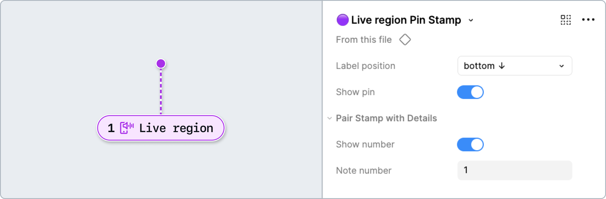

# How to: System Feedback

System feedback such as live region announcements and validation states can enable users, especially those using assistive technologies, to receive clear and timely updates about changes or errors. This boosts accessibility, helps everyone understand status and context, and supports WCAG compliance for inclusive, user-friendly web experiences.

**Table of contents**
- [System feedback](#system-feedback)
- [Live regions](#live-regions)
  - [How to use these annotations](#how-to-use-these-annotations)

## System feedback

For any system feedback that is not already present in our design system or shared components. These can be used to show validation states in forms or design system components (if these aren’t already built in), or as a label for Flow Lines to highlight validation states across frames in a design flow.

### [Annotation Tiers](https://github.com/github/annotation-toolkit/blob/main/deep-dives/tiered-model.md)
- Difficulty Tier 2: **Moderate**
- Priority Tier 3: **Nice to have**

### Variants

#### Error

Informs about an error that occurred, such as: 
- General form entry errors
- Validation errors for syntax or input patterns
- Null value errors for empty required fields
- Loss of access or data as a result of an action

#### Warning

Informs about a potential issue or consequence as the result of an action.

#### Success

Informs about successfully completing an action.

#### Info

Highlights important information that has an influence on the current view or offers an action.

---

## Live regions

Live regions are parts of a webpage that are monitored for dynamic content updates. While visual changes like a new message appearing or a status updating, may be obvious to people that can see the screen, someone using a screen reader might miss them entirely. That’s where live regions come in. They “listen” for these updates and announce the changes to assistive technologies like screen readers, ensuring that everyone stays informed in real time.

### [Annotation Tiers](https://github.com/github/annotation-toolkit/blob/main/deep-dives/tiered-model.md)
- Difficulty Tier 3: **Advanced**
- Priority Tier 3: **Nice to have**

### Why?

Live regions are advanced and should be avoided unless necessary. Approach with caution, as they often perform poorly and inconsistently. If you must use them, limit the number of them on any given page. 
Annotating live regions in your designs ensures:
- Dynamic changes are intentional, meaning, the announcement is defined, and not redundant, or ignored
- Developers receive clear guidance on how to implement the live region. For example, should it be `assertive` or `polite`?
- The experience of people using screen readers is baked in from the design process, ensuring important updates are not limited to people that can see the screen

### Additional recommendations

Avoid live regions if you can. Moving focus and clearly written UI instructions are the best alternative. If live regions are necessary, keep these tips in mind:
- Keep notification messages concise. Users can’t review these ephemeral messages. 
- Don’t use special characters or non-text content.
- Ensure an empty live region exists in the DOM on load—without being *hidden* via `display: none`, for example—otherwise they won’t exist in the accessibility tree. 
- Set a timeout to remove notification text. If an element is dynamically updated, but you didn’t want to send constant announcements about it, then it may be best to use the `timer` or `marquee` role, or use a generic element with an `aria-live=off`.
- If building an app-like experience and using ephemeral notifications like toasts, consider creating a ‘notification center’ so that these messages can be revisited.

[Primer’s live-region-element](https://github.com/primer/live-region-element) can also help you avoid many common issues.

### Variants

You can use the Template property to quickly annotate live region semantics for common types of interactions. These have roles and aria-semantics pre-filled already.

#### None

This default template setting allows you to set all values and aria attributes manually. 
- **Show guidance**: Toggle high-level guidance and resources.
- **role**: Select the role of the live region. Most use cases will need either `Status` or `Alert`. If a role is not selected, a live region will require an `aria-live` value. 
    - ​[Status](https://developer.mozilla.org/en-US/docs/Web/Accessibility/ARIA/Reference/Roles/status_role): Delivers cautionary or supportive info. Has an implicit `aria-live` value of `polite`.
    - [Alert](https://developer.mozilla.org/en-US/docs/Web/Accessibility/ARIA/Reference/Roles/alert_role): Important and time sensitive info. Carries an implicit `aria-live` value of `assertive`.
    - [Progressbar](https://developer.mozilla.org/en-US/docs/Web/Accessibility/ARIA/Reference/Roles/progressbar_role): Provides live updates on the progress or completion of a task
    - [Timer](https://developer.mozilla.org/en-US/docs/Web/Accessibility/ARIA/Reference/Roles/timer_role): A countdown 
    - [Log](https://developer.mozilla.org/en-US/docs/Web/Accessibility/ARIA/Reference/Roles/log_role): Contains sequential information that may be replaced by more up to date status messages
    - [Marquee](https://developer.mozilla.org/en-US/docs/Web/Accessibility/ARIA/Reference/Roles/marquee_role): Information that is likely to change and is typically categorized as not important
- **aria-live**: Set the politeness setting (if Role is not already selected). May be pre-filled depending what Template is selected.
- **Advanced mode**: Additional options that may be needed in complex use cases. They are not well supported.
    - [​aria-atomic](https://developer.mozilla.org/en-US/docs/Web/Accessibility/ARIA/Reference/Attributes/aria-atomic): controls *whether* everything is read or just updates to the announcement
    - [aria-relevant](https://developer.mozilla.org/en-US/docs/Web/Accessibility/ARIA/Reference/Attributes/aria-relevant): controls *when* live-regions should read
    - [aria-busy](https://developer.mozilla.org/en-US/docs/Web/Accessibility/ARIA/Reference/Attributes/aria-busy): when a section of a page is undergoing updates and it isn’t ready to be announced

#### Loading notification

A common, low-risk live region that informs users when content is loading or has finished loading dynamically. 
- **aria-live**: polite
- **aria-busy**: true

#### Inline form error

A common, medium-risk live region that announces specific validation errors next to individual form fields as they occur.
If a form is longer and it’s more tedious to go back and edit fields, it may be worth setting aria-live to assertive. 
- **aria-live**: `polite`

#### Form error after submit

A live region that announces validation errors affecting the whole form after submission.
- **role**: `alert`
- **aria-live**: `assertive`

#### Search results

A common, medium-risk live region that announces dynamic search results and filtering changes.
Make sure this live region doesn’t update too frequently.
- **role**: `status`
- **aria-live**: `polite`

#### Progress indicator

A common, low risk live region that conveys real-time updates about the status or completion of an ongoing process. Similar to the loading live region in that there is a definitive start and end. Often used with UI for uploading or downloading data, and paired with a visual progress bar.
- **role**: `progressbar`
- **aria-live**: `polite`

#### Toast notification

A transient live region that announces brief system or application messages without disrupting user focus. These typically appear in a corner of the interface.
- **role**: `alert` or `status` depending on the type of content
- **aria-live**: `assertive` or `polite` depending on the type of content

> [!WARNING]
> Toasts are high risk and temperamental, and should be avoided. They are deprecated in Primer as they present [many accessibility barriers](https://adrianroselli.com/2020/01/defining-toast-messages.html). Try some [better alternatives](https://adamsilver.io/blog/the-problem-with-toast-messages-and-what-to-do-instead/) instead.

#### Feed/chat log update

A rare, high-risk live region that announces new entries or messages in a live-updating feed or chat interface. Generally used within application-style interfaces where a chat/feed is the main feature.
- **role**: `log`
- **aria-live**: `polite` or `assertive`
- **aria-atomic**: `false` to ensure that the entire transcript isn’t read

#### Live charts/data

A rare, high risk live region for specialized scenarios primarily within applications, such as stock tickers or CPU usage graphs. 
Too many updates can be quite overwhelming, so announcements should be batched/staggered carefully—or this control can be given to users.
- **role**: `marquee`

#### Timers/countdown

A rare, high risk live region for specialized scenarios where there is a real world time limit, such as booking sites, test taking, or stock trading. 
Too many updates can be overwhelming, so announcements should be manually staggered or batched.
- **role**: `timer`

#### Mobile announcements (iOS or Android)

The polite or assertive behavior of live region announcements can be simulated on iOS and Android as long as specific traits and settings are included.

### How to use these annotations

1. ​Add a **❖ Live Region Stamp** component from the asset panel. Place the stamp over the design frame and resize to extend pin, bracket, or lasso. Configure the component properties as needed:
- **Label position**: Set based on Stamp’s placement relative to the element being annotated.
- **Show number**: Toggle off if there’s no need for a matching Details annotation.
- **Note number**: Set this number in relative sequence with the other numbered Stamps placed over the same design.

​2. Place a **❖ Live Region Details** component in the margins next to the design and configure the component properties as needed: 
- **Template**: Select the live region type for common use cases.
- **Show guidance**: Toggle high-level guidance and resources.  
- **Note number**: Set this to match the corresponding **❖ Live Region Stamp**. This number should be unique and in relative sequence with other Details annotations on the same design.
- **Message**: Specify the contents of the live region message.  Keep notification messages concise. Don’t use special characters or non-text content.
- **Role**: Select the role of the live region.  Most use cases will need either Status or Alert. If a role is not selected, a live region will require an aria-live value. May be pre-filled depending what Template is selected.
- **aria-live**: Set the politeness setting (if Role is not already selected). May be pre-filled depending what Template is selected.

---

## Design considerations

- Is a live region the best way to convey this information or can it be displayed with a visual status message?
- If yes, select the correct role for the live region, e.g. `status`, `alert`, `progressbar`, `timer`, `log`, or `marquee`
- Should the message interrupt the user? E.g `assertive` or `polite`

## Resources

- [​Accessible notifications - Primer design guidance](https://primer.style/accessibility/patterns/accessible-notifications-and-messages/)
- [aria-live regions - MDN](https://developer.mozilla.org/en-US/docs/Web/Accessibility/ARIA/ARIA_Live_Regions)
- [Accessible notifications with ARIA Live Regions (Part 1) - Sara Soueidan](https://www.sarasoueidan.com/blog/accessible-notifications-with-aria-live-regions-part-1/)
- [Accessible notifications with ARIA Live Regions (Part 2) - Sara Soueidan](https://www.sarasoueidan.com/blog/accessible-notifications-with-aria-live-regions-part-2/)
- [Why are my Live Regions not working? - TetraLogical](https://tetralogical.com/blog/2024/05/01/why-are-my-live-regions-not-working/)
- [Are we live? - Scott O’Hara](https://www.scottohara.me/blog/2022/02/05/are-we-live.html)
- [Exposing Field Errors - Adrian Roselli](https://adrianroselli.com/2023/04/exposing-field-errors.html)
- [The Many Lives of a Notification (Video) - Sarah Higley](https://www.youtube.com/live/W5YAaLLBKhQ?si=SxKUbgEKmGxItV8D)
