# How to: Table

A table is a 2-dimensional data structure where rows and columns are used to represent data about a specific item. Present information in a grid with columns or rows to give quick access to tabular data to help people more easily understand complicated information relationships.

## Why? 

Tables help people more easily understand complicated information relationships. When constructed properly, they also enable people who use assistive technology to quickly and efficiently navigate and understand the relationship between a table’s columns, rows, and the information placed within each cell. 
- All table content must be shown at every screen size. Convey responsive behavior with a Table Details annotation.
- Screen readers have difficulty parsing tables with merged rows and columns.
- Try to keep one discrete piece of information per table cell.

## Table Stamps and Details

### [Annotation Tiers](https://github.com/github/annotation-toolkit/blob/main/deep-dives/tiered-model.md)
- Difficulty Tier 3: **Advanced**
- Priority Tier 3: **Nice to have**

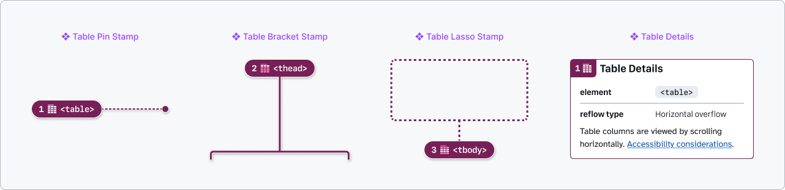 and a note number set to 1. The second is a maroon bracket stamp with a label of <thead> and a note number set to 2. The third is a maroon lasso stamp which has a white and maroon dashed outline attached to it, a label of <tbody>, and a note number set to 3. The last annotation is a Table Details component with a note number set to 4. It is a white rectangular panel with maroon accents and information about the table HTML element, reflow behavior preference set to horizontal overflow, and a link to the accessibility considerations for that preference." width="1012">

### Elements

#### Table container `<table>`

Defines a data table, organized into columns and rows. Required. Tables must include: a caption, at least two rows, and at least two columns.
- **Reflow type**: Specifies responsive behavior for the entire table. 
    - `Horizontal overflow`: Table columns are viewed by scrolling horizontally. Useful for tables that have a lot of columns.
    - `Columns become rows`: Table columns are turned into rows, to avoid horizontal scrolling on narrower viewports.
    - `No responsive behavior`: Table does not adapt responsively. *Warning: This may have accessibility issues!*

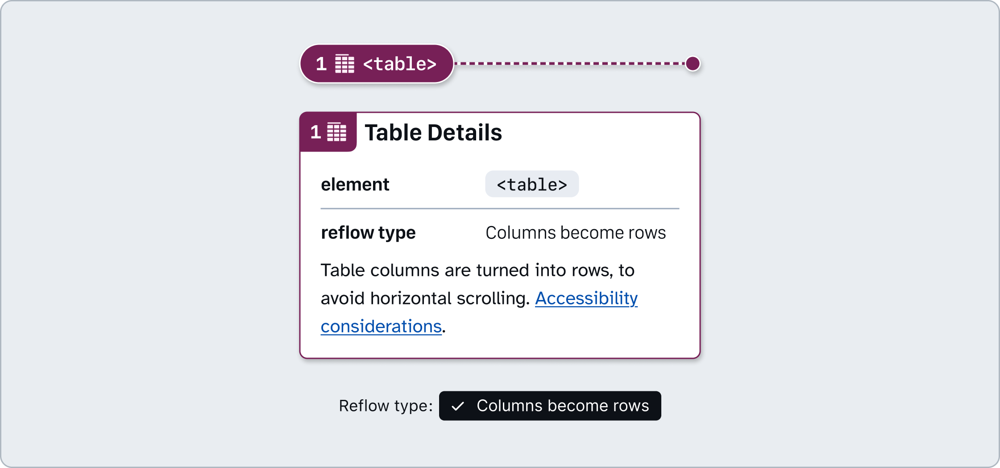

#### Caption `<caption>`

Provides a unique and succinct description or title for the table’s content. Important for helping people who use screen readers quickly understand the table’s purpose. Required.
- **Visually hidden**: using a visually hidden caption ensures that the table’s purpose is still conveyed to screen reader users who can't see the screen. If the text is hidden, be sure to fill out the **caption text** field.

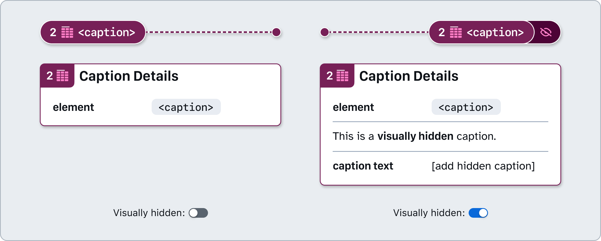

#### Table head `<thead>`

Groups header rows that describe the columns of the table. Required.
- **Sticky head**: Indicates the table header row sticks to the top of the viewport when scrolled past.

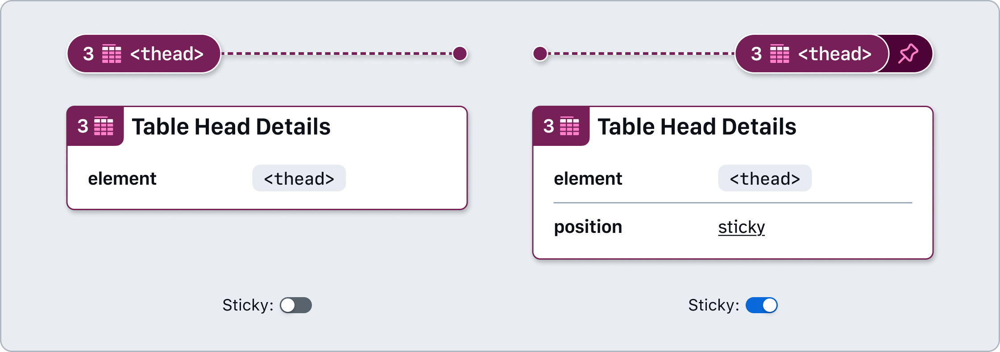

#### Table header `<th>`

Identifies a header cell, which labels the cells being scoped. All cells in a table’s `<thead>` must be `<th>` elements with a scope of col. If a table uses row headers: the first cell must be a `<th>` element with a scope of row; the other cells are `<td>` elements.
- **Scope**: Defines the table cells that the table header cell relates to. This can be set to `row`, `col`, `rowgroup`, or `columngroup`.
- **Sortable**: Indicates if the table column’s data can be sorted, as well as **sort order** (`ascending` or `descending`). Can also optionally specify **sort priority** if the table can be sorted by multiple columns at the same time.
- **Advanced mode**: Additional options that may be needed in complex use cases.
    - **Element ID**: Specifies an id value for the table header cell. Useful for complicated table layouts.
    - **Headers**: A list of space-separated strings corresponding to the id values of the `<th>` elements that provide the headers for this header cell.
    - **Colspan**: How many columns the header cell spans across.
    - **Rowspan**: How many rows the header cell spans across.

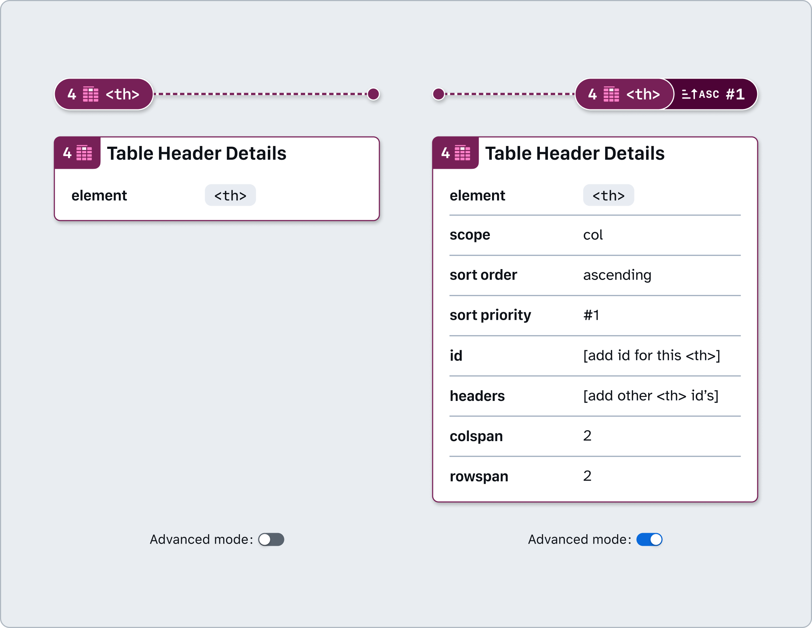

#### Table body `<tbody>`

Groups the main data rows of the table together.

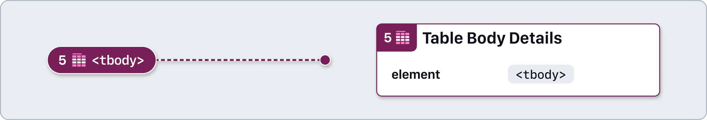

#### Table row `<tr>`

Represents a horizontal row of cells.
- **Expandable**: Indicates if the table row’s content can be `collapsed` or `expanded`, as well as the state it defaults to.

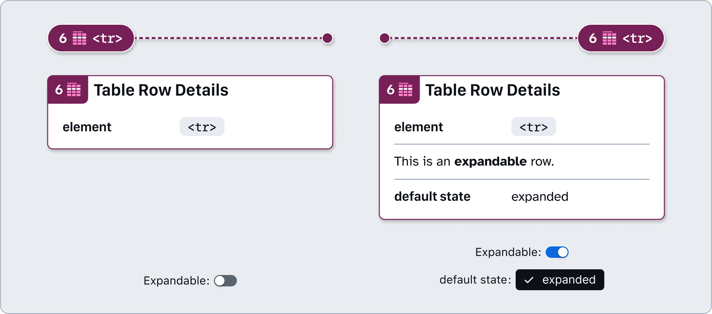

#### Table body cell `<td>`

Contains a data cell within a table.
- **Advanced mode**: Additional options that may be needed in complex use cases.
    - **Element ID**: Specifies an id value for the table cell. Useful for complicated table layouts.
    - **Headers**: A list of space-separated strings corresponding to the id values of the `<th>` elements that provide the headers for this cell.
    - **Colspan**: How many columns the cell spans across.
    - **Rowspan**: How many rows the cell spans across.

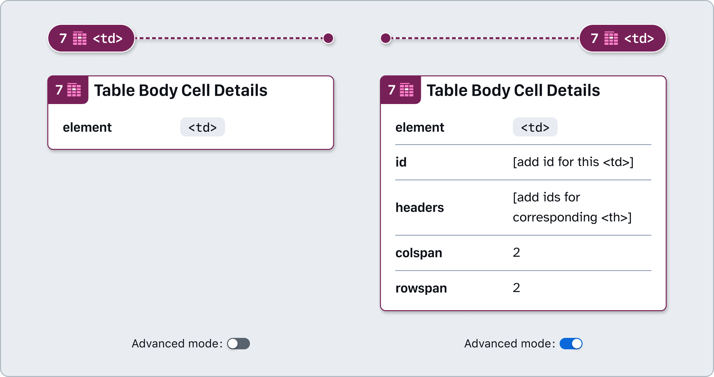

#### Table footer `<tfoot>`

Groups rows concluding the table content. A table footer is optional, only use it if your content needs it.
- **Sticky footer**: Indicates the table footer row sticks to the top of the viewport when scrolling.

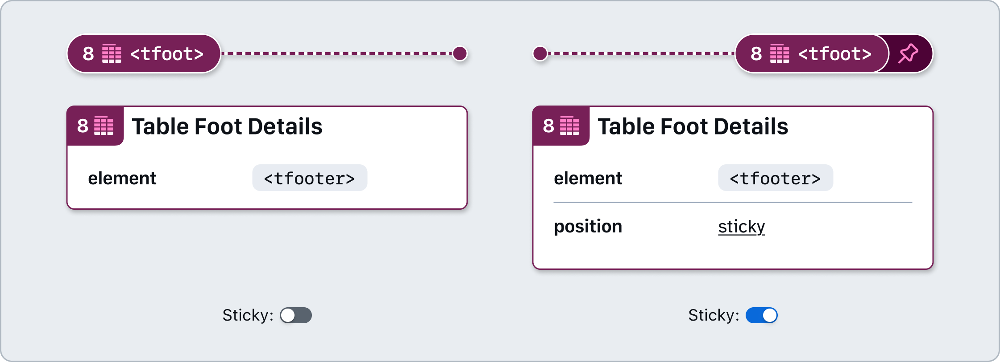

#### Column group `<colgroup>`

Defines a group of one or more columns for styling or structural purposes. This element is typically not needed, and its inclusion may interfere with some screen readers. 
- `span`: Specifies the number of columns the grouping contains. Spanning starts on the first table column and extends the same number of columns as the `span` number used. `span` cannot be used if one or more `<cols>` are also used.

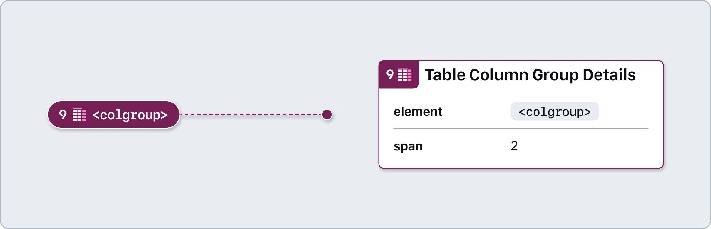

#### Column `<col>`

Represents a single column’s definition, used for styling or width control. This element is typically not needed, and its inclusion may interfere with some screen readers.
- **Columns span**: Specifies the number of columns the grouping contains. Spanning starts on the first table column and extends the same number of columns as the span number used.

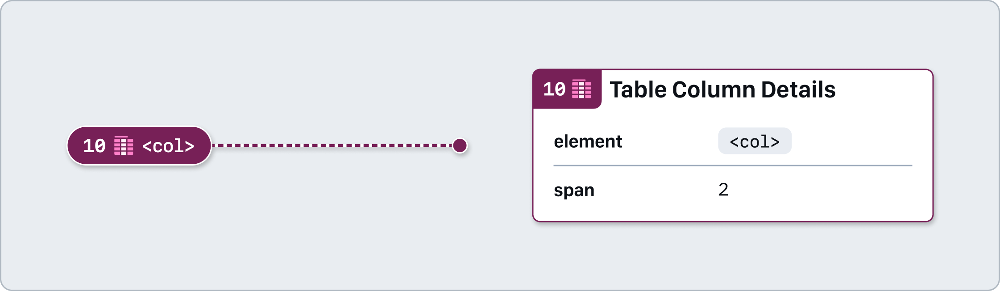

### How to use these annotations

1. ​Add a **❖ Table Stamp component** from the asset panel. Place the stamp over the design frame and resize to extend pin, bracket, or lasso. Configure the component properties as needed:
    - **Label position**: Set based on Stamp’s placement relative to the element being annotated.
    - **Show number**: Toggle off if there’s no need for a matching Details annotation (in which case, skip step 2).
    - **Note number**: Set this number in relative sequence with the other numbered Stamps placed over the same design.
    - **Element**: Select the corresponding element to ensure the Stamp is paired and labelled correctly.

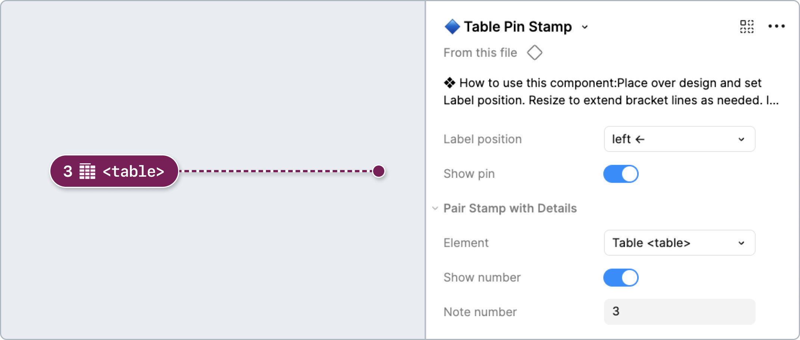

2. ​Place a ❖ Table Details component in the margins next to the design and configure the component properties as needed:
Element: Select the applicable table element. 
Show guidance: Toggle high-level guidance and resources.
Note number: Set this to match the corresponding ❖ Table Stamp. This number should be unique and in relative sequence with other Details annotations on the same design.

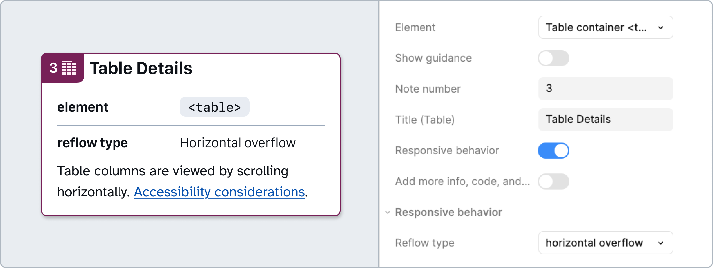

## Table structure

Proper table structure is essential for presenting data in a clear and meaningful way. Tables without proper structure can be confusing or unusable for users who rely on screen readers, compromising both accessibility and the clarity of the data being presented.

### [Annotation Tiers](https://github.com/github/annotation-toolkit/blob/main/deep-dives/tiered-model.md):
- Difficulty Tier 3: **Advanced**
- Priority Tier 3: **Nice to have**

### How to use these annotations

Place a ❖ Table Structure component in the margins next to the design and configure the component properties as needed:

1. Toggle the **Show guidance** property if the additional high level guidance and resources aren’t needed.
2. Optionally update the **Title** field. This can help differentiate annotations when multiple tables are used in a single design. 
3. Optionally use the **Show description** property to add a description for the table structure itself.
4. Configure the table structure to include all elements.
   1.  Select the appropriate **Table element** for the content and place within the table hierarchy.
   2.  Select the appropriate **Nesting level**. Each table structure item must be appropriately nested.
   3.  Provide a **description** for each item if more context is needed.
   4.  For certain elements, there are property toggles to convey when an item may be **sticky**, **sortable**, or **visually hidden**.

> [!NOTE]
> **You can safely detach this component!** If you need more rows than are included by default in order to show the table structure, you can add more by detaching the component (<kbd>**⌥⌘B**</kbd>). Then you can duplicate the **Table structure item** rows.

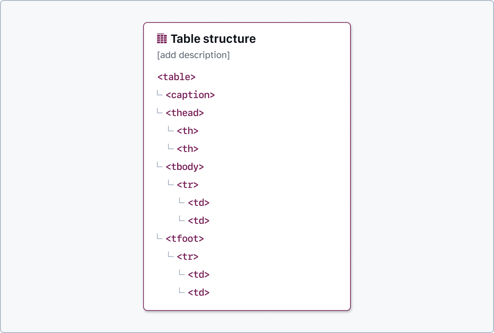

---

## Design considerations

- Does the table caption succinctly describe the table’s purpose?
- Can all of the table’s information be read on narrower viewports?
- Are the table rows and columns clearly communicated visually?
- Does each column and row header have a succinct title? 
- Does each table cell have straightforward information? If not, can it be broken out into new columns?
- Are sorting functionality and current sorted state easy to understand?
- Is the data in each column aligned in a way that makes it easier to visually scan?

## Resources

- [Tables Tutorial - W3C WAI Tutorials](https://www.w3.org/WAI/tutorials/tables/)
- [HTML table accessibility - MDN](https://developer.mozilla.org/en-US/docs/Learn_web_development/Core/Structuring_content/Table_accessibility)
- [Table Pattern - ARIA Authoring Practices Guide (APG)](https://www.w3.org/WAI/ARIA/apg/patterns/table/)
- [How To Architect A Complex Web Table - Smashing Magazine](https://www.smashingmagazine.com/2019/02/complex-web-tables/)
- [Web Typography: Designing Tables to be Read, Not Looked At - A List Apart](https://alistapart.com/article/web-typography-tables/)
- [Designing Tables for Reusability - UX Collective](https://uxdesign.cc/designing-tables-for-reusability-490a3760533)
- [Designing a complex table for mobile consumption (nom) - UX Collective](https://uxdesign.cc/designing-a-complex-table-for-mobile-consumption-nom-7472f7b11fe6)
- [A Responsive Accessible Table - Adrian Roselli](https://adrianroselli.com/2017/11/a-responsive-accessible-table.html)
- [Under-Engineered Responsive Tables - Adrian Roselli](https://adrianroselli.com/2020/11/under-engineered-responsive-tables.html)
- [HTML Table Element Guide - CSS Tricks](https://css-tricks.com/complete-guide-table-element/)
