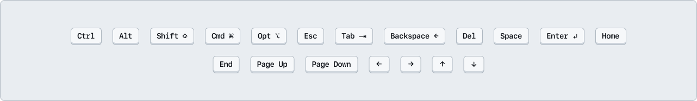

# How to: **User Interactions**

People engage with designs in different ways, often influenced by disabilities, be they permanent, temporary, or situational, as well as personal adaptive strategies. Interaction annotations help designers clearly communicate the full range of user interactions, making sure that diversity is considered and integrated during the build stage. 

**Types of user interactions**
- [Keyboard shortcut](#keyboard-shortcut)
- [Touch gesture](#touch-gesture)
- [Mouse action](#mouse-action)
- [Device setting](#device-setting)
- [Platform function](#platform-function)

## Keyboard shortcut

Annotate keyboard shortcuts to a fine detail with the kit. Choose between 1 to 5 key combinations, and specify both the key type (modifier, alphanumeric, or arrow) and the individual key.

### [Annotation Tiers](https://github.com/github/annotation-toolkit/blob/main/deep-dives/tiered-model.md)
- Difficulty Tier 3: **Advanced**
- Priority Tier 3: **Nice to have**

### Why?

Keyboard shortcuts can be immensely useful to power users and novices users alike. They can also hurt accessibility usability if there is no way to adjust them or if it overrides a key feature that their assistive technology uses to map out a webpage.

### How to use a keyboard combo shortcut

Add a **❖ Keyboard combo shortcut** component from the asset panel. Place the stamp over the design frame and resize either the label or the flow line. Configure the component properties as needed:
    - Select a key combo length (anywhere between 1 - 5 keys)
    - Determine key types (Modifier, Alphanumeric, or Arrow)
    - Select the specific keys for the shortcut
    - If using a flow line with a keyboard shortcut as the label

**Caution**
- Keyboard combinations cannot interfere with common keyboard accessibility key commands (see [WebAIM Keyboard Accessibility](https://webaim.org/techniques/keyboard/)). 
- **Do not** introduce single-character shortcuts to a new feature.

## Touch gesture

A touch gesture is a physical interaction with a screen, such as tap, swipe, or pinch, made on a touchscreen to trigger a digital response or action.

### [Annotation Tiers](https://github.com/github/annotation-toolkit/blob/main/deep-dives/tiered-model.md)
- Difficulty Tier 3: **Advanced**
- Priority Tier 3: **Nice to have**

### Why?

When designing touch interactions, it's important to consider whether they may create barriers for users with different disabilities. Because of this, touch gestures are grouped into three categories based on complexity: **Basic**, **Specialized**, and **Advanced**. These categories are included both as a reminder to consider those who depend on them *and* as a caution against using gestures that may be inaccessible. 

### Gesture type

#### Basic 

Basic tap gestures are the most widely accessible, require minimal dexterity, and can be completed with the use of one limb.

#### Specialized

Specialized gestures are more complex and should be used rarely, as they may be inaccessible to some users. Tap-and-hold or swipe gestures require fine motor control, limiting people with motor disabilities such as tremors, Parkinson's, arthritis, and cerebral palsy. Some people with visual disabilities will be inhibited by these gestures as they require visual feedback.

#### Advanced

Avoid using these. Multi-point input (using two or more fingers simultaneously) assumes users have both the physical ability and precise motor control to interact with a design. They are inaccessible on their own and should be avoided unless absolutely *essential* to an experience. 
If they *must* be used, you *must* provide [accessible alternatives](https://tetralogical.com/blog/2023/03/17/foundations-pointer-gestures/#examples-of-accessible-alternatives). Attempting to use these will present a warning and requires acknowledgement that accessible alternatives are provided.

## Mouse action

Mouse action gestures refer to different actions that can be performed with a mouse. 

### [Annotation Tiers](https://github.com/github/annotation-toolkit/blob/main/deep-dives/tiered-model.md)
- Difficulty Tier 3: **Advanced**
- Priority Tier 3: **Nice to have**

## Why?

Some mouse actions may impact accessibility and create barriers or confusion for users. Mouse actions are not accessible to all users, particularly those who are blind or have low vision, as they cannot rely on visual cues to navigate with a pointer. Not everyone can use a mouse, so all functionality must be available through accessible alternatives such as keyboard navigation. These are grouped into three categories based on complexity: **Basic**, **Specialized**, and **Advanced**.

### Type

#### Basic

Basic mouse actions refer to those that are accessible for people that can navigate with a mouse. 

#### Specialized

Specialized mouse actions should be used sparingly as they can pose accessibility challenges for some users. They typically require additional user awareness, interaction, and customization.

#### Advanced

Avoid using these. Advanced mouse actions require a level of physical ability and precise motor control that not every person has. They are inaccessible on their own and should be avoided unless absolutely essential to an experience. If they must be used, you must provide accessible alternatives.

## Device setting

Device settings refer to preferences or configurations that a user sets at the system or device level to customize how content is displayed or how interactions behave. These, like touch gestures and mouse actions, should also be approached with caution. 

### [Annotation Tiers](https://github.com/github/annotation-toolkit/blob/main/deep-dives/tiered-model.md)
- Difficulty Tier 3: **Advanced**
- Priority Tier 3: **Nice to have**

### Why?

While device settings are meant to honor user preferences and create more accessible experiences, forcing them into design without a way to turn off or adjust functionality may end up creating barriers or confusion for users. These are grouped into three categories based on complexity: **Basic**, **Specialized**, and **Advanced**.

### Type
#### Basic

Common and often expected platform functions, including:
- **Reduced motion** can reflect user preferences that are set at various levels (device, browser, platform, etc) to minimize discomfort from animations.
- **Viewport zoom** can enhance readability and accessibility. This can highlight changes to zoom level whether the preference is set via device, browser, or platform. This may not only increase the size of elements on the page, but affect reflow via layout changes as a design adapts to a different zoom level.

#### Specialized

Specialized device settings should be used sparingly as they can pose accessibility challenges for some users. These features support some user groups (for example, users with visual, motor, or cognitive disabilities). Not all users can or will interact this way, as individual abilities and device capabilities vary widely. 
- **Voice input** enable hands-free interaction through speech.
- **Viewport resize** can be used to show content adapting to various screen sizes. This may affect reflow via layout changes.

#### Advanced

Advanced device settings are inaccessible and should be avoided unless absolutely essential. Provide accessible alternatives if they must be used.
- No assumptions should be made about the **orientation** of a device. Some users may have their device locked in a horizontal orientation (landscape), and therefore, any functionality that is limited to landscape/horizontal setting cannot be assumed accessible to everyone, or vice versa. 
- **Shake device** should be avoided as it may not be possible for a user to shake their device as an input. 

## Platform function

Built-in behaviors and constraints from the platform which define how people may use, navigate, and understand a digital experience.

### [Annotation Tiers](https://github.com/github/annotation-toolkit/blob/main/deep-dives/tiered-model.md)
- Difficulty Tier 3: **Advanced**
- Priority Tier 3: **Nice to have**

### Why?

Some platform-level interactions may impact accessibility and create barriers or confusion for users. These are grouped into three categories based on complexity: **Basic**, **Specialized** and **Advanced**. 

### Type
#### Basic

Basic platform functions do not present barriers as long as they are announced. 
Loading is a reminder to give users receive clear visual and programmatic feedback as they wait for content or actions to complete.

#### Specialized

Specialized platform functions should be used sparingly, as they can cause frustration and pose accessibility challenges.
Automatic transitions involve system-initiated changes in screen, state, or content without direct user interaction. They can create confusion and disorientation.
Opening a link in a new tab or window may disorient screen reader users unless they’re given an audible cue to indicate the change. This removes access to the back button, making navigation more difficult. Screen magnification users may not notice a context switch at all, leading to a disjointed and confusing experience.

#### Advanced

Avoid these. Advanced platform functions are inaccessible and should be avoided unless absolutely essential. Provide accessible alternatives if they must be used.
Time limits can cause stress and anxiety for many users. This includes those with cognitive disabilities who may struggle to complete tasks in a set time limit, as well as those with motor control disabilities who may not physically be capable of performing the task in the allotted time. 
Cognitive puzzles (such as CAPTCHA) can be a struggle for people with cognitive disabilities. This may be due to working memory limitations, which contribute to the complexity of a puzzle, or a cognitive puzzle that relies on one sense. For example, blind and low-vision users that cannot see the screen are automatically disadvantaged when it comes to solving an image-based puzzle. Puzzles that require advanced mouse actions or touch gestures may also prove inaccessible for users with motor impairments.

---

## Design considerations

- Can all functionality be accessed using more than one input method (e.g. mouse, touch, keyboard)?
- Are any input types required to complete a task? If so, is there an accessible alternative?
- Are you relying on a gesture or interaction that may not be supported across all input types (e.g., pinch to zoom, hover)?
- Have you considered how users will discover interactive elements using each input method?

## Resources

- ​[Foundations: Keyboard accessibility - TetraLogical](https://tetralogical.com/blog/2025/05/09/foundations-keyboard-accessibility/)
- [Foundations: Pointer gestures - TetraLogical](https://tetralogical.com/blog/2023/03/17/foundations-pointer-gestures/)
- [Knowbility: Exploring WCAG 2.1 - 2.5.1 Pointer Gestures](https://knowbility.org/blog/2018/WCAG21-251PointerGestures)
- [Home Office Design System: Gestures and motion](https://design.homeoffice.gov.uk/accessibility/gestures-and-motion)
- [W3C: Understanding 2.5.1 - Pointer Gestures (Level A)](https://www.w3.org/WAI/WCAG21/Understanding/pointer-gestures.html)
- [W3C: Understanding 2.5.7 - Dragging Movements (Level AA)](https://www.w3.org/WAI/WCAG22/Understanding/dragging-movements)
